# Azure App Service Deployment Guide

## Overview

This guide documents the complete setup process for deploying the Order Processing System to Azure App Service using GitHub Actions with OIDC authentication.

**Date Completed**: November 16, 2025  
**Last Updated**: November 24, 2025 (Added Pre-Validation and Enhanced Bootstrap Workflow)  
**Deployment Method**: GitHub Actions CI/CD with OIDC (Passwordless Authentication)  
**Target Environments**: dev, staging, production (branch-mapped)  
**Azure Region (Primary)**: Central India  
**Current Focus (Curriculum Day 31)**: Execute manual infrastructure dry run (`infra-deploy.yml`) prior to real deployment

### 🆕 Recent Enhancements (November 24, 2025)

**Bootstrap Workflow (`azure-bootstrap.yml`) now includes:**
- ✅ **Pre-Validation Job**: Validates OIDC and GitHub App credentials BEFORE bootstrap starts
  - Checks AZUREAPPSERVICE_CLIENTID, TENANTID, SUBSCRIPTIONID exist
  - Checks APP_ID and APP_PRIVATE_KEY exist
  - **Fails immediately** if prerequisites are missing (blocks bootstrap execution)
- ✅ **Reordered Workflow Inputs**: Logical setup sequence for better UX
  1. Setup Azure OIDC (first-time only)
  2. Setup GitHub App (first-time only) 
  3. OIDC App Name (requires GitHub App setup)
  4. Configure GitHub secrets
  5. Enable pre-deployment validation (default: ✅ true)
  6. Bootstrap infrastructure (default: ✅ true)
- ✅ **Enable-Validation Job**: Automatically enables validation for future deployments
  - Runs AFTER bootstrap completes
  - Modifies `infra-deploy.yml` to enable pre-validate checks
  - Enables what-if analysis before every future deployment

**Key Benefit**: Prerequisites are now validated upfront, preventing bootstrap failures and providing clear error messages.

**Job Execution Chain**:
```
setup-oidc → setup-github-app → configure-secrets 
    ↓
pre-validate-prerequisites (fails if credentials missing)
    ↓ (blocked if failed)
bootstrap-dev, bootstrap-staging, bootstrap-prod
    ↓
enable-validation → summary
```

### 📚 Related Documentation

For detailed step-by-step execution flow of the bootstrap script:
- **[BOOTSTRAP_SCRIPT_FLOW.md](./BOOTSTRAP_SCRIPT_FLOW.md)** - Complete optimized flow documentation for junior developers and code reviewers

For GitHub Actions automation and secret management:
- **[AUTOMATED-BOOTSTRAP-GUIDE.md](../03-Configuration-Guides/AUTOMATED-BOOTSTRAP-GUIDE.md)** - Complete end-to-end automation setup (Azure OIDC + GitHub App)
- **[QUICK-SETUP-GITHUB-APP.md](../03-Configuration-Guides/QUICK-SETUP-GITHUB-APP.md)** - 5-minute GitHub App setup guide (eliminates PAT expiration)
- **[GITHUB-APP-AUTHENTICATION.md](../03-Configuration-Guides/GITHUB-APP-AUTHENTICATION.md)** - Technical deep-dive on GitHub App authentication
- **[GITHUB-SECRETS-FIX.md](../03-Configuration-Guides/GITHUB-SECRETS-FIX.md)** - GitHub secrets configuration troubleshooting
- **[WORKFLOW-AUTOMATION-VISUAL-GUIDE.md](../03-Configuration-Guides/WORKFLOW-AUTOMATION-VISUAL-GUIDE.md)** - Visual workflow automation flow diagrams

For Application Insights monitoring and observability:
- **[APP_INSIGHTS_AUTOMATED_SETUP.md](./APP_INSIGHTS_AUTOMATED_SETUP.md)** ⭐ **NEW** - Automated environment-wise App Insights configuration (enterprise approach)
- **[APPLICATION_INSIGHTS_SETUP.md](./APPLICATION_INSIGHTS_SETUP.md)** - Manual setup reference (legacy)

---

## ⚙️ Manual Infrastructure Deployment via GitHub Actions (`infra-deploy.yml`)

### Why This Workflow Exists
The **`infra-deploy.yml`** workflow enables a controlled, parameterized, and auditable Azure infrastructure deployment using Bicep modules with two modes:
1. **Dry Run (What-If / Validation)** – Safe preview, no changes applied.
2. **Real Deployment** – Applies infrastructure changes once validated.

It supports iterative learning (Curriculum Day 31) and prevents accidental production changes by requiring explicit manual triggers and clear inputs.

### Location
`/.github/workflows/infra-deploy.yml`

---

## 📋 Manual Infrastructure Deployment - Step-by-Step Guide

This section provides a complete walkthrough for executing your first manual infrastructure deployment. Follow these steps sequentially for a safe and successful deployment.

### Task 1: Read Workflow Documentation (10 mins)
**File:** `.github/workflows/README-INFRA-DEPLOY.md`

**What to learn:**
- How to run manual deployments
- Parameter options and their meanings
- Difference between dry run and real deployment
- Troubleshooting common issues

**Action:** Open and read the README-INFRA-DEPLOY.md file before proceeding.

---

### Task 2: Run Dry Run Test (15 mins)

**Steps:**
1. Open browser: https://github.com/pavanthakur/XYDataLabs.OrderProcessingSystem/actions
2. **IMPORTANT**: At the top of the page, change the branch filter from "main" to **"dev"**
3. Click on **"Deploy Azure Infrastructure"** workflow (left sidebar)
4. Click **"Run workflow"** button (dropdown on right)
5. Fill in parameters:
   ```
   Use workflow from: Branch: dev
   Environment: dev
   Location: centralindia
   App Service SKU: F1
   Enable Identity: false  ⚠️ Important: Set to false
   Dry Run: true  ✅ Safe mode
   ```
6. Click green **"Run workflow"** button
7. Wait 2-3 minutes for completion
8. Click on the running workflow to see details
9. Review the **"What-If"** output

**Expected outcome:** See list of resources that would be created/modified (5 resources for dev environment)

---

### Task 3: Analyze What-If Output (10 mins)

**Look for:**
- ✅ Resource Group: `rg-orderprocessing-dev`
- ✅ App Service Plan: `asp-orderprocessing-dev`
- ✅ Web Apps: `pavanthakur-orderprocessing-api-xyapp-dev` and `pavanthakur-orderprocessing-ui-xyapp-dev`
- ✅ Application Insights: `ai-orderprocessing-dev`
- ⚠️ No unexpected deletions
- ⚠️ No unexpected resource type changes

**Questions to answer:**
- Does it match what you expect?
- Are the resource names correct (with `pavanthakur` prefix)?
- Is it trying to delete anything important?
- Does the SKU match (F1 for dev)?

**Document your findings** in your learning journal or curriculum progress tracker.

---

### Task 4: Real Deployment (20 mins)
**⚠️ Only proceed if dry run looks good!**

**Steps:**
1. Go back to Actions → Infrastructure Deploy
2. Click **"Run workflow"** again
3. Use the **same parameters** but change:
   - **Dry Run: false** ✅
4. Wait 5-10 minutes for deployment
5. Review deployment summary in workflow output
6. Open Azure Portal: https://portal.azure.com
7. Navigate to resource group: `rg-orderprocessing-dev`
8. Verify all 5 resources exist:
   - Resource group
   - App Service Plan
   - API Web App
   - UI Web App
   - Application Insights

**Verification Commands:**
```powershell
# Check resources via CLI
az resource list -g rg-orderprocessing-dev -o table

# Test API endpoint (may return 404 until code deployed)
curl https://pavanthakur-orderprocessing-api-xyapp-dev.azurewebsites.net

# Test UI endpoint
curl https://pavanthakur-orderprocessing-ui-xyapp-dev.azurewebsites.net
```

---

### Task 5: Document Your Experience (10 mins)

**Create note with:**
- ✅ What worked?
- ❌ What failed? (if anything)
- 🤔 What was confusing?
- 💡 What did you learn?
- 📝 Screenshots of workflow run (especially What-If output)
- ⏱️ Actual time taken vs estimated

**Save to:** 
- Personal learning journal, or
- `Documentation/05-Self-Learning/Azure-Curriculum/02-Daily-Progress/November-2025/21-Nov-2025.md`

**Commit reference:**
```powershell
# After successful deployment, create audit trail
git commit -am "chore(infra): completed dev infra deployment via workflow run #<RunNumber>"
git push
```

---

### 🎓 Learning Outcomes

After completing these tasks, you will have:
1. ✅ Hands-on experience with GitHub Actions manual workflows
2. ✅ Understanding of Azure what-if analysis (infrastructure preview)
3. ✅ Ability to deploy infrastructure on-demand
4. ✅ Knowledge of parameter-driven deployments
5. ✅ Confidence in multi-environment setup
6. ✅ Practical troubleshooting experience

**This prepares you for:**
- Future infrastructure updates
- Environment-specific deployments (staging, production)
- Testing infrastructure changes safely
- Container infrastructure (ACR, ACA) in later weeks

---

### Trigger Methods
| Method | Use Case | Notes |
|--------|----------|-------|
| `workflow_dispatch` (Manual) | Curriculum tasks, Dry Run first | Primary learning path mode |
| `push` (optional future) | Automated environment sync | Disabled/limited in current plan |
| `pull_request` (optional future) | Preview changes from feature branches | Pair with dryRun=true for governance |

### Inputs (Manual Trigger Form Fields)
| Input | Type | Required | Example | Description | Recommendation (Dev Today) |
|-------|------|----------|---------|-------------|-----------------------------|
| `environment` | string | ✅ | `dev` | Logical target environment; drives naming & RG selection | `dev` |
| `location` | string | ✅ | `centralindia` | Azure region for resource group & resources | `centralindia` |
| `appServiceSku` | string | ✅ | `F1` | App Service Plan SKU (dev: F1, staging: B1, prod: P1v3) | `F1` |
| `enableIdentity` | boolean | ✅ | `false` | Toggle for managed identity provisioning module | `false` (identity deferred) |
| `dryRun` | boolean | ✅ | `true` or `false` | Chooses validate-only vs apply deployment path | `true` for first run |

### Recommended Parameter Sets
| Scenario | environment | location | appServiceSku | enableIdentity | dryRun |
|----------|------------|----------|---------------|----------------|--------|
| First Learning Pass (Today) | dev | centralindia | F1 | false | true |
| Dev Apply After Validation | dev | centralindia | F1 | false | false |
| Staging Introduction | staging | centralindia | B1 | false | true |
| Staging Apply | staging | centralindia | B1 | false | false |
| Production Preview | prod | centralindia | P1v3 | false | true |
| Production Apply (Later Phase) | prod | centralindia | P1v3 | true (when authorized) | false |

### Dry Run vs Real Deployment
| Aspect | Dry Run (`dryRun=true`) | Real Deployment (`dryRun=false`) |
|--------|------------------------|----------------------------------|
| Bicep Action | `az deployment sub what-if` (no changes) | `az deployment sub create` (applies) |
| Risk | None | Changes applied to Azure |
| Duration | Faster (skips provisioning) | Longer (resource creation) |
| Output | Planned adds/updates/deletes, summary table | Final state, IDs, connection info |
| Next Step | Review & adjust parameters | Verify resources + proceed to app deploy |

### Execution Steps (Manual Trigger)
1. Navigate: GitHub Repository → `Actions` tab.
2. Select workflow: `Infrastructure Deploy (infra-deploy.yml)`.
3. Click `Run workflow`.
4. Fill inputs (start with: environment=`dev`, location=`centralindia`, appServiceSku=`F1`, enableIdentity=`false`, dryRun=`true`).
5. Click `Run workflow` and wait for both jobs:
    - `validate` job (should succeed and summarize planned changes).
    - `deploy` job (SKIPPED when dryRun=true).
6. Review workflow `Summary` (bottom of run) for: resource group name, plan name, app names, status codes.
7. If acceptable, re-run workflow with `dryRun=false` (same parameters) to apply.

### 🔄 Dry Run Quick Reference (GitHub Actions)
Use this condensed checklist whenever you need to validate changes safely before applying:
1. Open: Repository → `Actions` → select `Infrastructure Deploy (infra-deploy.yml)`.
2. Click: `Run workflow` (top-right of workflow page).
3. Branch: ensure `dev` (or target environment branch when branching strategy evolves).
4. Parameters:
    - environment: `dev`
    - location: `centralindia`
    - appServiceSku: `F1`
    - enableIdentity: `false` (until Graph permissions granted)
    - dryRun: `true`
5. Run → wait for `validate` job success (deploy job skipped).
6. Open run → expand `Validate` step → locate What-If summary.
7. Confirm only expected Creates (RG, Plan, API, UI, Insights) and no Deletes.
8. Capture notes in `1_MASTER_CURRICULUM.md` (Day 31 section) before proceeding.
9. Re-run with `dryRun=false` when confident.

### 🖥️ Dry Run Quick Reference (Local CLI What-If)
Prerequisites: Azure CLI logged in (`az login`), correct subscription selected.
```powershell
az account show --query "id" -o tsv   # confirm subscription

# Validate (no changes applied)
az deployment sub what-if `
   --name dev-infra-dryrun-$(Get-Date -Format yyyyMMddHHmmss) `
   --location centralindia `
   --template-file infra/main.bicep `
   --parameters environment=dev githubOwner=pavanthakur appServiceSku=F1 enableIdentity=false

# (Optional) Apply after validation
az deployment sub create `
   --name dev-infra-deploy-$(Get-Date -Format yyyyMMddHHmmss) `
   --location centralindia `
   --template-file infra/main.bicep `
   --parameters environment=dev githubOwner=pavanthakur appServiceSku=F1 enableIdentity=false
```
Verification after apply:
```powershell
az group show --name rg-orderprocessing-dev --query name
az webapp list --resource-group rg-orderprocessing-dev --query "[].{Name:name, State:state}" -o table
```

### ✅ Dry Run Acceptance Criteria
- Exactly 5 planned Creates for dev (RG, Plan, 2 WebApps, App Insights)
- No Deletes or unexpected Modifies
- Naming follows: `pavanthakur-orderprocessing-<role>-xyapp-dev`
- SKU matches requested (`F1` for dev)
- Identity module skipped with clear notice (since `enableIdentity=false`)

### ⏭️ Next After Successful Dry Run
1. Run real deployment (`dryRun=false`).
2. Trigger API/UI application workflows if not already deployed.
3. Proceed to Day 32 (Azure SQL) only after confirming resources exist and endpoints respond (even if 404 initially).

### ⚠️ Common Dry Run Pitfalls
| Pitfall | Symptom | Fix |
|---------|---------|-----|
| Wrong branch | Federated credential mismatch | Re-run selecting `dev` branch in dropdown |
| Identity errors | What-if fails referencing identity module | Keep `enableIdentity=false` (stub module) |
| Extra modifies | What-if shows RG tag modifications | Ensure tags intended; proceed if correct |
| CLI transient error | ConnectionResetError 10054 | Re-run command; usually network hiccup |
| Unexpected region | Location differs from plan | Verify parameter `location` before apply |

### 🧪 Audit Tip
Add commit referencing run ID after real deployment:
```powershell
git commit -am "chore(infra): applied dev infra run #<GitHubRunId>"
git push
```
This creates a traceable link between infra state and source history.

### Output Interpretation (Dry Run)
Key Sections:
- What-If Change Set: Shows `Create` vs `Modify` operations per resource.
- Parameter Echo Block: Confirms the inputs used (audit safety).
- Resource Naming Table: Predicts final names for RG, Plan, Web Apps, Insights.
- Identity Notice: If `enableIdentity=false`, an informational message defers identity provisioning.

### Post-Deployment Verification (Real Run)
After `dryRun=false` execution:
```powershell
az group show --name rg-orderprocessing-dev --query "name"
az appservice plan show --name asp-orderprocessing-dev --resource-group rg-orderprocessing-dev --query "{Sku:sku.name, Tier:sku.tier}" -o table
az webapp list --resource-group rg-orderprocessing-dev --query "[].{Name:name, State:state}" -o table
```
Then test endpoints (API/UI) once code deploy workflow runs.

### Identity Provisioning Guidance
- Leave `enableIdentity=false` until directory permissions (Graph scope) granted.
- When switching to `true`, ensure Bicep identity module scope is correct (`scope: appRg`).
- After creation: add role assignments or Key Vault access policies manually or via follow-up scripts.

### Common Issues & Resolutions
| Issue | Symptom | Cause | Resolution |
|-------|---------|-------|-----------|
| Missing Permissions | `AuthorizationFailed` during subscription deployment | Insufficient role at subscription scope | Assign `Owner` or `Contributor` temporarily; re-run dry run |
| Identity Failure | Identity module errors | `enableIdentity=true` without Graph permissions | Re-run with `enableIdentity=false`; request directory access |
| Parameter Typo | Unexpected resource name pattern | Misspelled environment or base name | Re-run dry run with corrected input |
| Stalled Validate | Long what-if (>10 min) | Large subscription or transient CLI | Cancel run → retry; ensure latest Azure CLI |
| Unexpected Modify | What-if shows modifications on existing RG | Re-using existing RG with new tags | Confirm tag changes intentional; proceed if ok |

### Re-Run Strategy
- Always begin new environment with a dry run.
- Use commit messages referencing run ID (e.g., `chore(infra): applied run #123 dryRun=false`).
- Capture summary JSON (enhancement idea) for audit—future improvement.

### CLI Alternative (Advanced)
Replicate validate locally (subscription scope):
```powershell
az deployment sub what-if `
   --name validate-dev-$(Get-Date -Format yyyyMMddHHmmss) `
   --location centralindia `
   --template-file infra/main.bicep `
   --parameters environment=dev sku=F1 enableIdentity=false
```
Apply:
```powershell
az deployment sub create `
   --name deploy-dev-$(Get-Date -Format yyyyMMddHHmmss) `
   --location centralindia `
   --template-file infra/main.bicep `
   --parameters environment=dev sku=F1 enableIdentity=false
```

### Curriculum Alignment
- This section fulfills Day 31 priority: mastering dry run process.
- Record findings in `1_MASTER_CURRICULUM.md` after each run.
- Do not advance to SQL provisioning (Days 32–35) until real infra deployment confirmed stable.

---

## Architecture

### Deployed Applications

**Naming Convention**: `{GitHubOwner}-{BaseName}-{Component}-{Environment}`  
This ensures global uniqueness of Azure Web App names by prefixing with the GitHub owner.

| Application | Azure App Service | URL | Runtime |
|------------|------------------|-----|---------|
| **API** | `pavanthakur-orderprocessing-api-xyapp` | https://pavanthakur-orderprocessing-api-xyapp.azurewebsites.net | .NET 8 |
| **UI** | `pavanthakur-orderprocessing-ui-xyapp` | https://pavanthakur-orderprocessing-ui-xyapp.azurewebsites.net | .NET 8 |

### Azure Resources by Environment

#### Development Environment (`dev` branch)

| Resource Type | Resource Name | Configuration |
|--------------|---------------|---------------|
| Resource Group | `rg-orderprocessing-dev` | Central India |
| App Service Plan | `asp-orderprocessing-dev` | Windows, F1 (Free tier) |
| API Web App | `pavanthakur-orderprocessing-api-xyapp-dev` | .NET 8, Auto-deploy from `dev` branch |
| UI Web App | `pavanthakur-orderprocessing-ui-xyapp-dev` | .NET 8, Auto-deploy from `dev` branch |
| Application Insights | `ai-orderprocessing-dev` | Monitoring & diagnostics |
| Federated Credential | `github-dev-oidc` | Subject: `ref:refs/heads/dev` |

#### Staging Environment (`staging` branch)

| Resource Type | Resource Name | Configuration |
|--------------|---------------|---------------|
| Resource Group | `rg-orderprocessing-staging` | Central India |
| App Service Plan | `asp-orderprocessing-staging` | Windows, F1 (Free tier) |
| API Web App | `pavanthakur-orderprocessing-api-xyapp-staging` | .NET 8, Auto-deploy from `staging` branch |
| UI Web App | `pavanthakur-orderprocessing-ui-xyapp-staging` | .NET 8, Auto-deploy from `staging` branch |
| Application Insights | `ai-orderprocessing-staging` | Monitoring & diagnostics |
| Federated Credential | `github-staging-oidc` | Subject: `ref:refs/heads/staging` |

#### Shared Resources (All Environments)

| Resource Type | Resource Name | Configuration |
|--------------|---------------|---------------|
| App Registration | `GitHub-Actions-OIDC` | OIDC federated credentials for dev/staging/main |
| Service Principal | Auto-generated | Contributor role on all resource groups |

---

## Branch Strategy

This project uses a **three-branch workflow** that maps directly to Azure environments:

| Branch | Purpose | Azure Resources | Federated Credential | Auto-Deploy |
|--------|---------|-----------------|---------------------|-------------|
| `dev` | Testing & Development | `rg-orderprocessing-dev`<br>`pavanthakur-orderprocessing-api-xyapp-dev`<br>`pavanthakur-orderprocessing-ui-xyapp-dev` | `github-dev-oidc`<br>Subject: `repo:pavanthakur/TestAppXY_OrderProcessingSystem:ref:refs/heads/dev` | ✅ Yes |
| `staging` | Pre-production Validation | `rg-orderprocessing-staging`<br>`orderprocessing-api-xyapp-staging`<br>`orderprocessing-ui-xyapp-staging` | `github-staging-oidc`<br>Subject: `repo:pavanthakur/TestAppXY_OrderProcessingSystem:ref:refs/heads/staging` | ✅ Yes |
| `main` | Production | (Future production resources) | (Not created yet) | ⚠️ Manual approval recommended |

### Branch Workflow

```
Developer commits → dev branch
       ↓
   GitHub Actions triggers
       ↓
   Authenticates via github-dev-oidc federated credential
       ↓
   Deploys to dev Azure resources
       ↓
   Validation passes → Merge to staging
       ↓
   GitHub Actions triggers with github-staging-oidc
       ↓
   Deploys to staging Azure resources
       ↓
   Final testing → Merge to main (production)
```

**Key Benefits:**
- ✅ Each branch automatically deploys to its own isolated environment
- ✅ One set of repository secrets works for all environments (branch-based OIDC)
- ✅ No manual resource switching or credential management
- ✅ Safe testing path: dev → staging → production

---

## Prerequisites

Before starting the deployment setup, ensure you have:

- ✅ Azure subscription with appropriate permissions
- ✅ GitHub repository with code
- ✅ **Git branches created**: `dev`, `staging`, `main` (see Branch Strategy above)
- ✅ Azure CLI installed locally (`az version`)
- ✅ Git configured with repository access
- ✅ PowerShell 5.1+ (Windows) or PowerShell Core 7+

**Creating Branches** (if not already done):
```powershell
# From main branch
git checkout -b dev
git push -u origin dev

git checkout -b staging  
git push -u origin staging

git checkout main
```

---

## 🔐 Deployment Flow: OIDC Authentication & GitHub Secrets

### Overview

The deployment pipeline uses **OpenID Connect (OIDC)** for passwordless authentication between GitHub Actions and Azure. The bootstrap script automates the complete setup, including:

1. Azure resource provisioning
2. OIDC App Registration and federated credentials
3. **Automatic GitHub repository secrets configuration**
4. Application Insights connection strings

**Critical Sequence**: GitHub secrets are configured **BEFORE** any CI/CD deployment can be triggered.

### Execution Order

```mermaid
graph TD
    A[Bootstrap Script Start] --> B[Provision Azure Resources]
    B --> C[Resource Group Ready]
    C --> D[App Service Plan Created]
    D --> E[Web Apps Created API + UI]
    E --> F[Application Insights Created]
    F --> G[OIDC Setup: Create App Registration]
    G --> H[Configure Federated Credentials dev/staging/main]
    H --> I[Assign RBAC Contributor Roles]
    I --> J[🔑 Auto-Configure GitHub Secrets]
    J --> K[Bootstrap Complete]
    K --> L[USER ACTION: git push origin dev]
    L --> M[GitHub Actions Workflow Triggered]
    M --> N[OIDC Authentication with Azure]
    N --> O[Deploy to Azure App Services]
```



### Detailed Flow

#### Phase 1: Azure Resource Provisioning (0-21 min)

| Step | Action | Duration | Output |
|------|--------|----------|--------|
| **0** | Verify RG readiness gate | 0-10 min | RG `Succeeded` state confirmed |
| **1** | Create App Service Plan | 30-60 sec | Plan status: `Ready` |
| **2** | Create Web Apps (parallel) | 1-2 min | API + UI state: `Running` |
| **3** | Create Application Insights | 30 sec | AI workspace linked |
| **4** | Unified readiness loop | 0-20 min | HTTP 200/404 checks |
| **5** | Configure App Insights strings | 30 sec | Connection strings set |

#### Phase 2: OIDC Setup & Authentication (1-2 min)

| Step | Action | Details |
|------|--------|---------|
| **6** | Create App Registration | Name: `GitHub-Actions-OIDC` |
| **7** | Create Service Principal | Auto-generated from App Registration |
| **8** | Configure federated credentials | Creates 3 credentials for branches |

**Federated Credential Configuration:**

```json
{
  "name": "github-dev-oidc",
  "issuer": "https://token.actions.githubusercontent.com",
  "subject": "repo:getpavanthakur/TestAppXY_OrderProcessingSystem:ref:refs/heads/dev",
  "audiences": ["api://AzureADTokenExchange"]
}
```

Similar credentials created for `staging` and `main` branches.

| **9** | Assign RBAC roles | Contributor on all resource groups |

#### Phase 3: 🔑 GitHub Secrets Auto-Configuration (30 sec)

**Bootstrap calls** `configure-github-secrets.ps1` with `-Force` flag:

```powershell
# Automatic execution during bootstrap (line 717-726)
& $configScriptPath -Repository "pavanthakur/TestAppXY_OrderProcessingSystem" -Force
```

**Secrets Configured:**

| Secret Name | Value Source | Purpose |
|------------|--------------|---------|
| `AZUREAPPSERVICE_CLIENTID` | App Registration Client ID | OIDC authentication |
| `AZUREAPPSERVICE_TENANTID` | Azure AD Tenant ID | OIDC authentication |
| `AZUREAPPSERVICE_SUBSCRIPTIONID` | Azure Subscription ID | Resource scope |

**Verification:**

```powershell
# View configured secrets
gh secret list --repo pavanthakur/TestAppXY_OrderProcessingSystem

# Expected output:
# AZUREAPPSERVICE_CLIENTID        Updated 2025-11-17
# AZUREAPPSERVICE_TENANTID        Updated 2025-11-17
# AZUREAPPSERVICE_SUBSCRIPTIONID  Updated 2025-11-17
```

#### Phase 4: Bootstrap Completion Message

```
Next Steps:
  1. [DONE] GitHub Actions OIDC configured with federated credentials for main, staging, dev
  2. [DONE] Git branches created: dev, staging, main (pushed to GitHub)
  3. [DONE] GitHub secrets configured automatically
  4. Push code to dev branch to trigger first deployment  ← USER ACTION REQUIRED
  5. After validation, merge dev → staging → main for promotion
```

**Important**: Bootstrap **DOES NOT** automatically push code. User must manually trigger deployment.

#### Phase 5: User-Triggered Deployment

```powershell
# User manually pushes code to dev branch
git add .
git commit -m "feat: trigger deployment after bootstrap"
git push origin dev
```

**GitHub Actions Workflow Execution:**

1. **Workflow file**: `.github/workflows/deploy-api-to-azure.yml` (or `deploy-ui-to-azure.yml`)
2. **Trigger**: Push to `dev` branch
3. **Authentication**: Uses OIDC federated credential `github-dev-oidc`
4. **Secrets**: Retrieved from repository secrets (configured in Phase 3)
5. **Deployment**: Builds and deploys to `pavanthakur-orderprocessing-api-xyapp-dev`

**OIDC Authentication Flow in GitHub Actions:**

```yaml
- name: Login to Azure
  uses: azure/login@v1
  with:
    client-id: ${{ secrets.AZUREAPPSERVICE_CLIENTID }}
    tenant-id: ${{ secrets.AZUREAPPSERVICE_TENANTID }}
    subscription-id: ${{ secrets.AZUREAPPSERVICE_SUBSCRIPTIONID }}
```

GitHub Actions requests OIDC token → Azure validates token against federated credential → Access granted without passwords.

### Timeline Summary

```
Bootstrap Start (0 min)
    ↓
[0-21 min] Resource provisioning + readiness checks
    ↓
[21 min] OIDC setup complete
    ↓
[21 min] 🔑 GitHub secrets AUTO-CONFIGURED ← Happens HERE
    ↓
[21 min] Bootstrap exits with success message
    ↓
[WAIT] User reviews bootstrap output
    ↓
[USER ACTION] git push origin dev
    ↓
[Instant] GitHub Actions workflow triggered
    ↓
[2-5 min] Build + Deploy to Azure
    ↓
[Complete] Application live on Azure
```

**Total automated time**: ~21 minutes (bootstrap) + manual git push + ~3 minutes (CI/CD) = **~25 minutes end-to-end**

### Key Security Features

✅ **No passwords stored**: OIDC federated credentials eliminate password management  
✅ **Least privilege**: Service Principal has Contributor role only on specific resource groups  
✅ **Branch isolation**: Each branch uses separate federated credential with unique subject claim  
✅ **Audit trail**: All authentications logged in Azure AD sign-in logs  
✅ **Token expiration**: OIDC tokens expire automatically (short-lived)

### Troubleshooting

**Issue**: GitHub Actions fails with "AADSTS700016: Application not found"

**Solution**: Verify App Registration exists and Client ID matches secret:
```powershell
az ad app list --display-name "GitHub-Actions-OIDC" --query "[].{name:displayName, clientId:appId}"
gh secret list --repo pavanthakur/TestAppXY_OrderProcessingSystem
```

**Issue**: Secrets not configured automatically

**Solution**: Run manual configuration:
```powershell
cd Resources/Azure-Deployment
./configure-github-secrets.ps1 -Repository "pavanthakur/TestAppXY_OrderProcessingSystem" -Force
```

---

## Step 1: Create Azure Resources

### 1.1 Create Resource Group

```powershell
az group create --name rg-orderprocessing-dev --location centralindia
```

**Expected Output**:
```json
{
  "id": "/subscriptions/{subscription-id}/resourceGroups/rg-orderprocessing-dev",
  "location": "centralindia",
  "name": "rg-orderprocessing-dev",
  "properties": {
    "provisioningState": "Succeeded"
  }
}
```

### 1.2 Create App Service Plan

```powershell
az appservice plan create `
  --name asp-orderprocessing-dev `
  --resource-group rg-orderprocessing-dev `
  --location centralindia `
  --sku F1 `
  --is-linux false
```

**Notes**:
- F1 SKU = Free tier (limited to 1 instance, 1 GB RAM, 1 GB storage)
- Windows-based for .NET framework compatibility

### 1.3 Create API App Service

```powershell
az webapp create `
  --name orderprocessing-api-xyapp `
  --resource-group rg-orderprocessing-dev `
  --plan asp-orderprocessing-dev `
  --runtime "dotnet:8"
```

**Verification**:
```powershell
az webapp show --name orderprocessing-api-xyapp --resource-group rg-orderprocessing-dev --query "{Name:name, State:state, DefaultHostName:defaultHostName}" -o table
```

### 1.4 Create UI App Service

```powershell
az webapp create `
  --name orderprocessing-ui-xyapp `
  --resource-group rg-orderprocessing-dev `
  --plan asp-orderprocessing-dev `
  --runtime "dotnet:8"
```

**Alternative**: Create via Azure Portal if CLI has connection issues:
1. Navigate to: https://portal.azure.com/#create/Microsoft.WebSite
2. Select subscription: `Pay as you go Dev/Test`
3. Resource Group: `rg-orderprocessing-dev`
4. Name: `orderprocessing-ui-xyapp`
5. Publish: `Code`
6. Runtime stack: `.NET 8 (LTS)`
7. Operating System: `Windows`
8. Region: `Central India`
9. Windows Plan: `asp-orderprocessing-dev (F1)`
10. Click **Review + create** → **Create**

---

## Step 2: Configure OIDC Authentication

### 2.1 Overview

OIDC (OpenID Connect) authentication enables **passwordless deployment** from GitHub Actions to Azure. This eliminates the need to store Azure credentials as GitHub secrets.

**Benefits**:
- ✅ No passwords or service principal secrets in GitHub
- ✅ Automatic token rotation
- ✅ Scoped permissions via federated credentials
- ✅ Audit trail through Azure AD

### 2.2 Run OIDC Setup Script

The repository includes an automated setup script: `Resources/Azure-Deployment/setup-github-oidc.ps1`

**Execute**:
```powershell
.\Resources\Azure-Deployment\setup-github-oidc.ps1 -ResourceGroupName "rg-orderprocessing-dev"
```

**What the script does**:

1. **Creates App Registration** named `GitHub-Actions-OIDC`
   - Retrieves Client ID (Application ID)
   - Gets Tenant ID and Subscription ID from current context

2. **Creates Service Principal**
   - Automatically generated from app registration
   - Enables authentication for GitHub Actions

3. **Configures Federated Credential**
   - **Name**: `github-main-oidc`
   - **Issuer**: `https://token.actions.githubusercontent.com`
   - **Subject**: `repo:getpavanthakur/TestAppXY_OrderProcessingSystem:ref:refs/heads/main`
   - **Audience**: `api://AzureADTokenExchange`
   - This allows GitHub Actions running from the `main` branch to authenticate

4. **Assigns Permissions**
   - Grants **Contributor** role to service principal
   - Scoped to resource group: `rg-orderprocessing-dev`

5. **Displays Configuration**
   - Outputs Client ID, Tenant ID, Subscription ID
   - Copies values to clipboard for easy pasting

**Expected Output (Example – values will differ)**:
```
=====================================
GitHub Actions OIDC Setup
=====================================

[1/7] Getting Azure subscription details...
  Subscription: <SUBSCRIPTION_NAME>
  Tenant ID: <TENANT_ID>
  Subscription ID: <SUBSCRIPTION_ID>

[2/7] Checking for existing app registration...
  Created app: GitHub-Actions-OIDC
  App (Client) ID: <NEW_CLIENT_ID_FROM_SCRIPT>
  Object ID: <OBJECT_ID>

[3/7] Checking for service principal...
  Service principal created

[4/7] Configuring federated credentials...
  Federated credential created for main branch (github-main-oidc)

[5/7] Assigning Contributor role...
  Contributor role assigned to resource group: rg-orderprocessing-dev

[6/7] GitHub Repository Secrets Configuration
  AZUREAPPSERVICE_CLIENTID:        <NEW_CLIENT_ID_FROM_SCRIPT>
  AZUREAPPSERVICE_TENANTID:        <TENANT_ID>
  AZUREAPPSERVICE_SUBSCRIPTIONID:  <SUBSCRIPTION_ID>
  (Object ID is informational only: <OBJECT_ID>)

[7/7] Setup complete!
=====================================
Secrets copied to clipboard!
```

### 2.3 Manual OIDC Setup (Alternative)

If you cannot use the script, follow these manual steps:

#### Create App Registration
```powershell
az ad app create --display-name "GitHub-Actions-OIDC"
```

Note the `appId` from the output.

#### Create Service Principal
```powershell
az ad sp create --id <APP_ID>
```

#### Configure Federated Credential

**Azure Portal Method** (Recommended):
1. Navigate to: Azure Portal → Microsoft Entra ID → App registrations
2. Select your app registration (Client ID: `<NEW_CLIENT_ID_FROM_SCRIPT>` – copy from script output)
3. Go to: **Certificates & secrets** → **Federated credentials** → **Add credential**
4. Configure:
   - **Federated credential scenario**: GitHub Actions deploying Azure resources
   - **Organization**: `getpavanthakur` (your GitHub username)
   - **Repository**: `TestAppXY_OrderProcessingSystem`
   - **Entity type**: `Branch`
   - **Branch name**: `main` (case-sensitive)
   - **Name**: `github-main-oidc`
5. Click **Add**

**CLI Method** (Alternative):

Create a JSON file `federated-credential.json`:
```json
{
  "name": "github-main-oidc",
  "issuer": "https://token.actions.githubusercontent.com",
  "subject": "repo:getpavanthakur/TestAppXY_OrderProcessingSystem:ref:refs/heads/main",
  "audiences": ["api://AzureADTokenExchange"]
}
```

Apply it:
```powershell
$appObjectId = az ad app list --display-name "GitHub-Actions-OIDC" --query "[0].id" -o tsv
az ad app federated-credential create --id $appObjectId --parameters federated-credential.json
```

#### Assign Permissions
```powershell
$subscriptionId = az account show --query id -o tsv
$spObjectId = az ad sp list --display-name "GitHub-Actions-OIDC" --query "[0].id" -o tsv

az role assignment create `
  --assignee $spObjectId `
  --role Contributor `
  --scope /subscriptions/$subscriptionId/resourceGroups/rg-orderprocessing-dev
```

---

## Step 3: Configure GitHub Repository Secrets

### Understanding GitHub Secret Types

GitHub provides two types of secrets for Actions workflows:

| Feature | **Repository Secrets** (✅ Our Choice) | **Environment Secrets** |
|---------|---------------------------------------|------------------------|
| **Location** | Settings → Secrets and variables → Actions → Repository secrets | Settings → Environments → [Environment Name] → Secrets |
| **Scope** | Available to ALL workflows in the repository | Only available when workflow references the environment |
| **Branch Access** | Works with ANY branch (main, dev, staging) | Restricted to environment's branch protection rules |
| **Approval Required** | ❌ No - workflows run immediately | ✅ Optional - can require manual approval |
| **Setup Complexity** | ✅ Simple - 3 secrets, done | ⚠️ Complex - create environments, configure protection |
| **OIDC Subject** | Branch-based: `ref:refs/heads/{branch}` | Environment-based: `environment:{env_name}` |
| **Use Case** | Fast iteration, automatic deployments | Production with approval gates |

### Why We Use Repository Secrets

Our bootstrap script configures **branch-based federated credentials**:

```
Branch: main    → Federated Credential: github-main-oidc    → Deploys to: rg-orderprocessing-prod
Branch: staging → Federated Credential: github-staging-oidc → Deploys to: rg-orderprocessing-stg
Branch: dev     → Federated Credential: github-dev-oidc     → Deploys to: rg-orderprocessing-dev
```

**How it works**:
1. Push to `dev` branch
2. Workflow uses repository secret `AZUREAPPSERVICE_CLIENTID`
3. GitHub Actions generates token with subject: `repo:pavanthakur/TestAppXY_OrderProcessingSystem:ref:refs/heads/dev`
4. Azure validates against `github-dev-oidc` federated credential
5. Deployment succeeds to dev resources

**Key Benefit**: One set of repository secrets works for all environments - the branch name determines which Azure resources to deploy to.

### 3.1 Add Repository Secrets

1. Navigate to: GitHub → Repo → Settings → Secrets and variables → Actions → **New repository secret**
2. Add these secrets (copy values from the script output - already copied to clipboard):

| Secret Name | Value | Purpose |
|------------|-------|---------|
| `AZUREAPPSERVICE_CLIENTID` | `<CLIENT_ID_FROM_SCRIPT>` | App registration client ID (changes if app recreated) |
| `AZUREAPPSERVICE_TENANTID` | `<TENANT_ID_FROM_SCRIPT>` | Azure AD tenant ID (rarely changes) |
| `AZUREAPPSERVICE_SUBSCRIPTIONID` | `<SUBSCRIPTION_ID_FROM_SCRIPT>` | Azure subscription ID (rarely changes) |

**Example from script output**:
```
AZUREAPPSERVICE_CLIENTID:        dcb3394d-cc23-422d-b525-9ecf872949b7
AZUREAPPSERVICE_TENANTID:        c6355169-b3a6-4ed9-92b9-86f597a203ed
AZUREAPPSERVICE_SUBSCRIPTIONID:  b4994ccc-d2c5-49e1-ade8-4fb70aa499c0
```

**📋 Note**: The script automatically copies these values to your clipboard. Simply paste when adding each secret.

> ⚠️ **Important**: Object ID is displayed for informational purposes but is NOT needed as a GitHub secret.

### 3.2 Alternative: Environment Secrets (Advanced)

If you need approval workflows or separate credentials per environment, you can use Environment Secrets instead:

**Setup Steps**:
1. Create environments: Settings → Environments → **New environment** (Production, Staging, Development)
2. Configure protection rules (optional):
   - Required reviewers
   - Wait timer
   - Deployment branches (main only, etc.)
3. Add secrets to each environment
4. Update workflow to reference environment:
   ```yaml
   jobs:
     deploy:
       environment: Production  # ← Add this line
   ```
5. Create environment-based federated credentials:
   ```
   Subject: repo:getpavanthakur/TestAppXY_OrderProcessingSystem:environment:Production
   ```

**When to Use Environment Secrets**:
- ✅ Production deployments requiring manual approval
- ✅ Different Azure subscriptions per environment
- ✅ Separate service principals with different permissions
- ✅ Compliance requirements for change control

**Tradeoff**: More secure but slower (approval gates) vs faster but automatic (repository secrets).

---

### 3.3 Updating Secrets After Recreation

If you delete and recreate the app registration:
1. Re-run `bootstrap-enterprise-infra.ps1` with optional `-GitHubOwner` parameter if using different owner:
   ```powershell
   .\bootstrap-enterprise-infra.ps1 -Environment dev -GitHubOwner "pavanthakur"
   ```
2. Copy new Client ID from script output (auto-copied to clipboard)
3. Update `AZUREAPPSERVICE_CLIENTID` in GitHub Actions → Repository secrets
4. Tenant and subscription IDs rarely change – verify only if subscription context changed

**💡 Tip**: The script displays all three values and copies them to clipboard automatically.

### 3.4 Verify Secret Configuration

Run a manual workflow and confirm the `azure/login@v2` step succeeds with OIDC (look for “Federated credentials detected”).

---

## Step 4: GitHub Actions Workflows

### 4.1 API Deployment Workflow

**File**: `.github/workflows/deploy-api-to-azure.yml`

**Key Configuration** (excerpt):
```yaml
env:
  DOTNET_VERSION: '8.x'
  AZURE_WEBAPP_NAME: 'orderprocessing-api-xyapp'
  PROJECT_PATH: 'XYDataLabs.OrderProcessingSystem.API/XYDataLabs.OrderProcessingSystem.API.csproj'
```

**Workflow Steps**:
1. **Build Job** (windows-latest):
   - Checkout code
   - Setup .NET 8
   - Restore dependencies
   - Build in Release configuration
   - Publish to `./publish` folder
   - Upload artifact named `dotnet-app`

2. **Deploy Job** (windows-latest):
   - Download artifact
   - Login to Azure using OIDC (no passwords)
   - Deploy to App Service using `azure/webapps-deploy@v3`

### Pre-Deployment Readiness Gating (New)
Add a gating step to prevent deployment before infrastructure fully stabilizes. Use `wait-appservice-ready.ps1` after Azure login and before the deploy action.

Example (API deploy job excerpt):
```yaml
   deploy-api:
      runs-on: windows-latest
      steps:
         - uses: actions/checkout@v4
         - name: Azure Login (OIDC)
            uses: azure/login@v2
            with:
               client-id: ${{ secrets.AZUREAPPSERVICE_CLIENTID }}
               tenant-id: ${{ secrets.AZUREAPPSERVICE_TENANTID }}
               subscription-id: ${{ secrets.AZUREAPPSERVICE_SUBSCRIPTIONID }}

         - name: Gate readiness (Plan + API + UI)
            shell: pwsh
            run: |
               ./Resources/Azure-Deployment/wait-appservice-ready.ps1 `
                  -ResourceGroup rg-orderprocessing-dev `
                  -PlanName asp-orderprocessing-dev `
                  -WebApps "pavanthakur-orderprocessing-api-xyapp-dev,pavanthakur-orderprocessing-ui-xyapp-dev" `
                  -TimeoutMinutes 20

         - name: Deploy API
            uses: azure/webapps-deploy@v3
            with:
               app-name: pavanthakur-orderprocessing-api-xyapp-dev
               package: ./publish
```
Exit code `1` aborts deployment (infra not ready); exit code `0` proceeds.

**Triggers**:
- **Automatic**: Push to `main` branch with changes in:
  - `XYDataLabs.OrderProcessingSystem.API/**`
  - `XYDataLabs.OrderProcessingSystem.Application/**`
  - `XYDataLabs.OrderProcessingSystem.Domain/**`
  - `XYDataLabs.OrderProcessingSystem.Infrastructure/**`
  - `XYDataLabs.OrderProcessingSystem.Utilities/**`
- **Manual**: `workflow_dispatch` via GitHub UI

### 4.2 UI Deployment Workflow

**File**: `.github/workflows/deploy-ui-to-azure.yml`

**Key Configuration** (excerpt):
```yaml
env:
  DOTNET_VERSION: '8.x'
  AZURE_WEBAPP_NAME: 'orderprocessing-ui-xyapp'
  PROJECT_PATH: 'XYDataLabs.OrderProcessingSystem.UI/XYDataLabs.OrderProcessingSystem.UI.csproj'
```

**Workflow Steps**: Identical to API workflow with different project path
Include optional gating for UI only (shorter timeout):
```yaml
         - name: Gate UI readiness
            shell: pwsh
            run: |
               ./Resources/Azure-Deployment/wait-appservice-ready.ps1 -ResourceGroup rg-orderprocessing-dev -PlanName asp-orderprocessing-dev -WebApps "pavanthakur-orderprocessing-ui-xyapp-dev" -TimeoutMinutes 10
```

**Triggers**:
- **Automatic**: Push to `main` with changes in:
  - `XYDataLabs.OrderProcessingSystem.UI/**`
  - Shared layers (Application, Domain, Infrastructure, Utilities)
- **Manual**: `workflow_dispatch`

**Artifact Names**:
- API: `dotnet-app`
- UI: `ui-dotnet-app` (prevents conflicts when both workflows run simultaneously)

---

## Step 5: Deployment Process

### 5.1 Manual Deployment

**API Deployment**:
1. Navigate to: https://github.com/getpavanthakur/TestAppXY_OrderProcessingSystem/actions/workflows/deploy-api-to-azure.yml
2. Click **"Run workflow"** button
3. Select **main** branch
4. Click **"Run workflow"**

**UI Deployment**:
1. Navigate to: https://github.com/getpavanthakur/TestAppXY_OrderProcessingSystem/actions/workflows/deploy-ui-to-azure.yml
2. Click **"Run workflow"** button
3. Select **main** branch
4. Click **"Run workflow"**

### 5.2 Automatic Deployment

**Trigger API Deployment**:
```powershell
# Make a change to API project
Add-Content -Path ".\XYDataLabs.OrderProcessingSystem.API\README.md" -Value "`n# Updated: $(Get-Date)"
git add .
git commit -m "chore(api): trigger deployment"
git push
```

**Trigger UI Deployment**:
```powershell
# Make a change to UI project
Add-Content -Path ".\XYDataLabs.OrderProcessingSystem.UI\README.md" -Value "`n# Updated: $(Get-Date)"
git add .
git commit -m "chore(ui): trigger deployment"
git push
```

### 5.3 Monitor Deployment

1. **GitHub Actions UI**:
   - Navigate to: https://github.com/pavanthakur/TestAppXY_OrderProcessingSystem/actions
   - Click on the running workflow
   - Expand build and deploy jobs to view logs

2. **Azure Portal**:
   - Navigate to: https://portal.azure.com
   - Open the App Service (`orderprocessing-api-xyapp` or `orderprocessing-ui-xyapp`)
   - Go to **Deployment Center** → **Logs** to see deployment history

### 5.4 Verify Deployment

**Check Application URLs**:
```powershell
# API Health Check
curl https://orderprocessing-api-xyapp.azurewebsites.net/swagger

# UI Home Page
curl https://orderprocessing-ui-xyapp.azurewebsites.net
```

**Azure CLI Verification**:
```powershell
az webapp list --resource-group rg-orderprocessing-dev --query "[].{Name:name, State:state, DefaultHostName:defaultHostName}" -o table
```

Expected output:
```
Name                       State    DefaultHostName
-------------------------  -------  -------------------------------------------
orderprocessing-api-xyapp  Running  orderprocessing-api-xyapp.azurewebsites.net
orderprocessing-ui-xyapp   Running  orderprocessing-ui-xyapp.azurewebsites.net
```

---

## Step 6: Database & Migrations

### 6.1 Provision Azure SQL and Configure App Settings

Use the repo script to provision an Azure SQL server and database, open firewall rules, and set the API/UI connection string settings. Idempotent and safe to re-run.

```powershell
.
Resources\Azure-Deployment\provision-azure-sql.ps1 `
   -Environment dev `
   -BaseName orderprocessing `
   -Location centralindia
```

### Polling-Based Provisioning Improvement (Nov 17, 2025)
The provisioning script now replaces fixed 10m/5m sleeps with adaptive polling loops:
- Server: poll every 15s (max 10m) until `az sql server show` succeeds.
- Database: poll every 10s (max 5m) until `az sql db show` succeeds.
Benefits: faster confirmation when Azure finishes early; graceful continuation with warning if unconfirmed.
Removed: preview-only `--enable-public-network true` flag that previously caused creation failures.
Troubleshooting: if readiness warnings appear, inspect portal provisioning state and re-run script (idempotent).

What it does:
- Creates/ensures SQL Server: `orderprocessing-sql-dev`
- Creates/ensures DB: `OrderProcessingSystem_Dev`
- Configures firewall: Allow Azure services and optional AllowMyIP
- Sets `OrderProcessingSystemDbConnection` on API/UI web apps
- Restarts the apps to pick up settings

### 6.2 Apply EF Core Migrations (with SQL fallback)

Ensures EF CLI version alignment (8.0.13) then updates the database; falls back to generating an idempotent SQL script and applying it with `sqlcmd` if needed.

```powershell
.
Resources\Azure-Deployment\run-database-migrations.ps1 `
   -Environment dev `
   -BaseName orderprocessing
```

Notes:
- Generated fallback scripts are written to `Resources/Azure-Deployment/generated-migrations-<env>.sql` and are git-ignored.
- After success, verify expected seed data (e.g., Customers count = 120) using Azure Portal Query editor.

---

## Step 7: Application Insights (Enterprise)

### Automated Setup (Recommended - Enterprise Approach) ⭐ NEW

**As of November 2025**, Application Insights is now automatically configured per environment during the Azure Bootstrap workflow. This is the recommended approach for enterprise deployments.

**See**: **[APP_INSIGHTS_AUTOMATED_SETUP.md](./APP_INSIGHTS_AUTOMATED_SETUP.md)** for complete documentation on the automated approach.

**What happens automatically:**
1. App Insights resource created per environment via Bicep (IaC)
2. Connection string retrieved from Azure automatically
3. Stored as GitHub environment secret (`APPLICATIONINSIGHTS_CONNECTION_STRING`)
4. App Services configured with App Insights settings at deployment time
5. .NET SDK integrated and configured at application startup

**Benefits:**
- ✅ Environment isolation (separate App Insights per dev/staging/prod)
- ✅ Zero manual configuration required
- ✅ Automatic secret management via GitHub App
- ✅ Infrastructure as Code (Bicep templates)
- ✅ Follows Azure Well-Architected Framework

**To use automated setup:**
Simply run the Azure Bootstrap workflow with `bootstrapInfra = true`. App Insights is configured automatically.

---

### Manual Setup (Legacy - For Reference Only)

> ⚠️ **Note**: Manual setup is no longer recommended. Use the automated approach above for new deployments.

For legacy reference or troubleshooting, the manual setup script is still available:

```powershell
# Legacy manual setup (not recommended for new deployments)
.
Resources\Azure-Deployment\setup-appinsights-dev.ps1 `
   -ResourceGroup rg-orderprocessing-dev `
   -Location centralindia `
   -WorkspaceName logs-orderprocessing-dev `
   -ApiAppName pavanthakur-orderprocessing-api-xyapp-dev `
   -UiAppName pavanthakur-orderprocessing-ui-xyapp-dev `
   -ApiAppInsights ai-orderprocessing-api-dev `
   -UiAppInsights ai-orderprocessing-ui-dev
```

What the manual script does:
- Ensures Log Analytics workspace and AI components exist
- Sets `APPLICATIONINSIGHTS_CONNECTION_STRING` on API/UI
- Enables App Service auto-instrumentation settings
- Configures Diagnostics (HTTP/App/Console/Platform logs + AllMetrics) to workspace

---

### Verify Telemetry (Both Approaches)

Allow 2-5 minutes after first traffic, then run KQL queries in Azure Portal:

**Requests:**
```kql
requests 
| where timestamp > ago(30m) 
| summarize count() by cloud_RoleName
```

**App Service HTTP logs:**
```kql
AppServiceHTTPLogs 
| where TimeGenerated > ago(30m) 
| summarize count()
```

**For more KQL examples and troubleshooting**, see [APP_INSIGHTS_AUTOMATED_SETUP.md](./APP_INSIGHTS_AUTOMATED_SETUP.md#kql-query-examples)

---

## Step 8: End-to-End Orchestrator (From Scratch)

To execute a from-scratch dev environment setup, including SQL, migrations, and App Insights in one pass:

```powershell
Set-ExecutionPolicy -Scope Process RemoteSigned
Set-Location R:\GitGetPavan\TestAppXY_OrderProcessingSystem
.
Resources\Azure-Deployment\test-enterprise-deployment.ps1 -Environment dev
```

This runs:
- Baseline infra (RG/Plan/WebApps + OIDC checks)
- SQL provisioning and connection settings
- EF migrations (with fallback)
- Application Insights workspace-based configuration and diagnostics
- Endpoint validation

---

## Troubleshooting Runtime 500.30

If the API/UI return HTTP 500.30 (ASP.NET Core startup failure):

```powershell
# Tail API logs
az webapp log tail --name pavanthakur-orderprocessing-api-xyapp-dev --resource-group rg-orderprocessing-dev

# Tail UI logs
az webapp log tail --name pavanthakur-orderprocessing-ui-xyapp-dev --resource-group rg-orderprocessing-dev
```

Checklist:
- Confirm DB connection string setting name/value on both apps
   - `OrderProcessingSystemDbConnection` exists and matches Azure SQL
- Ensure the database schema is present (rerun migrations if needed)
- Verify required environment variables exist for your app configuration
- Restart the apps after configuration changes

---

## Troubleshooting

### Issue 1: OIDC Authentication Failed - Malformed Federated Credential

**Error during GitHub Actions deployment**:
```
Error: AADSTS700213: No matching federated identity record found for presented assertion 
subject 'repo:getpavanthakur/TestAppXY_OrderProcessingSystem:ref:refs/heads/dev'
```

**Root Cause**: Federated credential subject is malformed - missing repository name between owner and branch reference

**Diagnosis**:
```powershell
# List all federated credentials to check format
$appId = "<YOUR_APP_CLIENT_ID>"
az ad app federated-credential list --id $appId --query "[].{Name:name, Subject:subject}" -o table
```

**Look for malformed subjects**:
- ❌ **INCORRECT**: `repo:pavanthakur//heads/dev` (missing repo name)
- ✅ **CORRECT**: `repo:pavanthakur/TestAppXY_OrderProcessingSystem:ref:refs/heads/dev`

**Solution - Delete and Recreate Credentials**:
```powershell
# 1. Get your App Client ID from GitHub secrets (AZUREAPPSERVICE_CLIENTID)
$appId = "dcb3394d-cc23-422d-b525-9ecf872949b7"

# 2. Delete malformed credentials
az ad app federated-credential delete --id $appId --federated-credential-id github-dev-oidc
az ad app federated-credential delete --id $appId --federated-credential-id github-staging-oidc

# 3. Recreate dev branch credential with correct format
$credentialJson = @{
    name = "github-dev-oidc"
    issuer = "https://token.actions.githubusercontent.com"
    subject = "repo:getpavanthakur/TestAppXY_OrderProcessingSystem:ref:refs/heads/dev"
    audiences = @("api://AzureADTokenExchange")
} | ConvertTo-Json

$tempFile = [System.IO.Path]::GetTempFileName()
$credentialJson | Out-File -FilePath $tempFile -Encoding UTF8
az ad app federated-credential create --id $appId --parameters $tempFile
Remove-Item $tempFile

# 4. Repeat for staging branch
$credentialJson = @{
    name = "github-staging-oidc"
    issuer = "https://token.actions.githubusercontent.com"
    subject = "repo:getpavanthakur/TestAppXY_OrderProcessingSystem:ref:refs/heads/staging"
    audiences = @("api://AzureADTokenExchange")
} | ConvertTo-Json

$tempFile = [System.IO.Path]::GetTempFileName()
$credentialJson | Out-File -FilePath $tempFile -Encoding UTF8
az ad app federated-credential create --id $appId --parameters $tempFile
Remove-Item $tempFile
```

**Verification**:
```powershell
# Verify all credentials have correct format
az ad app federated-credential list --id $appId --query "[].{Name:name, Subject:subject}" -o table
```

**Expected Output**:
```
Name                 Subject
-------------------  ------------------------------------------------------------------
github-dev-oidc      repo:pavanthakur/TestAppXY_OrderProcessingSystem:ref:refs/heads/dev
github-staging-oidc  repo:pavanthakur/TestAppXY_OrderProcessingSystem:ref:refs/heads/staging
github-main-oidc     repo:pavanthakur/TestAppXY_OrderProcessingSystem:ref:refs/heads/main
```

---

### Issue 2: OIDC Authentication Failed - General

**Error**:
```
AADSTS70025: The client has no configured federated identity credentials
```

**Root Cause**: Federated credential subject doesn't match GitHub workflow configuration

**Solution**:
1. Verify federated credential exists in Azure Portal:
   - Azure Portal → Microsoft Entra ID → App registrations → (select app `GitHub-Actions-OIDC`)
   - Certificates & secrets → Federated credentials
   - Should see credentials: `github-dev-oidc`, `github-staging-oidc`, `github-main-oidc`

2. Check federated credential details:
   ```powershell
   $appObjectId = az ad app list --display-name "GitHub-Actions-OIDC" --query "[0].id" -o tsv
   az ad app federated-credential list --id $appObjectId --query "[].{Name:name, Subject:subject}" -o table
   ```

3. Subject must match your branch:
   - For `dev` branch: `repo:getpavanthakur/TestAppXY_OrderProcessingSystem:ref:refs/heads/dev`
   - For `staging` branch: `repo:getpavanthakur/TestAppXY_OrderProcessingSystem:ref:refs/heads/staging`
   - For `main` branch: `repo:getpavanthakur/TestAppXY_OrderProcessingSystem:ref:refs/heads/main`

4. Ensure **branch name is case-sensitive** - must match exactly

5. Verify GitHub secrets are configured with correct Client ID

---

### Issue 3: Secrets Appear Blank in GitHub UI

**Status**: This is **expected behavior**

**Explanation**: GitHub never displays secret values after creation (security feature)

**Verification**: Secrets are correct if workflow authentication succeeds

---

### Issue 4: Azure CLI Connection Errors

**Error**:
```
('Connection aborted.', ConnectionResetError(10054, 'An existing connection was forcibly closed by the remote host'))
```

**Solutions**:
1. Wait 2-3 seconds and retry the command
2. Use Azure Portal as alternative for resource creation
3. Check network connectivity and firewall rules
4. Verify Azure CLI version: `az version`

### Issue 4: App Service Not Found

**Error**:
```
(ResourceNotFound) The Resource 'Microsoft.Web/sites/orderprocessing-api-xyapp' under resource group 'rg-orderprocessing-dev' was not found.
```

**Solution**:
```powershell
# Verify resource group exists
az group show --name rg-orderprocessing-dev

# List all web apps
az webapp list --resource-group rg-orderprocessing-dev --query "[].name" -o tsv

# Recreate if missing
az webapp create --name orderprocessing-api-xyapp --resource-group rg-orderprocessing-dev --plan asp-orderprocessing-dev --runtime "dotnet:8"
```

### Issue 5: Deployment Succeeds but Application Fails

**Check Application Logs**:
```powershell
# Stream logs in real-time
az webapp log tail --name orderprocessing-api-xyapp --resource-group rg-orderprocessing-dev

# Download logs
az webapp log download --name orderprocessing-api-xyapp --resource-group rg-orderprocessing-dev --log-file logs.zip
```

**Common Issues**:
- Missing environment variables
- Database connection string errors
- Missing dependencies in publish output

---

## Security Best Practices

### OIDC vs Service Principal Secrets

| Aspect | OIDC (Current) | Service Principal Secret |
|--------|---------------|-------------------------|
| **Credentials Stored** | None | Password/secret in GitHub |
| **Token Lifetime** | Short-lived (hours) | Long-lived (years) |
| **Rotation** | Automatic | Manual |
| **Compromise Risk** | Low | High |
| **Azure AD Logs** | Full audit trail | Limited visibility |

### Federated Credential Scoping

The federated credential is scoped to:
- **Repository**: `pavanthakur/TestAppXY_OrderProcessingSystem`
- **Environment**: `Production`
- **Branch**: Any (can be restricted further)

**To restrict to specific branch**:
```json
{
  "subject": "repo:pavanthakur/TestAppXY_OrderProcessingSystem:ref:refs/heads/main"
}
```

### Role-Based Access Control

Current setup:
- Service Principal has **Contributor** role on `rg-orderprocessing-dev`
- Cannot access resources outside this resource group

**To follow least privilege**:
```powershell
# Assign Website Contributor instead of Contributor
az role assignment create `
  --assignee $spObjectId `
  --role "Website Contributor" `
  --scope /subscriptions/$subscriptionId/resourceGroups/rg-orderprocessing-dev
```

---

## Maintenance and Operations

### Update Deployed Application

**Option 1 - Trigger Workflow**:
1. Make code changes locally
2. Commit and push to main branch
3. Workflow auto-deploys if paths match

**Option 2 - Manual Re-run**:
1. Go to GitHub Actions
2. Select previous successful run
3. Click "Re-run all jobs"

### View Deployment History

**GitHub Actions**:
- https://github.com/pavanthakur/TestAppXY_OrderProcessingSystem/actions

**Azure Portal**:
1. Open App Service
2. Navigate to **Deployment Center** → **Logs**
3. View deployment timeline and status

### Rotate OIDC Credentials

Federated credentials don't require rotation, but if needed:

1. Delete existing credential:
   ```powershell
   az ad app federated-credential delete --id $appObjectId --federated-credential-id "GitHub-Actions-Production"
   ```

2. Create new credential (re-run setup script or manual steps)

### Delete Resources

#### Option 1: Delete App Services Only (Keep Infrastructure)

**Use Case**: Recreate app services while keeping resource group and app service plan.

**CLI Method** (Recommended):
```powershell
# Delete API App Service
az webapp delete --name orderprocessing-api-xyapp --resource-group rg-orderprocessing-dev

# Delete UI App Service
az webapp delete --name orderprocessing-ui-xyapp --resource-group rg-orderprocessing-dev

# Verify deletion
az webapp list --resource-group rg-orderprocessing-dev --query "[].name" -o table
```

**Expected Output**:
```
(empty list - no web apps remaining)
```

**Azure Portal Method** (Alternative):
1. Navigate to: https://portal.azure.com
2. Search for and open **Resource Groups** → `rg-orderprocessing-dev`
3. Select `orderprocessing-api-xyapp` → Click **Delete** → Type app name → Confirm
4. Select `orderprocessing-ui-xyapp` → Click **Delete** → Type app name → Confirm
5. Verify under **Overview** that only App Service Plan and other resources remain

**What Gets Deleted**:
- ✅ API App Service
- ✅ UI App Service
- ❌ App Service Plan (retained)
- ❌ Resource Group (retained)
- ❌ App Registration (retained)

**What Remains**:
- App Service Plan: `asp-orderprocessing-dev` (can host new apps)
- Resource Group: `rg-orderprocessing-dev`
- App Registration: `GitHub-Actions-OIDC` (ready for redeployment)

---

#### Option 2: Delete All Azure Resources (Nuclear Option)

**Use Case**: Complete cleanup of all Azure resources.

**CLI Method** (Recommended):
```powershell
# Delete entire resource group (includes all apps, app service plan, etc.)
az group delete --name rg-orderprocessing-dev --yes --no-wait

# Monitor deletion status
az group show --name rg-orderprocessing-dev --query "properties.provisioningState" -o tsv
# Returns: "Deleting" → then error when complete (expected)

# Delete app registration (optional - keeps OIDC setup if you skip this)
az ad app delete --id b0e89b89-4cc4-4b56-a633-3e753960085f
```

**Azure Portal Method** (Alternative):
1. Navigate to: https://portal.azure.com
2. Search for and open **Resource Groups**
3. Find `rg-orderprocessing-dev`
4. Click **Delete resource group**
5. Type `rg-orderprocessing-dev` to confirm
6. Click **Delete**
7. Wait 2-5 minutes for deletion to complete

**To Delete App Registration**:
1. Navigate to: https://portal.azure.com
2. Search for **Microsoft Entra ID** (or Azure Active Directory)
3. Go to **App registrations** → **All applications**
4. Find `GitHub-Actions-OIDC`
5. Click on it → Click **Delete** → Confirm deletion

**What Gets Deleted**:
- ✅ API App Service
- ✅ UI App Service
- ✅ App Service Plan
- ✅ Resource Group
- ✅ App Registration (if deleted separately)

---

#### Option 3: Clean Slate & Redeploy (End-to-End Reset)

**Use Case**: Test deployment from scratch or troubleshoot issues.

**Prerequisites Check**:

Before starting, verify your OIDC setup using the verification script:
```powershell
.\Resources\Azure-Deployment\check-app-registration.ps1
```

This script verifies:
- ✅ Correct app registration exists (`GitHub-Actions-OIDC`)
- ✅ Client ID matches GitHub secrets (`b0e89b89-4cc4-4b56-a633-3e753960085f`)
- ✅ Federated credentials are configured (`github-main-oidc`)
- ✅ Old app registration is deleted (`GitHub-Actions-OrderProcessing-OIDC`)

**Step 1: Delete Existing Resources**
```powershell
# Delete app services only (keep infrastructure for faster redeploy)
az webapp delete --name orderprocessing-api-xyapp --resource-group rg-orderprocessing-dev
az webapp delete --name orderprocessing-ui-xyapp --resource-group rg-orderprocessing-dev

# Verify app service plan still exists
az appservice plan show --name asp-orderprocessing-dev --resource-group rg-orderprocessing-dev --query "{Name:name, Status:status, Sku:sku.name}" -o table
```

**Expected Output**:
```
Name                    Status   Sku
----------------------  -------  ----
asp-orderprocessing-dev  Ready    F1
```

**Step 2: Recreate App Services**
```powershell
# Recreate API App Service
az webapp create `
  --name orderprocessing-api-xyapp `
  --resource-group rg-orderprocessing-dev `
  --plan asp-orderprocessing-dev `
  --runtime "dotnet:8"

# Recreate UI App Service
az webapp create `
  --name orderprocessing-ui-xyapp `
  --resource-group rg-orderprocessing-dev `
  --plan asp-orderprocessing-dev `
  --runtime "dotnet:8"

# Verify both apps exist
az webapp list --resource-group rg-orderprocessing-dev --query "[].{Name:name, State:state, DefaultHostName:defaultHostName}" -o table
```

**Expected Output**:
```
Name                       State    DefaultHostName
-------------------------  -------  -------------------------------------------
orderprocessing-api-xyapp  Running  orderprocessing-api-xyapp.azurewebsites.net
orderprocessing-ui-xyapp   Running  orderprocessing-ui-xyapp.azurewebsites.net
```

**Step 3: Commit Changes & Trigger Deployment**

If you have any pending documentation or code changes:
```powershell
git add -A
git commit -m "docs: update deployment configuration"
git push origin main
```

Or trigger deployment manually without code changes:
1. Navigate to: https://github.com/getpavanthakur/TestAppXY_OrderProcessingSystem/actions
2. Select **Deploy API to Azure App Service** → **Run workflow** → **main** → **Run workflow**
3. Select **Deploy UI to Azure App Service** → **Run workflow** → **main** → **Run workflow**

**Step 4: Monitor Deployment**
1. Navigate to: https://github.com/pavanthakur/TestAppXY_OrderProcessingSystem/actions
2. Watch for two workflows to start:
   - **Deploy API to Azure App Service**
   - **Deploy UI to Azure App Service**
3. Click on each workflow to view real-time logs
4. Wait for both to show **✅ Success**

**Step 5: Verify Deployment**

**Azure Portal Verification**:
1. Navigate to: https://portal.azure.com
2. Search for `orderprocessing-api-xyapp`
3. Verify **State**: Running
4. Check **Deployment Center** → **Logs** for GitHub Actions deployment
5. Repeat for `orderprocessing-ui-xyapp`

**CLI Verification**:
```powershell
# Check both app services status
az webapp list --resource-group rg-orderprocessing-dev --query "[].{Name:name, State:state, DefaultHostName:defaultHostName}" -o table
```

**Endpoint Testing**:
```powershell
# Test API endpoint (wait 30-60 seconds after deployment)
Start-Sleep -Seconds 30
Invoke-WebRequest -Uri https://orderprocessing-api-xyapp.azurewebsites.net/swagger -Method Get

# Test UI endpoint
Invoke-WebRequest -Uri https://orderprocessing-ui-xyapp.azurewebsites.net -Method Get

# Check deployment logs in Azure
az webapp log tail --name orderprocessing-api-xyapp --resource-group rg-orderprocessing-dev
```

**Browser Verification**:
- API Swagger: https://orderprocessing-api-xyapp.azurewebsites.net/swagger
- UI Home: https://orderprocessing-ui-xyapp.azurewebsites.net

**Troubleshooting**:
- If workflows don't trigger automatically, click **Run workflow** manually in GitHub Actions
- If authentication fails, verify GitHub secrets match app registration Client ID
- If apps show 404, wait 2-3 minutes for deployment to complete
- Check **Deployment Center → Logs** in Azure Portal for detailed deployment status

---

## Cost Considerations

### F1 Free Tier Limitations

| Resource | Limit | Notes |
|----------|-------|-------|
| Compute | 60 CPU minutes/day | Shared across all F1 apps |
| Storage | 1 GB | Per app |
| Bandwidth | 165 MB/day outbound | Data transfer charges apply |
| Instances | 1 | No scaling available |
| Custom Domains | ❌ Not supported | .azurewebsites.net only |
| SSL Certificates | ✅ Included | For .azurewebsites.net |

### Estimated Monthly Cost

| Resource | SKU | Monthly Cost |
|----------|-----|--------------|
| App Service Plan | F1 (Free) | **$0.00** |
| API App Service | Included in plan | **$0.00** |
| UI App Service | Included in plan | **$0.00** |
| Data Transfer | < 5 GB/month | **$0.00** |
| **Total** | | **$0.00/month** |

**Production Recommendations**:
- Upgrade to B1 or higher for production workloads
- Enable Application Insights for monitoring
- Configure deployment slots for zero-downtime deployments

---

## Next Steps

### Completed ✅
- [x] Azure resource provisioning
- [x] OIDC authentication setup
- [x] GitHub environment and secrets configuration
- [x] CI/CD workflows for API and UI
- [x] Successful deployments verified

### Recommended Enhancements

1. **Application Insights Integration**
   - Monitor performance and errors
   - Track user behavior and diagnostics

2. **Health Check Endpoints**
   - Add `/health` endpoint to API
   - Configure App Service health checks

3. **Deployment Slots**
   - Add staging slot (requires B1+ tier)
   - Enable blue-green deployments

4. **Custom Domain and SSL**
   - Configure custom domain (requires Basic+ tier)
   - Apply SSL certificate

5. **Environment Variables**
   - Configure application settings in App Service
   - Store connection strings securely

6. **Database Integration**
   - Deploy Azure SQL Database
   - Configure connection strings
   - Apply EF migrations in workflow
7. **Readiness Gating in CI/CD**
   - Add `wait-appservice-ready.ps1` before each deploy job to prevent race conditions during initial infra creation or scaling operations
   - Ensures more reliable rollout and minimizes transient 500.30 startup failures

---

## References

### Official Documentation
- [Azure App Service](https://learn.microsoft.com/en-us/azure/app-service/)
- [GitHub Actions for Azure](https://learn.microsoft.com/en-us/azure/developer/github/github-actions)
- [OIDC with GitHub Actions](https://docs.github.com/en/actions/deployment/security-hardening-your-deployments/configuring-openid-connect-in-azure)
- [Azure CLI Reference](https://learn.microsoft.com/en-us/cli/azure/)

### Repository Files
- Setup Script: `Resources/Azure-Deployment/setup-github-oidc.ps1`
- API Workflow: `.github/workflows/deploy-api-to-azure.yml`
- UI Workflow: `.github/workflows/deploy-ui-to-azure.yml`
- Changelog: `CHANGELOG.md`

---

**Document Version**: 1.0  
**Last Updated**: November 16, 2025  
**Author**: DevOps Team  
**Status**: Production Ready  
**Last Updated**: November 17, 2025

---

## ⚡ Performance Optimizations (November 2025)

### Overview of Enhancements

The `bootstrap-enterprise-infra.ps1` script has been significantly optimized for faster, more reliable infrastructure provisioning:

| **Optimization** | **Impact** | **Details** |
|-----------------|-----------|-------------|
| **Parallel Resource Creation** | 3x faster | API, UI, and Application Insights created simultaneously using PowerShell background jobs |
| **Integrated OIDC Setup** | No manual steps | App Registration and Service Principal created in parallel with infrastructure |
| **Unified Readiness Loop** | Deterministic & fast | Always runs (max 20 min) but exits early once Plan + API + UI meet readiness criteria (state Running + HTTP 200/404) |
| **Removed Redundant Waits** | 5 seconds saved per environment | Eliminated unnecessary discrete verification pauses |
| **Pre-existence Checks** | Safer re-runs | Validates existing resources before creation to prevent false failures |
| **Auto-configuration** | Zero manual work | Automatic .NET 8 runtime configuration for both API and UI webapps |
| **Early Exit Logic** | Up to 20 minutes saved | Unified loop stops immediately when readiness achieved (even when all jobs succeeded) |
| **Retry Resilience** | Higher success rate | 3-attempt retry with 10-second delays handles transient errors |

### Execution Timeline Comparison

**Previous Sequential Approach**:
```
Resource Group: 2 seconds
App Service Plan: 5 seconds (create + wait)
API WebApp: 180 seconds (create + verify)
UI WebApp: 180 seconds (create + verify)
App Insights: 60 seconds
OIDC Setup (manual): 300 seconds
────────────────────────────────
Total: ~12-13 minutes per environment
```

**New Optimized Parallel Approach**:
```
Resource Group: 2 seconds
App Service Plan: 2 seconds (create, no immediate verify)
Parallel Jobs (API + UI + App Insights + OIDC): 3-5 minutes
Comprehensive Verification: 10 seconds
────────────────────────────────
Best Case Total: ~5-6 minutes per environment
Worst Case (with 20-min wait): ~20-21 minutes
```

### Technical Implementation Details

#### 1. PowerShell Background Jobs
```powershell
# Example: API webapp creation in background
$apiJob = Start-Job -ScriptBlock {
    param($rg, $apiApp, $plan)
    $attempts = 0
    while ($attempts -lt 3) {
        $result = az webapp create -g $rg -n $apiApp --plan $plan --runtime "dotnet:8" 2>&1
        if ($LASTEXITCODE -eq 0) { return @{ Success = $true; Output = $result } }
        $attempts++; Start-Sleep -Seconds 10
    }
    return @{ Success = $false; Error = "Failed after 3 attempts" }
} -ArgumentList $rg, $apiApp, $plan
```

#### 2. Consolidated Wait with Interval Checks
```powershell
# 20-minute wait with 30-second checks
$waitSeconds = 20 * 60
$checkInterval = 30
while ($elapsed -lt $waitSeconds -and (-not $allVerified)) {
    Start-Sleep -Seconds $checkInterval
    # Check Plan, API, UI availability via CLI and HTTP
    # Exit early if all resources respond
}
```

#### 3. Pre-existence Validation
```powershell
# Before creating, check if resource exists
$apiExists = az webapp show -g $rg -n $apiApp --query "name" -o tsv 2>$null
if (-not $apiExists) {
    # Create resource
} else {
    Write-Host "Resource already exists: $apiApp" -ForegroundColor Green
}
```

#### 4. Automatic Runtime Configuration
```powershell
# Verify and auto-configure .NET 8 runtime
$runtime = az webapp config show -g $rg -n $apiApp --query "netFrameworkVersion" -o tsv
if ($runtime -ne "v8.0") {
    az webapp config set -g $rg -n $apiApp --net-framework-version "v8.0"
}
```

### Error Handling & Resilience

**Retry Logic**:
- 3 attempts for each Azure CLI command
- 10-second delay between attempts
- Captures and logs specific error messages
- Continues with other resources on failure

**Transient Error Handling**:
- Handles connection errors (exit code 1, connection forcibly closed)
- Retries network-related failures automatically
- Provides clear feedback on retry attempts

**Graceful Degradation**:
- If App Insights creation fails, infrastructure continues
- If OIDC setup fails, provides manual fallback instructions
- If runtime auto-config fails, shows Azure Portal manual steps

### Monitoring During Execution

**Progress Indicators**:
```
[PROGRESS] [############................] 12/40 checks (6.0 minutes elapsed)
  [OK] App Service Plan verified via CLI after 2.5 minutes
  [OK] API webapp verified via CLI after 4.0 minutes
  [OK] UI website responding (HTTP 200) after 5.5 minutes
```

**Real-time Verification**:
- CLI checks every 30 seconds: `az webapp show`
- HTTP checks every 30 seconds: `Invoke-WebRequest`
- Early success feedback when resources become available

### Best Practices

✅ **Do**:
- Run script against clean or existing environments (idempotent)
- Let the 20-minute wait complete if triggered (resources may still be provisioning)
- Use pre-existence checks to safely re-run on failures
- Monitor Azure Portal for detailed error messages if needed

❌ **Don't**:
- Interrupt the script during parallel job execution
- Manually modify resources while script is running
- Assume failure from retry messages (check final output)
- Skip the comprehensive verification section

---

## Enterprise Production Strategy (Multi-Environment)

### Overview
For production-grade operations, adopt a multi-environment model (dev, stg, prod) with isolated resource groups, dedicated App Service Plans per environment, and branch-based OIDC credentials. This minimizes blast radius, enables staged rollouts, and supports least-privilege access.

### Infrastructure Provisioning
Use the bootstrap script to create consistent resources per environment:

```powershell
# Process one environment at a time
./Resources/Azure-Deployment/bootstrap-enterprise-infra.ps1 -Environment dev -BaseName orderprocessing -Location eastus
./Resources/Azure-Deployment/bootstrap-enterprise-infra.ps1 -Environment stg -BaseName orderprocessing -Location eastus
./Resources/Azure-Deployment/bootstrap-enterprise-infra.ps1 -Environment prod -BaseName orderprocessing -Location eastus

# Optional: Use custom GitHub owner if repository is forked/moved
./Resources/Azure-Deployment/bootstrap-enterprise-infra.ps1 -Environment dev -GitHubOwner "myorg"
```

Creates (idempotent):
- Resource Groups: `rg-orderprocessing-<env>`
- App Service Plans: `asp-orderprocessing-<env>` (SKU mapped per environment)
- API Apps: `orderprocessing-api-xyapp-<env>`
- UI  Apps: `orderprocessing-ui-xyapp-<env>`

Default SKU mapping (adjust before scaling):
| Environment | SKU  | Notes |
|------------|------|-------|
| dev        | F1   | Cost-free experimentation |
| stg        | B1   | Basic performance & slot eligibility |
| prod       | P1v3 | Production capacity, scaling, slots |

### OIDC Setup (Multi-Branch / Optional Environments)
Extended setup script now supports multiple branches and environment subjects:

```powershell
./Resources/Azure-Deployment/setup-github-oidc.ps1 `
  -ResourceGroupName rg-orderprocessing-prod `
  -Branches "main,staging,dev" `
  -Environments "Production" `
  -RoleName "Website Contributor"
```

Flags:
- `-Branches`: Creates branch-based federated credentials (preferred for build-driven promotions).
- `-Environments`: Adds environment-scoped credentials (use when approvals/protection rules are required in GitHub Environments).
- `-RoleName`: For tighter scope use `Website Contributor` instead of broad `Contributor`.

### Federated Credential Patterns
| Type | Example Name | Subject Example |
|------|--------------|-----------------|
| Branch | `github-main-oidc` | `repo:pavanthakur/TestAppXY_OrderProcessingSystem:ref:refs/heads/main` |
| Branch | `github-staging-oidc` | `repo:pavanthakur/TestAppXY_OrderProcessingSystem:ref:refs/heads/staging` |
| Branch | `github-dev-oidc` | `repo:pavanthakur/TestAppXY_OrderProcessingSystem:ref:refs/heads/dev` |
| Environment | `github-env-Production-oidc` | `repo:pavanthakur/TestAppXY_OrderProcessingSystem:environment:Production` |

### GitHub Workflow Adjustments
Workflows updated to:
- Trigger on branches: `main`, `staging`, `dev`.
- Dynamically set `AZURE_WEBAPP_NAME` based on branch (e.g. `orderprocessing-api-xyapp-prod` for `main`).
- Removed GitHub `environment:` block to reduce friction (reintroduce only if approval gates needed).

Promotion Flow (Example):
1. Developer merges feature → `dev` branch auto-deploys to dev apps.
2. Successful validation → fast-forward `staging` branch or create PR → deploys to staging apps.
3. Release approval → merge to `main` → deploys to production apps.

### Least Privilege RBAC
Scope role assignments narrowly:
```powershell
$spObjectId = az ad sp list --display-name "GitHub-Actions-OIDC" --query "[0].id" -o tsv
az role assignment create --assignee $spObjectId --role "Website Contributor" --scope "/subscriptions/<SUB_ID>/resourceGroups/rg-orderprocessing-prod"
```
Repeat per environment resource group; avoid subscription-wide roles.

### Verification Script Usage
Run enhanced inspection after OIDC changes:
```powershell
./Resources/Azure-Deployment/check-app-registration.ps1
```
Confirms branch and environment federated credentials presence.

### Zero-Downtime Enhancements (Optional)
- Upgrade staging + prod plans to SKU supporting deployment slots (B1+) then create slot `staging` on production apps for blue/green.
- Integrate Application Insights per environment for telemetry segregation.
- Introduce health endpoints `/health` consumed by slot swap preflight.

### Secret Management
Continue using repository-level secrets (static Tenant & Subscription IDs; dynamic Client ID after recreation). Rotate only when app registration replaced.

### Rollback Strategy
- Rapid rollback: redeploy previous commit via GitHub Actions run re-trigger.
- Infrastructure rollback: apps are stateless; if corruption suspected recreate target environment web app (preserves RG & plan).
- Slot rollback (with slots): swap production slot with staging slot to revert instantly.

### Disaster Recovery Considerations
- Script-driven infra enables rebuild in clean region: change `-Location` and re-run bootstrap + OIDC setup.
- Store doc + scripts in source control; avoid manual portal drift.

### Summary Checklist
| Item | Status Target |
|------|---------------|
| Multi-env infra script present | ✅ |
| Branch credentials (main, staging, dev) | ✅ |
| Least privilege roles per RG | ✅ |
| Dynamic workflows per branch | ✅ |
| Monitoring (App Insights) | ⬜ (planned) |
| Slots for prod | ⬜ (after SKU upgrade) |

---

## Script Reference & Execution Sequence

### Script Purposes
| Script | Path | Purpose |
|--------|------|---------|
| `bootstrap-enterprise-infra.ps1` | `Resources/Azure-Deployment/` | **[OPTIMIZED]** Provisions RGs, Plans, WebApps (API/UI), Application Insights, AND GitHub Actions OIDC setup - all in one automated workflow with parallel execution and intelligent wait strategies. |
| `setup-github-oidc.ps1` | `Resources/Azure-Deployment/` | **[STANDALONE - Optional]** Creates / reuses App Registration, service principal, and federated credentials for branches / environments; assigns RBAC to a single RG per run. **Note**: Now integrated into `bootstrap-enterprise-infra.ps1` for streamlined workflow. |
| `setup-github-oidc.ps1` (multi-RG) | `Resources/Azure-Deployment/` | Extended: use `-ResourceGroupNames "rg-orderprocessing-dev,rg-orderprocessing-stg,rg-orderprocessing-prod"` to assign role across multiple RGs in one run. |
| `check-app-registration.ps1` | `Resources/Azure-Deployment/` | Enumerates App Registration details, lists branch & environment federated credentials, outputs verification guidance. |
| `fix-federated-credential.ps1` | `Resources/Azure-Deployment/` | Adds missing main branch federated credential (legacy helper retained). |
| `setup-appinsights-dev.ps1` | `Resources/Azure-Deployment/` | Creates/links workspace-based App Insights for API/UI, sets connection strings, enables auto-instrumentation, and configures Diagnostics to Log Analytics. |
| `manage-appservice-slots.ps1` | `Resources/Azure-Deployment/` | Manages deployment slots (create, deploy, warmup, swap, rollback, delete) for zero-downtime releases. |
| `provision-azure-sql.ps1` | `Resources/Azure-Deployment/` | Creates Azure SQL server and database, configures firewall rules, sets app connection strings, and restarts apps. |
| `run-database-migrations.ps1` | `Resources/Azure-Deployment/` | Applies EF Core migrations (pins EF CLI 8.0.13); falls back to idempotent SQL via `sqlcmd` on failure. |
| `test-enterprise-deployment.ps1` | `Resources/Azure-Deployment/` | Orchestrates end-to-end from-scratch setup of infra, SQL, migrations, and Application Insights with endpoint validation. |
| `wait-appservice-ready.ps1` | `Resources/Azure-Deployment/` | CI/CD gating script: polls App Service Plan + one or more WebApps until readiness (early exit) or timeout; prevents premature deployments that cause transient 500.30 errors. |

### bootstrap-enterprise-infra.ps1 - Optimized Workflow

**Latest Enhancements (November 2025)**:
- ✅ **Parallel Resource Creation**: API, UI, and Application Insights webapps created simultaneously using PowerShell background jobs
- ✅ **Integrated OIDC Setup**: GitHub Actions App Registration and Service Principal created in parallel with infrastructure provisioning
- ✅ **Automated Federated Credentials**: Configures branch-based credentials for `main`, `staging`, `dev` automatically
- ✅ **Intelligent Wait Strategy**: Single 20-minute consolidated wait period with 30-second interval checks (only triggered if jobs fail)
- ✅ **Pre-existence Validation**: Checks for existing resources before creation to prevent false failures on re-runs
- ✅ **Automatic Runtime Configuration**: .NET 8 runtime verification and auto-configuration for both API and UI apps
- ✅ **RBAC Auto-assignment**: Contributor role automatically assigned to all provisioned resource groups
- ✅ **Connection String Configuration**: Application Insights connection strings automatically configured for webapps
- ✅ **Retry Logic**: 3-attempt retry with 10-second delays for transient Azure CLI errors
- ✅ **Early Exit Optimization**: Exits wait period as soon as all resources are verified (can finish before 20 minutes)

**Performance Improvements**:
- **Best Case**: ~5-6 minutes (all parallel jobs succeed)
- **Worst Case**: ~20-21 minutes (jobs fail, full wait period with verification)
- **Previous Sequential Approach**: Would take 30+ minutes for same operations

**What It Does**:
1. **Parallel Job Initialization** (Immediate):
   - Starts OIDC App Registration creation in background
   - Creates Resource Group (synchronous)
   - Creates App Service Plan (synchronous)
   - Starts API webapp creation job (background)
   - Starts UI webapp creation job (background)
   - Starts Application Insights creation job (background)

2. **Wait & Verify** (If Jobs Fail):
   - Monitors all resources with 30-second interval checks
   - Verifies App Service Plan availability
   - Verifies API webapp via CLI and HTTP checks
   - Verifies UI webapp via CLI and HTTP checks
   - Early exit when all resources respond

3. **Comprehensive Verification** (Always):
   - App Service Plan status (Ready/Succeeded)
   - Application Insights provisioning state
   - API webapp runtime (.NET 8) with auto-configuration
   - UI webapp runtime (.NET 8) with auto-configuration
   - Webapp state and availability

4. **OIDC Configuration** (After Environments):
   - Retrieves background job results (usually instant - already complete)
   - Configures federated credentials for branches
   - Assigns Contributor role to all resource groups
   - Displays GitHub secrets (copied to clipboard)

**Output**:
- Summary table of all provisioned resources
- GitHub repository secrets (auto-copied to clipboard)
- Clear status of OIDC configuration
- Actionable next steps

### Recommended End-to-End Sequence (Enterprise Multi-Environment)

**🎯 SIMPLIFIED WORKFLOW (Recommended)**:

The bootstrap script now handles complete infrastructure AND OIDC setup in a single optimized run:

1. **Prerequisites**: 
   - Install Azure CLI: `az version`
   - Login: `az login`
   - Select subscription: `az account set --subscription <SUBSCRIPTION_ID>`

2. **Single-Command Deployment** (All-in-One):
   ```powershell
   ./Resources/Azure-Deployment/bootstrap-enterprise-infra.ps1 `
     -BaseName orderprocessing `
     -Location centralindia `
     -Environments dev,stg,prod
   ```
   
   **This single command**:
   - ✅ Creates Resource Groups for all environments
   - ✅ Creates App Service Plans (F1 for dev, B1 for stg, P1v3 for prod)
   - ✅ Creates API webapps with .NET 8 runtime (parallel)
   - ✅ Creates UI webapps with .NET 8 runtime (parallel)
   - ✅ Creates Application Insights instances (parallel)
   - ✅ Creates GitHub Actions OIDC App Registration (parallel)
   - ✅ Configures federated credentials for main, staging, dev branches
   - ✅ Assigns Contributor role to all resource groups
   - ✅ Configures Application Insights connection strings
   - ✅ Displays GitHub secrets (auto-copied to clipboard)

3. **Add GitHub Repository Secrets**:
   
   The script automatically copies these to your clipboard:
   - `AZUREAPPSERVICE_CLIENTID` = Client ID
   - `AZUREAPPSERVICE_TENANTID` = Tenant ID
   - `AZUREAPPSERVICE_SUBSCRIPTIONID` = Subscription ID
   
   Add them at: `https://github.com/getpavanthakur/TestAppXY_OrderProcessingSystem/settings/secrets/actions`

4. **Verify Setup** (Optional):
   ```powershell
   ./Resources/Azure-Deployment/check-app-registration.ps1
   ```

5. **Deploy Applications**:
   - Push to `dev` branch → Deploys to dev environment
   - Push to `staging` branch → Deploys to staging environment
   - Push to `main` branch → Deploys to production environment

---

**📌 ALTERNATIVE: Manual OIDC Setup** (If you need custom configuration):

If you need to configure OIDC separately or customize settings:

1. Provision infrastructure (all environments in one pass):
  ```powershell
  ./Resources/Azure-Deployment/bootstrap-enterprise-infra.ps1 -SubscriptionId <SUBSCRIPTION_ID> -BaseName orderprocessing -Location eastus -Environments dev,stg,prod
  ```

2. Set up OIDC & federated credentials (repeat per environment RG if assigning RBAC separately):
  ```powershell
  # Production
  ./Resources/Azure-Deployment/setup-github-oidc.ps1 -ResourceGroupName rg-orderprocessing-prod -Branches "main,staging,dev" -RoleName "Website Contributor"
  # (Optional) Staging RBAC tightening
  ./Resources/Azure-Deployment/setup-github-oidc.ps1 -ResourceGroupName rg-orderprocessing-stg -Branches "staging" -RoleName "Website Contributor"
  # (Optional) Dev RBAC
  ./Resources/Azure-Deployment/setup-github-oidc.ps1 -ResourceGroupName rg-orderprocessing-dev -Branches "dev" -RoleName "Website Contributor"
  ```
    Multi-RG single invocation example (assign RBAC to all at once):
    ```powershell
    ./Resources/Azure-Deployment/setup-github-oidc.ps1 -ResourceGroupNames "rg-orderprocessing-dev,rg-orderprocessing-stg,rg-orderprocessing-prod" -Branches "main,staging,dev" -RoleName "Website Contributor"
    ```
  > Single App Registration strategy: run against each RG to grant scoped RBAC; credentials are created only once per name.

3. Add / update GitHub repository secrets:
  - `AZUREAPPSERVICE_CLIENTID` = output Client ID from first OIDC setup run
  - `AZUREAPPSERVICE_TENANTID` = tenant ID
  - `AZUREAPPSERVICE_SUBSCRIPTIONID` = subscription ID

4. Verify OIDC configuration:
  ```powershell
  ./Resources/Azure-Deployment/check-app-registration.ps1
  ```

5. Deploy environments by pushing to branches:
  - `dev` branch → dev API/UI apps (`pavanthakur-orderprocessing-api-xyapp-dev`, `pavanthakur-orderprocessing-ui-xyapp-dev`)
  - `staging` branch → staging apps
  - `main` branch → production apps

6. Validate deployments:
    8a. (Optional) Add Application Insights (workspace-based):
       ```powershell
       ./Resources/Azure-Deployment/setup-appinsights-dev.ps1 `
          -ResourceGroup rg-orderprocessing-dev `
          -Location centralindia `
          -WorkspaceName logs-orderprocessing-dev `
          -ApiAppName orderprocessing-api-xyapp-dev `
          -UiAppName orderprocessing-ui-xyapp-dev `
          -ApiAppInsights ai-orderprocessing-api-dev `
          -UiAppInsights ai-orderprocessing-ui-dev
       ```
       Confirms both apps have `APPLICATIONINSIGHTS_CONNECTION_STRING` and Diagnostics to workspace.

   8b. (Optional) Introduce staging slot for production API:
     ```powershell
     ./Resources/Azure-Deployment/manage-appservice-slots.ps1 -ResourceGroup rg-orderprocessing-prod -WebAppName orderprocessing-api-xyapp-prod -Action create -SlotName staging
     ./Resources/Azure-Deployment/manage-appservice-slots.ps1 -ResourceGroup rg-orderprocessing-prod -WebAppName orderprocessing-api-xyapp-prod -Action list
     ```
     Deploy artifact, warmup, then swap:
     ```powershell
     ./Resources/Azure-Deployment/manage-appservice-slots.ps1 -ResourceGroup rg-orderprocessing-prod -WebAppName orderprocessing-api-xyapp-prod -Action deploy -SlotName staging -PackagePath .\publish
     ./Resources/Azure-Deployment/manage-appservice-slots.ps1 -ResourceGroup rg-orderprocessing-prod -WebAppName orderprocessing-api-xyapp-prod -Action warmup -SlotName staging -HealthUrl https://orderprocessing-api-xyapp-prod-staging.azurewebsites.net/health
     ./Resources/Azure-Deployment/manage-appservice-slots.ps1 -ResourceGroup rg-orderprocessing-prod -WebAppName orderprocessing-api-xyapp-prod -Action swap -SlotName staging
     ```
     Rollback (if needed):
     ```powershell
     ./Resources/Azure-Deployment/manage-appservice-slots.ps1 -ResourceGroup rg-orderprocessing-prod -WebAppName orderprocessing-api-xyapp-prod -Action rollback
     ```
  ```powershell
  az webapp list --resource-group rg-orderprocessing-prod -o table
  curl https://orderprocessing-api-xyapp-prod.azurewebsites.net/swagger
  ```
8. (Optional) Add monitoring & slots after SKU upgrade (stg/prod): Application Insights, deployment slots.
9. (Optional) Extend OIDC: add environment credentials if using GitHub Environments for approvals (`-Environments "Production"`).
10. Periodic maintenance: re-run `check-app-registration.ps1` after any App Registration recreation; update secrets with new Client ID.

### Condensed Sequence (Cheat Sheet)
1. az login + az account set --subscription <SUB_ID>
2. Bootstrap infra: `bootstrap-enterprise-infra.ps1 -Environments dev,stg,prod`
3. OIDC + RBAC (multi-RG): `setup-github-oidc.ps1 -ResourceGroupNames "rg-orderprocessing-dev,rg-orderprocessing-stg,rg-orderprocessing-prod" -Branches "main,staging,dev"`
4. Add / update GitHub repository secrets (CLIENTID, TENANTID, SUBSCRIPTIONID)
5. Verify identity & credentials: `check-app-registration.ps1`
6. Push code to dev / staging / main → branch-triggered deployments
7. Validate apps (CLI + curl + browser)
8. Optional enhancements:
   - Monitoring: run `setup-appinsights-dev.ps1` per environment
  - Deployment slot (prod API/UI): `manage-appservice-slots.ps1 -Action create -SlotName staging`
  - Slot lifecycle: deploy → warmup → swap → rollback (if needed)
9. Ongoing: repeat steps 2–3 only when adding environments; repeat step 4 if App Registration recreated
10. Maintenance: re-run `check-app-registration.ps1` after changes, rotate nothing (OIDC is passwordless)

### Slot Deployment Mini-Flow
1. Build & publish artifact (CI workflow or local) → ensure zip/folder ready
2. Create slot (once): `manage-appservice-slots.ps1 -Action create -SlotName staging`
3. Deploy to slot: `manage-appservice-slots.ps1 -Action deploy -SlotName staging -PackagePath .\publish`
4. Warmup health: `manage-appservice-slots.ps1 -Action warmup -SlotName staging -HealthUrl https://<webapp>-staging.azurewebsites.net/health`
5. Swap to production: `manage-appservice-slots.ps1 -Action swap -SlotName staging`
6. Rollback (if needed): `manage-appservice-slots.ps1 -Action rollback`

### Rapid Rebuild (Single Environment)
```powershell
az group delete --name rg-orderprocessing-prod --yes --no-wait
./Resources/Azure-Deployment/bootstrap-enterprise-infra.ps1 -Environments prod
./Resources/Azure-Deployment/setup-github-oidc.ps1 -ResourceGroupName rg-orderprocessing-prod -Branches main
./Resources/Azure-Deployment/check-app-registration.ps1
git push origin main   # triggers redeploy
```

### Quick Reset (Single Environment)
To recycle production only:
```powershell
az group delete --name rg-orderprocessing-prod --yes --no-wait
./Resources/Azure-Deployment/bootstrap-enterprise-infra.ps1 -Environments prod
./Resources/Azure-Deployment/setup-github-oidc.ps1 -ResourceGroupName rg-orderprocessing-prod -Branches main
./Resources/Azure-Deployment/check-app-registration.ps1
```

---

## 🗄️ Azure SQL Database Provisioning & Migrations

**Last Updated**: November 23, 2025  
**Status**: ✅ Fully Automated in Bootstrap Workflow  

### Overview

As of November 23, 2025, the Azure Bootstrap workflow (`azure-bootstrap.yml`) now includes **automated SQL Database provisioning** for all environments. Additionally, the API deployment workflow (`deploy-api-to-azure.yml`) automatically runs **EF Core database migrations** after each deployment.

This ensures that:
- ✅ SQL Database infrastructure is created during bootstrap
- ✅ Database schema is automatically created and kept up-to-date
- ✅ Apps can connect to the database immediately after deployment
- ✅ Zero manual database setup required

### Environment Parameter Consistency

**Branch-to-Environment Mapping** (Standardized):

| Git Branch | Environment Parameter | SQL Server Name | Database Name |
|------------|---------------------|----------------|---------------|
| `dev` | `dev` | `orderprocessing-sql-dev` | `OrderProcessingSystem_Dev` |
| `staging` | `staging` | `orderprocessing-sql-staging` | `OrderProcessingSystem_Staging` |
| `main` | `prod` | `orderprocessing-sql-prod` | `OrderProcessingSystem_Prod` |

**Important Notes**:
- ✅ Use `staging` (NOT `stg`) for consistency across all scripts
- ✅ The `main` branch maps to `prod` environment (NOT a `prod` branch)
- ✅ All scripts use the full environment name: `dev`, `staging`, `prod`

### SQL Resources Created

#### 1. SQL Server (per environment)
```
Name Pattern: orderprocessing-sql-{environment}
Location: centralindia
Admin User: sqladmin
Admin Password: Configured via script (default: Admin100@)
```

**Created Resources**:
- **Dev**: `orderprocessing-sql-dev`
- **Staging**: `orderprocessing-sql-staging`
- **Prod**: `orderprocessing-sql-prod`

#### 2. SQL Database (per environment)
```
Name Pattern: OrderProcessingSystem_{Environment}
Collation: SQL_Latin1_General_CP1_CI_AS
Max Size: Standard default
```

**Created Databases**:
- **Dev**: `OrderProcessingSystem_Dev`
- **Staging**: `OrderProcessingSystem_Staging`
- **Prod**: `OrderProcessingSystem_Prod`

#### 3. Firewall Rules
- **Azure Services**: Allows Azure services and resources to access the server (IP: 0.0.0.0)
- **Additional Rules**: Can be configured for specific IP ranges if needed

#### 4. Connection Strings
Automatically configured in App Service application settings:
```
Server=tcp:orderprocessing-sql-{env}.database.windows.net,1433;
Initial Catalog=OrderProcessingSystem_{Env};
User ID=sqladmin;
Password=******;
Encrypt=True;
TrustServerCertificate=False;
Connection Timeout=30;
```

### Automated SQL Provisioning (Bootstrap Workflow)

#### When It Runs
The SQL provisioning step runs automatically as part of the bootstrap workflow for each environment **after** the infrastructure and App Insights configuration steps complete.

#### Bootstrap Workflow Location
`.github/workflows/azure-bootstrap.yml`

#### SQL Provisioning Step (Example for dev)
```yaml
- name: Provision Azure SQL Database
  if: success()
  run: |
    ./Resources/Azure-Deployment/provision-azure-sql.ps1 `
      -Environment dev `
      -BaseName orderprocessing `
      -Location centralindia
```

#### What the Script Does
1. ✅ Verifies resource group exists and is ready
2. ✅ Creates SQL Server if it doesn't exist
3. ✅ Waits for SQL Server to be fully provisioned
4. ✅ Creates database if it doesn't exist
5. ✅ Configures firewall rules for Azure services
6. ✅ Sets up connection strings in App Service application settings
7. ✅ Idempotent - safe to re-run multiple times

#### Manual SQL Provisioning (If Needed)

If you need to provision SQL Database manually or for troubleshooting:

```powershell
# For dev environment
./Resources/Azure-Deployment/provision-azure-sql.ps1 -Environment dev -BaseName orderprocessing -Location centralindia

# For staging environment
./Resources/Azure-Deployment/provision-azure-sql.ps1 -Environment staging -BaseName orderprocessing -Location centralindia

# For prod environment
./Resources/Azure-Deployment/provision-azure-sql.ps1 -Environment prod -BaseName orderprocessing -Location centralindia
```

**Parameters**:
- `-Environment`: dev, staging, or prod
- `-BaseName`: orderprocessing (default)
- `-Location`: centralindia (default)
- `-AdminUsername`: sqladmin (default)
- `-AdminPassword`: Admin100@ (default, should be changed for production)
- `-SkipAppServiceConfig`: Skip connection string configuration (optional)

### Automated Database Migrations (Deployment Workflow)

#### When It Runs
Database migrations run automatically **after each API deployment** for the respective environment based on the branch.

#### API Deployment Workflow Location
`.github/workflows/deploy-api-to-azure.yml`

#### Migration Step
```yaml
- name: Run Database Migrations
  shell: pwsh
  run: |
    # Determine environment from branch
    $ref = "${{ github.ref }}"
    if ($ref -eq 'refs/heads/main') { $env = 'prod' }
    elseif ($ref -eq 'refs/heads/staging') { $env = 'staging' }
    elseif ($ref -eq 'refs/heads/dev') { $env = 'dev' }
    
    ./Resources/Azure-Deployment/run-database-migrations.ps1 -Environment $env -BaseName orderprocessing
```

#### What the Migration Script Does
1. ✅ Verifies EF Core tools are installed
2. ✅ Builds connection string for the target environment
3. ✅ Runs `dotnet ef database update` to apply migrations
4. ✅ Fallback: Generates idempotent SQL script if EF CLI fails
5. ✅ Applies migrations using sqlcmd if needed
6. ✅ Non-blocking: Warns if migrations fail but continues deployment

#### Manual Migration Execution (If Needed)

If you need to run migrations manually or for troubleshooting:

```powershell
# For dev environment
./Resources/Azure-Deployment/run-database-migrations.ps1 -Environment dev -BaseName orderprocessing

# For staging environment
./Resources/Azure-Deployment/run-database-migrations.ps1 -Environment staging -BaseName orderprocessing

# For prod environment
./Resources/Azure-Deployment/run-database-migrations.ps1 -Environment prod -BaseName orderprocessing
```

**Parameters**:
- `-Environment`: dev, staging, or prod
- `-BaseName`: orderprocessing (default)
- `-AdminUsername`: sqladmin (default)
- `-AdminPassword`: Admin100@ (default)

### Verification Steps

#### 1. Verify SQL Server Exists
```powershell
# Check dev SQL Server
az sql server show --name orderprocessing-sql-dev --resource-group rg-orderprocessing-dev --output table

# Check staging SQL Server
az sql server show --name orderprocessing-sql-staging --resource-group rg-orderprocessing-staging --output table

# Check prod SQL Server
az sql server show --name orderprocessing-sql-prod --resource-group rg-orderprocessing-prod --output table
```

#### 2. Verify Database Exists
```powershell
# Check dev database
az sql db show --name OrderProcessingSystem_Dev --server orderprocessing-sql-dev --resource-group rg-orderprocessing-dev --output table

# Check staging database
az sql db show --name OrderProcessingSystem_Staging --server orderprocessing-sql-staging --resource-group rg-orderprocessing-staging --output table

# Check prod database
az sql db show --name OrderProcessingSystem_Prod --server orderprocessing-sql-prod --resource-group rg-orderprocessing-prod --output table
```

#### 3. Verify Connection String in App Service
```powershell
# Check dev connection string
az webapp config connection-string list --name orderprocessing-api-xyapp-dev --resource-group rg-orderprocessing-dev --output table

# Check staging connection string
az webapp config connection-string list --name orderprocessing-api-xyapp-staging --resource-group rg-orderprocessing-staging --output table

# Check prod connection string
az webapp config connection-string list --name orderprocessing-api-xyapp-prod --resource-group rg-orderprocessing-prod --output table
```

#### 4. Verify Migrations Applied
```powershell
# Connect to database and check migrations table
# (Requires SQL client installed)
sqlcmd -S orderprocessing-sql-dev.database.windows.net -d OrderProcessingSystem_Dev -U sqladmin -P Admin100@ -Q "SELECT * FROM __EFMigrationsHistory"
```

### Complete Bootstrap Flow (Updated)

The complete bootstrap flow now includes SQL provisioning:

1. ✅ **Setup OIDC** - Create/configure Azure AD app registration
2. ✅ **Configure Secrets** - Set GitHub repository secrets
3. ✅ **Bootstrap Infrastructure** - Create resource groups, app service plans, web apps
4. ✅ **Configure App Insights** - Set up Application Insights and secrets
5. ✅ **Provision SQL Database** ⭐ NEW - Create SQL Server and database
6. ✅ **Deploy API/UI** - Deploy application code
7. ✅ **Run Migrations** ⭐ NEW - Apply EF Core database migrations

### Troubleshooting

#### SQL Server Creation Fails
**Symptom**: SQL provisioning step fails with server creation error

**Solutions**:
1. Check if server name is unique globally (Azure SQL server names must be globally unique)
2. Verify you have permissions to create SQL servers in the subscription
3. Check if there's a quota limit on SQL servers in your subscription
4. Review firewall rules if connection fails

#### Database Connection Fails
**Symptom**: App can't connect to database

**Solutions**:
1. Verify connection string is configured in App Service settings
2. Check firewall rules allow Azure services
3. Verify SQL admin credentials are correct
4. Ensure database exists and is in "Online" state

#### Migrations Fail
**Symptom**: Migration step fails or reports errors

**Solutions**:
1. Check if EF Core tools are installed (`dotnet tool list -g`)
2. Verify connection string has correct database name
3. Check SQL admin password is correct
4. Review migration scripts for syntax errors
5. Ensure database is accessible (not paused or offline)

#### Connection String Not Found
**Symptom**: App Service doesn't have connection string configured

**Solutions**:
1. Re-run SQL provisioning script without `-SkipAppServiceConfig` flag
2. Manually configure connection string in Azure Portal
3. Check if App Service name matches expected pattern

### Security Considerations

#### Current Implementation
- ✅ SQL admin password: Default value (`Admin100@`)
- ✅ Connection strings: Encrypted at rest in App Service settings
- ✅ Firewall: Allows Azure services (required for App Service)
- ⚠️ Admin password: Consider storing in GitHub Secrets for production

#### Recommended Production Enhancements
1. **Use GitHub Secrets for SQL Password**:
   ```yaml
   env:
     SQL_ADMIN_PASSWORD: ${{ secrets.SQL_ADMIN_PASSWORD }}
   ```
   Then pass to script: `-AdminPassword $env:SQL_ADMIN_PASSWORD`

2. **Use Managed Identity** (Future enhancement):
   - Configure App Service with system-assigned managed identity
   - Grant identity access to SQL Database
   - Use passwordless authentication in connection string

3. **Configure Automated Backups**:
   ```powershell
   az sql db show --name OrderProcessingSystem_Dev --server orderprocessing-sql-dev --resource-group rg-orderprocessing-dev --query 'backupPolicy'
   ```

4. **Enable Auditing and Threat Detection**:
   ```powershell
   az sql db audit-policy update --name OrderProcessingSystem_Dev --resource-group rg-orderprocessing-dev --server orderprocessing-sql-dev --state Enabled
   ```

### Related Scripts

| Script | Purpose | Location |
|--------|---------|----------|
| `provision-azure-sql.ps1` | Creates SQL Server and Database | `Resources/Azure-Deployment/` |
| `run-database-migrations.ps1` | Applies EF Core migrations | `Resources/Azure-Deployment/` |
| `azure-bootstrap.yml` | Automated bootstrap workflow | `.github/workflows/` |
| `deploy-api-to-azure.yml` | API deployment with migrations | `.github/workflows/` |

### Quick Reference Commands

```powershell
# Provision SQL for all environments (manual)
./Resources/Azure-Deployment/provision-azure-sql.ps1 -Environment dev -BaseName orderprocessing -Location centralindia
./Resources/Azure-Deployment/provision-azure-sql.ps1 -Environment staging -BaseName orderprocessing -Location centralindia
./Resources/Azure-Deployment/provision-azure-sql.ps1 -Environment prod -BaseName orderprocessing -Location centralindia

# Run migrations for all environments (manual)
./Resources/Azure-Deployment/run-database-migrations.ps1 -Environment dev -BaseName orderprocessing
./Resources/Azure-Deployment/run-database-migrations.ps1 -Environment staging -BaseName orderprocessing
./Resources/Azure-Deployment/run-database-migrations.ps1 -Environment prod -BaseName orderprocessing

# Verify SQL resources
az sql server list --resource-group rg-orderprocessing-dev --output table
az sql db list --resource-group rg-orderprocessing-dev --server orderprocessing-sql-dev --output table

# Check connection strings
az webapp config connection-string list --name orderprocessing-api-xyapp-dev --resource-group rg-orderprocessing-dev
```

---
