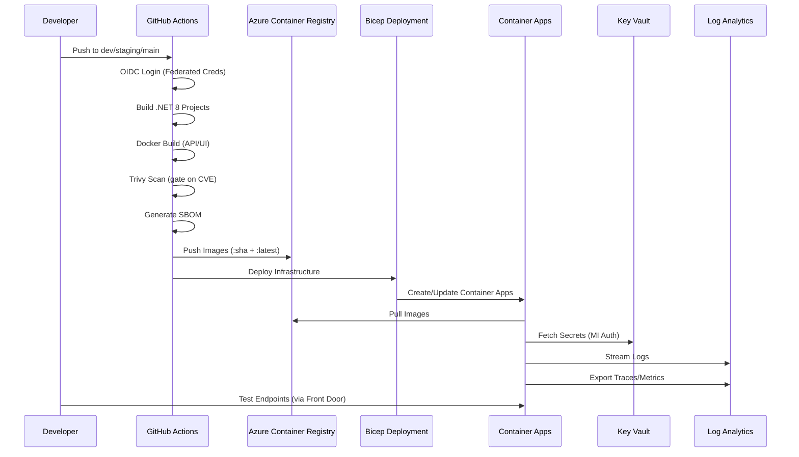

# Migration Plan: App Service to Azure Container Apps (ACA)

Generated: 2025-11-20

## Objective
Move the Order Processing System from Azure App Service (Web Apps) to Azure Container Apps (ACA) using a phased, low-risk approach that preserves CI/CD, hardens identity and observability first, then gradually introduces containers and ACA.

## Scope & Assumptions
- Subscription: 19f22d2f-1557-479b-a9b7-6dc6af67980c (Pay-As-You-Go)
- Region: centralindia
- GitHub owner prefix for global uniqueness: `<githubOwner>` (e.g., `pavanthakur`)
- CI/CD uses GitHub OIDC (no client secrets)
- Current workloads: `.NET 8` API and UI

## Current Baseline (Today)
- Compute: App Service plan + 2 Web Apps (API/UI)
- Infra as Code: Bicep (subscription-scope `infra/main.bicep`, modules for hosting, insights, identity)
- Identity: GitHub Actions OIDC → Azure; identity.bicep uses deploymentScripts (to harden)
- Observability: Application Insights; Log Analytics & diag settings pending

## Target Architecture (Future)
- Compute: Azure Container Apps (managed environment)
- Images: Azure Container Registry (ACR)
- Observability: ACA → Log Analytics (plus App Insights via OpenTelemetry if needed)
- Identity: GitHub OIDC for CI; User-Assigned Managed Identity (UAMI) for deployments/runtime where needed
- CI/CD: Build/push containers to ACR; deploy to ACA via Bicep or `azd`

Architecture diagram reference: `Documentation/04-Enterprise-Architecture/ACA-Target-Architecture.png`

### Architecture Evolution Diagram

```mermaid
graph TB
    subgraph "CURRENT STATE - App Service"
        GH1[GitHub Actions<br/>OIDC Auth]
        ASP[App Service Plan<br/>F1 SKU]
        API1[API Web App<br/>.NET 8]
        UI1[UI Web App<br/>.NET 8]
        AI1[Application Insights]
        
        GH1 -->|Deploy| API1
        GH1 -->|Deploy| UI1
        ASP --> API1
        ASP --> UI1
        API1 --> AI1
        UI1 --> AI1
    end
    
    subgraph "TARGET STATE - Azure Container Apps"
        GH2[GitHub Actions<br/>OIDC + UAMI]
        ACR[Azure Container Registry<br/>Images + SBOM]
        ACAENV[ACA Environment<br/>+ Log Analytics]
        APIACA[API Container App<br/>min/max replicas]
        UIACA[UI Container App<br/>public ingress]
        FD[Azure Front Door<br/>+ WAF]
        KV[Key Vault<br/>Secrets]
        AI2[Application Insights<br/>OpenTelemetry]
        LAW[Log Analytics<br/>Workspace]
        DEF[Defender for Cloud<br/>Security Scanning]
        
        GH2 -->|Build/Push| ACR
        GH2 -->|Deploy Bicep| ACAENV
        ACR -->|Pull Images| APIACA
        ACR -->|Pull Images| UIACA
        ACAENV --> APIACA
        ACAENV --> UIACA
        FD -->|Route| UIACA
        FD -->|Route| APIACA
        APIACA -->|Secret Ref| KV
        UIACA -->|Secret Ref| KV
        APIACA -->|Traces/Metrics| AI2
        UIACA -->|Traces/Metrics| AI2
        ACAENV -->|Logs| LAW
        AI2 -->|Export| LAW
        DEF -->|Scan| ACR
        DEF -->|Monitor| APIACA
        DEF -->|Monitor| UIACA
    end
    
    subgraph "MIGRATION PHASES"
        P0[Phase 0: Policy & Governance]
        P1[Phase 1: Baseline]
        P2[Phase 2: UAMI + Identity]
        P3[Phase 3: Observability LAW]
        P4[Phase 4: ACR]
        P5[Phase 5-6: Containerize]
        P7[Phase 7: ACA Environment]
        P8[Phase 8-9: Deploy Canary]
        P10[Phase 10: Blue/Green]
        P11[Phase 11: Decommission]
        
        P0 --> P1
        P1 --> P2
        P2 --> P3
        P3 --> P4
        P4 --> P5
        P5 --> P7
        P7 --> P8
        P8 --> P10
        P10 --> P11
    end
    
    style GH2 fill:#0078d4,color:#fff
    style ACR fill:#0078d4,color:#fff
    style ACAENV fill:#0078d4,color:#fff
    style FD fill:#ff6b35,color:#fff
    style KV fill:#ffd700,color:#000
    style DEF fill:#ff4444,color:#fff
```



### Deployment Flow (Target State)



---

## Phased Plan (High-Level)
**Phase 0:** Governance & Policy  
**Phase 1:** Confirm current baseline  
**Phase 2:** Harden identity (OIDC + UAMI)  
**Phase 3:** Observability foundations  
**Phase 3b:** Secrets & Key Vault  
**Phase 4:** Introduce ACR (no cutover)  
**Phase 4b:** Supply chain security (SBOM, scanning, signing)  
**Phase 5:** Containerize API service  
**Phase 6:** Containerize UI service  
**Phase 7:** Provision ACA environment  
**Phase 7b:** Networking & edge (Front Door/App Gateway + WAF)  
**Phase 8:** Deploy API to ACA (canary)  
**Phase 9:** Deploy UI to ACA (canary)  
**Phase 10:** Blue/green cutover plan  
**Phase 11:** Decommission App Service  
**Phase 12:** Optimize & scale  
**Phase 12b:** SRE enhancements (SLOs, workbooks, synthetic tests)  
**Phase 13:** Documentation & runbooks

Each phase has acceptance criteria and rollback steps.

---

## Phase 0 — Governance & Policy
**Establish guardrails before infrastructure provisioning**

- Azure Policy: Assign built-in initiatives for allowed regions, required tags, SKU restrictions, diagnostic settings enforcement
- Budget alerts and cost management quotas per env
- Enable Microsoft Defender for Cloud plans: Container Registries, Container Apps, Key Vault, App Services
- Tag strategy: `env`, `app`, `owner`, `cost-center`, `compliance`

Acceptance:
- Policy assignments active; deny violations in effect; budgets set; Defender enabled.

Commands:
```powershell
# Example: Assign policy initiative for required tags
az policy assignment create --name 'enforce-tags' --policy-set-definition <INITIATIVE_ID> \
  --scope /subscriptions/19f22d2f-1557-479b-a9b7-6dc6af67980c \
  --params '{"tagNames":{"value":["env","app"]}}'
# Create budget
az consumption budget create --budget-name 'dev-monthly' --amount 100 --time-grain Monthly \
  --start-date 2025-11-01 --end-date 2026-11-01 \
  --resource-group rg-orderprocessing-dev
```

Rollback:
- Remove policy assignments; retain budgets for visibility.

---

## Phase 1 — Confirm Current Baseline
- Snapshot resource names, regions, app settings, and secrets
- Ensure Infra (Bicep) reflects actual state (what-if clean)

Acceptance:
- A documented inventory and successful `what-if` shows no drift.

Commands (PowerShell):
```powershell
az account show -o table
az group show -n rg-orderprocessing-dev -o table
az deployment sub what-if --location centralindia --template-file infra/main.bicep --parameters @infra/parameters/dev.json
```

Rollback: N/A

---

## Phase 2 — Harden Identity (OIDC + UAMI)
- Create UAMI for infra deployments and/or runtime as needed
- Grant least-privileged Azure RBAC on target RG(s)
- Update `infra/modules/identity.bicep` to use UAMI (remove tenant-level privileges from scripts)

Acceptance:
- Bicep deployments succeed using UAMI; no client secrets in CI.

Commands:
```powershell
# Create UAMI
az identity create -g rg-orderprocessing-dev -n uami-ops-deploy --location centralindia
# Assign roles (example: Contributor on RG)
az role assignment create --assignee-object-id <UAMI_PRINCIPAL_ID> --role Contributor --scope \
  /subscriptions/19f22d2f-1557-479b-a9b7-6dc6af67980c/resourceGroups/rg-orderprocessing-dev
```

Rollback:
- Remove UAMI and role assignments; restore previous CI identity.

---

## Phase 3 — Observability Foundations
- Create Log Analytics Workspace (LAW) per env or shared
- Add Diagnostic Settings from App Service/Plan + App Insights → LAW
- Create Action Group and basic metric/log alerts

Acceptance:
- Logs/metrics visible in LAW; alerts fire on synthetic thresholds.

Commands:
```powershell
# LAW
az monitor log-analytics workspace create -g rg-orderprocessing-dev -n law-orderprocessing-dev -l centralindia
# Diagnostic settings examples
az monitor diagnostic-settings create --name ds-appsvc --resource <APP_SERVICE_ID> \
  --workspace <LAW_ID> --logs '[{"category":"AppServiceHTTPLogs","enabled":true}]' \
  --metrics '[{"category":"AllMetrics","enabled":true}]'
```

Rollback:
- Remove diagnostic settings and alerts; keep App Insights active.

---

## Phase 3b — Secrets & Key Vault
**Centralize secrets management**

- Provision Azure Key Vault per env (or shared with RBAC)
- Store connection strings, API keys, certificates
- Update ACA to use Key Vault secret references (no inline secrets)
- Grant ACA managed identity `Key Vault Secrets User` role

Acceptance:
- Secrets stored in KV; ACA references KV; no plaintext secrets in Bicep/CI.

Commands:
```powershell
# Create Key Vault
az keyvault create -g rg-orderprocessing-dev -n kv-ops-dev-<unique> -l centralindia --enable-rbac-authorization
# Add secret
az keyvault secret set --vault-name kv-ops-dev-<unique> --name 'ApiKey' --value '<secret>'
# Grant MI access
az role assignment create --assignee <MI_PRINCIPAL_ID> --role 'Key Vault Secrets User' \
  --scope /subscriptions/19f22d2f-1557-479b-a9b7-6dc6af67980c/resourceGroups/rg-orderprocessing-dev/providers/Microsoft.KeyVault/vaults/kv-ops-dev-<unique>
```

Rollback:
- Revert ACA to inline secrets temporarily; delete KV after stable cutover.

---

## Phase 4 — Introduce ACR (No Cutover)
- Provision ACR via Bicep
- Update CI to login via OIDC and push test images

Acceptance:
- Successful push of a dummy `hello-world` or API image to ACR on dev branch.

Commands:
```powershell
# Bicep deploy ACR (example sub-scope)
az deployment sub create --location centralindia --template-file infra/main.bicep --parameters @infra/parameters/dev.json
# Login to ACR in CI (OIDC)
az acr login --name <acrName>
```

Rollback:
- Delete ACR; remove CI steps.

---

## Phase 4b — Supply Chain Security
**Harden container build and artifact integrity**

- Generate SBOM (Syft or Docker BuildKit SBOM)
- Scan images for vulnerabilities (Trivy, Microsoft Defender for Containers)
- Sign images (Notary v2 or Azure Container Registry content trust)
- Gate CI on critical CVEs; publish SBOM to artifact registry

Acceptance:
- SBOM generated and attached; images scanned; critical CVEs blocked; signed images in ACR.

Commands:
```powershell
# Install Trivy
choco install trivy
# Scan image
trivy image --severity HIGH,CRITICAL <acr>.azurecr.io/orderprocessing-api:dev
# Generate SBOM (Syft)
syft <acr>.azurecr.io/orderprocessing-api:dev -o spdx-json > sbom.json
# Sign image (example with notation CLI)
notation sign <acr>.azurecr.io/orderprocessing-api:dev --key <key>
```

CI integration:
- Add Trivy scan step before push
- Fail build if HIGH/CRITICAL vulnerabilities found
- Upload SBOM as GitHub artifact

Rollback:
- Disable scan gates temporarily; manual vulnerability reviews.

---

## Phase 5 — Containerize API Service
- Add multi-stage Dockerfile under `XYDataLabs.OrderProcessingSystem.API/`
- Build locally; run; push to ACR via CI

Acceptance:
- Image builds; container starts; health probe responds.

Local test:
```powershell
docker build -t <acr>.azurecr.io/orderprocessing-api:dev -f XYDataLabs.OrderProcessingSystem.API/Dockerfile .
docker run -p 8080:8080 <acr>.azurecr.io/orderprocessing-api:dev
```

Rollback:
- Revert Dockerfile and CI steps.

---

## Phase 6 — Containerize UI Service
- Add multi-stage Dockerfile under `XYDataLabs.OrderProcessingSystem.UI/`
- Build locally; verify static/site hosting strategy

Acceptance:
- Image builds; renders basic UI; API URL configurable via env.

Rollback:
- Revert Dockerfile and CI steps.

---

## Phase 7 — Provision ACA Environment
- Add Bicep modules for ACA Managed Environment
- Parameterize LAW and environment names per env

Acceptance:
- `Microsoft.App/managedEnvironments` available; logs wired to LAW.

Commands:
```powershell
az deployment sub create --location centralindia --template-file infra/main.bicep --parameters @infra/parameters/dev-aca.json
```

Rollback:
- Delete ACA environment resources; retain LAW.

---

## Phase 7b — Networking & Edge
**Secure ingress with WAF and custom domains**

- Provision Azure Front Door or Application Gateway
- Configure WAF policies (OWASP rules, rate limiting)
- Add custom domain and TLS certificate from Key Vault
- Route traffic: Front Door → ACA (internal or public ingress)

Acceptance:
- Traffic flows through WAF; HTTPS enforced; custom domain resolves; WAF blocks test attacks.

Commands:
```powershell
# Create Front Door (example)
az afd profile create -g rg-orderprocessing-dev --profile-name afd-ops-dev --sku Premium_AzureFrontDoor
# Add origin (ACA endpoint)
az afd origin create --profile-name afd-ops-dev --origin-group-name og-aca \
  --origin-name aca-api --host-name <aca-api-hostname> --enabled-state Enabled
# Add custom domain
az afd custom-domain create --profile-name afd-ops-dev --custom-domain-name api-ops \
  --host-name api.orderprocessing.com --certificate-type ManagedCertificate
```

Rollback:
- Remove Front Door; expose ACA ingress directly (non-prod only).

---

## Phase 8 — Deploy API to ACA (Canary)
- Create Container App for API pointing to ACR image (ingress off or limited)
- Set minReplicas=0→1; verify health, logs, and feature parity

Acceptance:
- API reachable internally; smoke tests pass; CPU/RAM baseline OK.

Rollback:
- Scale to 0; keep App Service as primary.

---

## Phase 9 — Deploy UI to ACA (Canary)
- Create Container App for UI with public ingress
- Configure API base URL via env vars; validate end-to-end

Acceptance:
- UI accessible; calls API on ACA; basic flows OK.

Rollback:
- Disable UI ingress on ACA; restore App Service UI.

---

## Phase 10 — Blue/Green Cutover
- Enable/adjust ingress; shift traffic gradually (e.g., by DNS/front door)
- Monitor errors and latency; be ready to revert

Acceptance:
- Stable traffic on ACA for ≥72 hours under normal load.

Rollback:
- Switch DNS back; scale App Service up.

---

## Phase 11 — Decommission App Service
- After stability window, remove App Service resources
- Keep IaC definition archived for rollback window timeframe

Acceptance:
- No residual dependencies on App Service.

Rollback:
- Re-deploy App Service from archived IaC if needed.

---

## Phase 12 — Optimize & Scale
- Tune autoscaling (KEDA), CPU/memory limits
- Add resource quota guards and cost budgets

Acceptance:
- Predictable scaling and cost profiles.

---

## Phase 12b — SRE Enhancements
**Measure reliability and respond proactively**

- Define SLOs/SLIs (e.g., API p95 latency <200ms; 99.9% availability)
- Create Azure Monitor workbooks for dashboards (request rate, error rate, latency, cost)
- Add availability tests (synthetic HTTP checks every 5 min from multiple regions)
- Incident/rollback runbooks; on-call rotation; blameless postmortems

Acceptance:
- SLOs documented and tracked; workbooks live; synthetic tests alerting; runbooks published.

Commands:
```powershell
# Create availability test (Application Insights)
az monitor app-insights web-test create --resource-group rg-orderprocessing-dev \
  --app-insights ai-orderprocessing-dev --name 'api-health-check' \
  --location centralindia --kind ping --web-test-kind ping \
  --url https://api.orderprocessing.com/health --frequency 300 --timeout 30
```

Rollback:
- Disable synthetic tests; rely on reactive monitoring.

---

## Phase 13 — Documentation & Runbooks
- Update architecture diagrams and READMEs
- Add ops runbooks: release, rollback, incident, cost, DR

Acceptance:
- Docs published in `Documentation/` and referenced from repo root README.

---

## CI/CD Notes (GitHub Actions)
- Prefer OIDC with `azure/login@v2`
- Steps:
  1. Checkout; setup .NET
  2. Login to Azure (OIDC)
  3. Login to ACR; build/push images (`api`, `ui`)
  4. Deploy via Bicep with image tag parameters (or `azd` if desired)
- Replace any client secret workflows from starter with OIDC.

---

## File/Module Plan
- Infra modules to add:
  - `infra/modules/acr.bicep`
  - `infra/modules/aca/managedEnvironment.bicep`
  - `infra/modules/aca/containerApp.bicep`
- Parameters:
  - `infra/parameters/dev-aca.json`, `staging-aca.json`, `prod-aca.json`
- App Dockerfiles:
  - `XYDataLabs.OrderProcessingSystem.API/Dockerfile`
  - `XYDataLabs.OrderProcessingSystem.UI/Dockerfile`
- Workflows:
  - `.github/workflows/app-build-deploy-aca.yml`

---

## Risks & Mitigations
- Cold start and scaling behavior: validate KEDA settings; keep min replicas during peak
- Networking and egress: review SNAT/egress limits; consider VNET integration if needed
- Secrets management: use Key Vault references; avoid inline secrets
- Cost: monitor ACR/ACA/LAW costs; set budgets

## Acceptance Summary
- Each phase has explicit acceptance tests and rollback
- Final success: ACA serves production traffic, App Service removed, observability/identity strengthened, CI/CD fully OIDC and container-native
