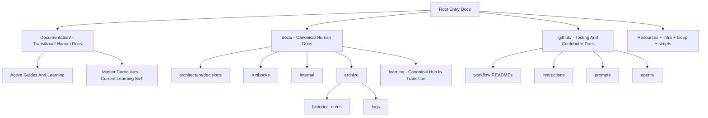
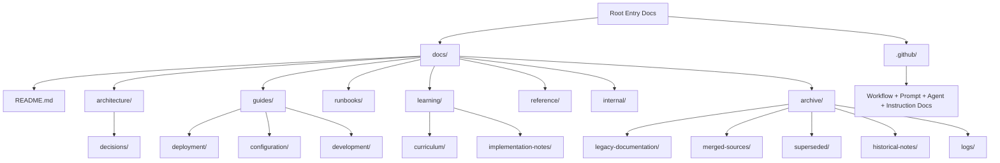

# Documentation Audit And Rationalization Baseline

Date: 2026-04-04

## Purpose

This document is the baseline audit for the repository documentation rationalization effort.

It serves four purposes:

1. Inventory the project markdown documents that existed before this implementation batch.
2. Define the enterprise-standard target hierarchy.
3. Recommend canonical placement or archive handling for each document.
4. Record the first implemented archive-normalization changes without deleting content.

Important scope note:

- The baseline inventory below covers the 114 markdown files that existed before the governance artifacts created by this implementation batch.
- The governance artifacts added by this batch are tracked in `docs/archive/logs/documentation-rationalization-summary.md`.

## Executive Summary

The repository originally contained 114 markdown files spread across root, `.github/`, `Documentation/`, `docs/`, `Resources/`, `infra/`, `bicep/`, `scripts/`, and one third-party library location.

The main structural issues were:

1. Human-facing documentation was split between `Documentation/` and `docs/`.
2. Historical archive content existed in multiple places.
3. `.github/` tooling and workflow guidance was mixed conceptually with human-facing project documentation.
4. Learning documentation was authoritative but lived outside the intended long-term canonical tree.

This implementation batch establishes the following direction:

1. `docs/` is the canonical human-facing documentation tree.
2. `.github/` remains the canonical tooling and contributor guidance tree.
3. `Documentation/` is transitional.
4. The authoritative learning source now lives in `docs/learning/curriculum/1_MASTER_CURRICULUM.md`.
5. Retired or merged documents are archived, not deleted.

Implemented in this batch:

- Created canonical archive structure under `docs/archive/`.
- Moved 23 already-archived historical markdown files into canonical archive locations.
- Created canonical documentation hub and archive index.
- Created a summary log for all implemented actions.

Implemented in the second batch:

- Created canonical `docs/guides/` and `docs/reference/` subtree hubs.
- Created the canonical `docs/learning/README.md` hub while preserving the current curriculum source in `Documentation/`.
- Promoted the first active guide and reference set into canonical `docs/` locations by copy-first migration.

Implemented in the third batch:

- Expanded the canonical deployment subtree with additional Azure navigation and bootstrap-flow guides.
- Expanded the canonical configuration subtree with Application Insights and GitHub App setup/authentication guidance.
- Kept all transitional source documents in `Documentation/` unchanged while promoting canonical copies.

Implemented in the fourth batch:

- Expanded the canonical deployment subtree with supporting deployment, infrastructure, and migration guides.
- Expanded the canonical development subtree with the Visual Studio Docker profiles guide.
- Continued copy-first promotion from both transitional documentation folders and supporting technical doc locations.

Implemented in the fifth batch:

- Expanded the canonical development subtree with the scripts inventory guide.
- Expanded the canonical configuration subtree with security and Key Vault setup support docs.
- Expanded the canonical deployment and reference subtrees with the remaining obvious low-risk supporting technical references.

Implemented in the sixth batch:

- Activated the canonical `docs/learning/curriculum/`, `docs/learning/implementation-notes/`, and `docs/learning/reference/` subtree indexes.
- Promoted the Azure curriculum navigation guide and implementation notes into canonical learning destinations by copy-first migration.
- Promoted the ACA/Aspire containerization learning path into a canonical learning-reference destination while preserving the source file in `Documentation/`.

Implemented in the seventh batch:

- Archived the stale weekly learning plan as a historical learning-planning artifact.
- Promoted the active Azure bootstrap improvements backlog into the canonical `docs/internal/` subtree.
- Added a canonical internal hub and updated transitional documentation references to the new governance state.

Implemented in the eighth batch:

- Archived the retired transitional self-learning hub now that `docs/learning/README.md` fully covers its active navigation role.
- Updated the canonical learning hub and governance records to reflect that only the broader `Documentation/README.md` hub remains transitional.

Implemented in the ninth batch:

- Redirected the remaining inbound references from the transitional documentation hub to `docs/README.md`.
- Archived `Documentation/README.md` after validation confirmed that only audit/history mentions remained.
- Left the `Documentation/` subtree itself in place for remaining document-by-document rationalization work.

Implemented in the tenth batch:

- Redirected the canonical quick reference, transitional quick reference, curriculum instructions, and day-complete prompt to the canonical `docs/reference/` command deep dives.
- Archived the four legacy `Documentation/commands/*.md` files after confirming only audit history still referenced the old paths.
- Preserved the canonical command references in `docs/reference/` as the single active destination for hands-on command guidance.

Implemented in the eleventh batch:

- Redirected root docs, workflow docs, script guides, and deployment guides from `Documentation/03-Configuration-Guides/` to the canonical `docs/guides/configuration/` subtree.
- Repaired additional live broken links that still referenced missing bootstrap-summary and automation-guide filenames by routing them to real canonical deployment or workflow documentation.
- Archived the five legacy `Documentation/03-Configuration-Guides/*.md` source files after validation confirmed only audit history and archived notes still referenced the old paths.

Implemented in the twelfth batch:

- Archived `Documentation/01-Project-Overview/README.md` after confirming the canonical development guide had no remaining live inbound references to the legacy source path.
- Updated the canonical development-guides hub to reflect that source retirement now proceeds family by family instead of leaving all original files in place.

Implemented in the thirteenth batch:

- Redirected workflow and repository-context references from the transitional quick-reference docs to `docs/reference/quick-command-reference.md` and `docs/reference/operations-quick-links.md`.
- Archived the two legacy quick-reference hub files after confirming only audit history still referenced the old source paths.
- Updated the canonical reference hub to reflect that quick-reference source retirement now proceeds family by family.

Implemented in the fourteenth batch:

- Redirected root docs, workflow docs, troubleshooting guidance, and repository context from `Documentation/QUICK-START-AZURE-BOOTSTRAP.md` to the canonical deployment guides.
- Archived `Documentation/QUICK-START-AZURE-BOOTSTRAP.md` after confirming only audit history still referenced the old source path.
- Updated the canonical deployment hub to reflect that deployment-guide source retirement now proceeds incrementally.

Implemented in the fifteenth batch:

- Established `docs/guides/deployment/workflow-separation-architecture.md` as the canonical home for the workflow-separation rationale document.
- Redirected live workflow and repository-context references to the new canonical deployment-guide path.
- Archived `Documentation/GITHUB-WORKFLOW-SEPARATION-ARCHITECTURE.md` after promoting its content into the canonical deployment subtree.

Implemented in the sixteenth batch:

- Redirected the remaining bootstrap-flow and App Insights references in the deployment guide family to canonical docs under `docs/guides/deployment/` and `docs/guides/configuration/`.
- Archived `Documentation/02-Azure-Learning-Guides/AZURE_README.md`, `BOOTSTRAP_SCRIPT_FLOW.md`, and `APP_INSIGHTS_AUTOMATED_SETUP.md` after confirming only audit history still referenced those exact source paths.
- Reduced the remaining `Documentation/02-Azure-Learning-Guides/` surface to the higher-dependency deployment, Docker, and learning-path sources.

Implemented in the seventeenth batch:

- Redirected remaining live Docker and containerization references in the development guides, curriculum source of truth, and internal progress tracker to canonical docs.
- Archived `Documentation/02-Azure-Learning-Guides/DOCKER_COMPREHENSIVE_GUIDE.md`, `VISUAL_STUDIO_DOCKER_PROFILES.md`, and `Containerization-ACA-Aspire-Learning-Path.md` after confirming only audit history and archived notes still referenced those exact source paths.
- Reduced the remaining `Documentation/02-Azure-Learning-Guides/` surface to the higher-dependency `AZURE_DEPLOYMENT_GUIDE.md` source.

Implemented in the eighteenth batch:

- Redirected the last live references from `Documentation/02-Azure-Learning-Guides/AZURE_DEPLOYMENT_GUIDE.md` to the canonical deployment guide and repaired stale internal references inside the canonical deployment-guide family.
- Archived `Documentation/02-Azure-Learning-Guides/AZURE_DEPLOYMENT_GUIDE.md` after confirming only audit history still referenced the source path.
- Reduced the `Documentation/02-Azure-Learning-Guides/` subtree to the isolated `SKU_UPGRADE_SLOT_TESTING.md` source.

Implemented in the nineteenth batch:

- Archived `Documentation/02-Azure-Learning-Guides/SKU_UPGRADE_SLOT_TESTING.md` after confirming only audit history still referenced the source path.
- Fully completed the rationalization of the `Documentation/02-Azure-Learning-Guides/` subtree.

Implemented in the twentieth batch:

- Archived `Documentation/04-Enterprise-Architecture/TODO-AZURE-BOOTSTRAP-IMPROVEMENTS.md` after confirming the canonical internal backlog was already active.
- Updated the solution documentation items to remove stale weekly-plan/source-path entries and surface the canonical internal backlog instead.

Implemented in the twenty-first batch:

- Archived `Documentation/04-Enterprise-Architecture/ACA-Migration-Plan.md` after redirecting its remaining live references to the canonical deployment guide.
- Updated the solution documentation items to remove the stale ACA migration plan source entry from the remaining `Documentation/04-Enterprise-Architecture/` solution folder.

Implemented in the twenty-second batch:

- Archived `Documentation/05-Self-Learning/Azure-Curriculum/README.md` after redirecting its remaining live reference to the canonical curriculum navigation guide.
- Updated the solution documentation items to remove the stale curriculum navigation source entry from the remaining `Documentation/05-Self-Learning/Azure-Curriculum/` solution folder.

Implemented in the twenty-third batch:

- Archived `Documentation/05-Self-Learning/Azure-Curriculum/IMPLEMENTATION_NOTES.md` after redirecting its remaining live references to the canonical implementation-notes location.
- Updated the solution documentation items to remove the stale implementation-notes source entry from the remaining `Documentation/05-Self-Learning/Azure-Curriculum/` solution folder.

Implemented in the twenty-fourth batch:

- Archived `.github/workflows/README-AZURE-BOOTSTRAP-SETUP.md` after redirecting its remaining live repository-context reference to the active bootstrap workflow guide.
- Updated the solution documentation items to remove the stale superseded workflow README from the `.github/workflows` solution folder.

Implemented in the twenty-fifth batch:

- Moved `Documentation/04-Enterprise-Architecture/ACA-Target-Architecture.png` into the canonical deployment-assets location at `docs/guides/deployment/assets/ACA-Target-Architecture.png`.
- Updated the active and archived ACA migration plan guides to reference the normalized asset path and removed the stale `Documentation/04-Enterprise-Architecture` solution item.

## Current-State Landscape

## Target-State Canonical Hierarchy

## Baseline Inventory Summary

| Area | Baseline Count | Status After This Batch | Notes |
|------|----------------|-------------------------|-------|
| Root markdown docs | 4 | Unchanged | Core entry docs retained |
| `.github/` | 31 | Unchanged | Tooling/contributor documentation |
| `Documentation/` | 49 | 30 active docs remain in place | 19 historical docs normalized into canonical archive |
| `docs/` | 21 | 40 pre-governance docs after archive normalization | 23 historical docs moved here from prior archive locations |
| `Resources/` | 4 | Unchanged | Supporting technical docs |
| `infra/` + `bicep/` + `scripts/` | 4 | Unchanged | Inline technical docs |
| Third-party markdown | 1 | Unchanged | Excluded from rationalization actions |
| **Baseline total** | **114** | **114 baseline docs preserved** | No markdown file was deleted |

## Document Inventory

Action vocabulary used in the tables below:

- `Keep` — retain in current canonical area
- `Copy-to-Canonical` — future move by copy into canonical subtree while keeping source during transition
- `Merge-into-Canonical` — merge content into canonical document, then archive source
- `Archive-Move` — move into archive tree without deletion
- `Consolidate-by-Reference` — keep one authoritative source and reduce the other to reference/archive handling later
- `Exclude` — not subject to rationalization action

### Root Entry Documents

| Index | Document | Path | Classification | Purpose | Recommended Action | Canonical Destination | Archive Destination | Notes |
|------|----------|------|----------------|---------|--------------------|----------------------|--------------------|-------|
| ROOT-01 | README.md | `README.md` | Core project entry document | Primary repository entry point | Keep | `README.md` | N/A | Core root doc |
| ROOT-02 | ARCHITECTURE.md | `ARCHITECTURE.md` | Core project entry document | Binding architecture constraints and rules | Keep | `ARCHITECTURE.md` | N/A | Core root doc |
| ROOT-03 | ARCHITECTURE-EVOLUTION.md | `ARCHITECTURE-EVOLUTION.md` | Core project entry document | Architecture roadmap and evolution phases | Keep | `ARCHITECTURE-EVOLUTION.md` | N/A | Core root doc |
| ROOT-04 | TROUBLESHOOTING-INDEX.md | `TROUBLESHOOTING-INDEX.md` | Core project entry document | Troubleshooting navigation hub | Keep | `TROUBLESHOOTING-INDEX.md` | N/A | Core root doc |

### `.github/` Tooling And Contributor Documents

#### `.github/workflows/`

| Index | Document | Path | Classification | Purpose | Recommended Action | Canonical Destination | Archive Destination | Notes |
|------|----------|------|----------------|---------|--------------------|----------------------|--------------------|-------|
| GH-WF-01 | README.md | `.github/workflows/README.md` | Repo tooling / workflow / AI enablement | Workflow overview hub | Keep | `.github/workflows/README.md` | N/A | Tooling doc |
| GH-WF-02 | README-AZURE-INITIAL-SETUP.md | `.github/workflows/README-AZURE-INITIAL-SETUP.md` | Repo tooling / workflow / AI enablement | One-time setup workflow guide | Keep | `.github/workflows/README-AZURE-INITIAL-SETUP.md` | N/A | Active tooling doc |
| GH-WF-03 | README-AZURE-BOOTSTRAP.md | `.github/workflows/README-AZURE-BOOTSTRAP.md` | Repo tooling / workflow / AI enablement | Bootstrap and deploy workflow guide | Keep | `.github/workflows/README-AZURE-BOOTSTRAP.md` | N/A | Active tooling doc |
| GH-WF-04 | README-AZURE-BOOTSTRAP-SETUP.md | `.github/workflows/README-AZURE-BOOTSTRAP-SETUP.md` | Repo tooling / workflow / AI enablement | Superseded bootstrap setup guide | Archive-Move | `.github/workflows/README-AZURE-BOOTSTRAP.md` | `docs/archive/superseded/README-AZURE-BOOTSTRAP-SETUP.md` | Tooling-phase cleanup completed |
| GH-WF-05 | README-INFRA-DEPLOY.md | `.github/workflows/README-INFRA-DEPLOY.md` | Repo tooling / workflow / AI enablement | Infra deploy workflow guide | Keep | `.github/workflows/README-INFRA-DEPLOY.md` | N/A | Tooling doc |
| GH-WF-06 | README-VALIDATE-DEPLOYMENT.md | `.github/workflows/README-VALIDATE-DEPLOYMENT.md` | Repo tooling / workflow / AI enablement | Validation workflow guide | Keep | `.github/workflows/README-VALIDATE-DEPLOYMENT.md` | N/A | Tooling doc |
| GH-WF-07 | README-CONFIGURE-GITHUB-SECRETS.md | `.github/workflows/README-CONFIGURE-GITHUB-SECRETS.md` | Repo tooling / workflow / AI enablement | Secret configuration workflow guide | Keep | `.github/workflows/README-CONFIGURE-GITHUB-SECRETS.md` | N/A | Tooling doc |
| GH-WF-08 | README-TEST-VALIDATE-DEPLOYMENT.md | `.github/workflows/README-TEST-VALIDATE-DEPLOYMENT.md` | Repo tooling / workflow / AI enablement | Test validation workflow guide | Keep | `.github/workflows/README-TEST-VALIDATE-DEPLOYMENT.md` | N/A | Tooling doc |
| GH-WF-09 | README-VALIDATE-ADRS.md | `.github/workflows/README-VALIDATE-ADRS.md` | Repo tooling / workflow / AI enablement | ADR validation workflow guide | Keep | `.github/workflows/README-VALIDATE-ADRS.md` | N/A | Tooling doc |
| GH-WF-10 | QUICK-START-TEST-VALIDATION.md | `.github/workflows/QUICK-START-TEST-VALIDATION.md` | Repo tooling / workflow / AI enablement | Quick-start workflow test guide | Keep | `.github/workflows/QUICK-START-TEST-VALIDATION.md` | N/A | Tooling doc |

#### `.github/instructions/`

| Index | Document | Path | Classification | Purpose | Recommended Action | Canonical Destination | Archive Destination | Notes |
|------|----------|------|----------------|---------|--------------------|----------------------|--------------------|-------|
| GH-IN-01 | architecture.instructions.md | `.github/instructions/architecture.instructions.md` | Repo tooling / workflow / AI enablement | ADR authoring rules | Keep | `.github/instructions/architecture.instructions.md` | N/A | Tooling doc |
| GH-IN-02 | azure-workflows.instructions.md | `.github/instructions/azure-workflows.instructions.md` | Repo tooling / workflow / AI enablement | Workflow editing rules | Keep | `.github/instructions/azure-workflows.instructions.md` | N/A | Tooling doc |
| GH-IN-03 | bicep.instructions.md | `.github/instructions/bicep.instructions.md` | Repo tooling / workflow / AI enablement | Bicep editing rules | Keep | `.github/instructions/bicep.instructions.md` | N/A | Tooling doc |
| GH-IN-04 | clean-architecture.instructions.md | `.github/instructions/clean-architecture.instructions.md` | Repo tooling / workflow / AI enablement | Clean architecture coding rules | Keep | `.github/instructions/clean-architecture.instructions.md` | N/A | Tooling doc |
| GH-IN-05 | curriculum.instructions.md | `.github/instructions/curriculum.instructions.md` | Repo tooling / workflow / AI enablement | Curriculum documentation rules | Keep | `.github/instructions/curriculum.instructions.md` | N/A | Tooling doc |
| GH-IN-06 | ef-migrations.instructions.md | `.github/instructions/ef-migrations.instructions.md` | Repo tooling / workflow / AI enablement | EF migration editing rules | Keep | `.github/instructions/ef-migrations.instructions.md` | N/A | Tooling doc |
| GH-IN-07 | multitenant-payment-schema.instructions.md | `.github/instructions/multitenant-payment-schema.instructions.md` | Repo tooling / workflow / AI enablement | Multitenant and payment schema rules | Keep | `.github/instructions/multitenant-payment-schema.instructions.md` | N/A | Tooling doc |

#### `.github/agents/`, `.github/prompts/`, and Copilot hub

| Index | Document | Path | Classification | Purpose | Recommended Action | Canonical Destination | Archive Destination | Notes |
|------|----------|------|----------------|---------|--------------------|----------------------|--------------------|-------|
| GH-AI-01 | copilot-instructions.md | `.github/copilot-instructions.md` | Repo tooling / workflow / AI enablement | Repository operating context for Copilot | Keep | `.github/copilot-instructions.md` | N/A | Canonical tooling hub |
| GH-AI-02 | azure-devops.agent.md | `.github/agents/azure-devops.agent.md` | Repo tooling / workflow / AI enablement | Azure DevOps specialist agent | Keep | `.github/agents/azure-devops.agent.md` | N/A | Tooling doc |
| GH-AI-03 | code-reviewer.agent.md | `.github/agents/code-reviewer.agent.md` | Repo tooling / workflow / AI enablement | Code review specialist agent | Keep | `.github/agents/code-reviewer.agent.md` | N/A | Tooling doc |
| GH-AI-04 | cqrs-backend.agent.md | `.github/agents/cqrs-backend.agent.md` | Repo tooling / workflow / AI enablement | CQRS backend specialist agent | Keep | `.github/agents/cqrs-backend.agent.md` | N/A | Tooling doc |
| GH-AI-05 | README.md | `.github/prompts/README.md` | Repo tooling / workflow / AI enablement | Prompt catalog hub | Keep | `.github/prompts/README.md` | N/A | Tooling doc |
| GH-AI-06 | XYDataLabs-day-complete.prompt.md | `.github/prompts/XYDataLabs-day-complete.prompt.md` | Repo tooling / workflow / AI enablement | End-of-day routing prompt | Keep | `.github/prompts/XYDataLabs-day-complete.prompt.md` | N/A | Tooling doc |
| GH-AI-07 | XYDataLabs-context-audit.prompt.md | `.github/prompts/XYDataLabs-context-audit.prompt.md` | Repo tooling / workflow / AI enablement | Context audit prompt | Keep | `.github/prompts/XYDataLabs-context-audit.prompt.md` | N/A | Tooling doc |
| GH-AI-08 | XYDataLabs-completion-check.prompt.md | `.github/prompts/XYDataLabs-completion-check.prompt.md` | Repo tooling / workflow / AI enablement | Completion gate prompt | Keep | `.github/prompts/XYDataLabs-completion-check.prompt.md` | N/A | Tooling doc |
| GH-AI-09 | XYDataLabs-new-feature.prompt.md | `.github/prompts/XYDataLabs-new-feature.prompt.md` | Repo tooling / workflow / AI enablement | New feature workflow prompt | Keep | `.github/prompts/XYDataLabs-new-feature.prompt.md` | N/A | Tooling doc |
| GH-AI-10 | XYDataLabs-docker-start.prompt.md | `.github/prompts/XYDataLabs-docker-start.prompt.md` | Repo tooling / workflow / AI enablement | Docker startup helper prompt | Keep | `.github/prompts/XYDataLabs-docker-start.prompt.md` | N/A | Tooling doc |
| GH-AI-11 | XYDataLabs-setup-local.prompt.md | `.github/prompts/XYDataLabs-setup-local.prompt.md` | Repo tooling / workflow / AI enablement | Local setup orchestrator prompt | Keep | `.github/prompts/XYDataLabs-setup-local.prompt.md` | N/A | Tooling doc |
| GH-AI-12 | XYDataLabs-sql-local-access.prompt.md | `.github/prompts/XYDataLabs-sql-local-access.prompt.md` | Repo tooling / workflow / AI enablement | SQL local access prompt | Keep | `.github/prompts/XYDataLabs-sql-local-access.prompt.md` | N/A | Tooling doc |
| GH-AI-13 | XYDataLabs-validate-adrs.prompt.md | `.github/prompts/XYDataLabs-validate-adrs.prompt.md` | Repo tooling / workflow / AI enablement | ADR validation prompt | Keep | `.github/prompts/XYDataLabs-validate-adrs.prompt.md` | N/A | Tooling doc |
| GH-AI-14 | XYDataLabs-verify-db-logs.prompt.md | `.github/prompts/XYDataLabs-verify-db-logs.prompt.md` | Repo tooling / workflow / AI enablement | DB and log verification prompt | Keep | `.github/prompts/XYDataLabs-verify-db-logs.prompt.md` | N/A | Tooling doc |

### `Documentation/` Transitional Human-Facing Documents

| Index | Document | Path | Classification | Purpose | Recommended Action | Canonical Destination | Archive Destination | Notes |
|------|----------|------|----------------|---------|--------------------|----------------------|--------------------|-------|
| DOC-01 | README.md | `Documentation/README.md` | Human-facing guide/reference | Current documentation hub | Consolidate-by-Reference | `docs/README.md` | `docs/archive/legacy-documentation/README.md` | Archive copy preserved; legacy path now retained as a redirect stub |
| DOC-02 | QUICK-START-AZURE-BOOTSTRAP.md | `Documentation/QUICK-START-AZURE-BOOTSTRAP.md` | Human-facing guide/reference | Quick bootstrap guide | Consolidate-by-Reference | `docs/guides/deployment/quick-start-azure-bootstrap.md` | `docs/archive/legacy-documentation/QUICK-START-AZURE-BOOTSTRAP.md` | Archive copy preserved; legacy path now retained as a redirect stub |
| DOC-03 | QUICK-COMMAND-REFERENCE.md | `Documentation/QUICK-COMMAND-REFERENCE.md` | Human-facing guide/reference | Consolidated command reference | Archive-Move | `docs/reference/quick-command-reference.md` | `docs/archive/legacy-documentation/QUICK-COMMAND-REFERENCE.md` | Canonical reference already established |
| DOC-04 | Operations-Quick-Links-README.md | `Documentation/Operations-Quick-Links-README.md` | Human-facing guide/reference | Operations quick links hub | Archive-Move | `docs/reference/operations-quick-links.md` | `docs/archive/legacy-documentation/Operations-Quick-Links-README.md` | Canonical reference already established |
| DOC-05 | GITHUB-WORKFLOW-SEPARATION-ARCHITECTURE.md | `Documentation/GITHUB-WORKFLOW-SEPARATION-ARCHITECTURE.md` | Human-facing guide/reference | Workflow separation rationale | Archive-Move | `docs/guides/deployment/workflow-separation-architecture.md` | `docs/archive/legacy-documentation/GITHUB-WORKFLOW-SEPARATION-ARCHITECTURE.md` | Canonical guide established in this batch |
| DOC-06 | README.md | `Documentation/01-Project-Overview/README.md` | Human-facing guide/reference | Project overview and first-time setup | Archive-Move | `docs/guides/development/project-overview.md` | `docs/archive/legacy-documentation/project-overview.md` | Canonical guide already established |
| DOC-07 | AZURE_README.md | `Documentation/02-Azure-Learning-Guides/AZURE_README.md` | Human-facing guide/reference | Azure guide navigation hub | Archive-Move | `docs/guides/deployment/azure-guides-overview.md` | `docs/archive/legacy-documentation/AZURE_README.md` | Canonical guide already established |
| DOC-08 | AZURE_DEPLOYMENT_GUIDE.md | `Documentation/02-Azure-Learning-Guides/AZURE_DEPLOYMENT_GUIDE.md` | Human-facing guide/reference | Primary Azure deployment guide | Archive-Move | `docs/guides/deployment/azure-deployment-guide.md` | `docs/archive/legacy-documentation/AZURE_DEPLOYMENT_GUIDE.md` | Canonical guide already established |
| DOC-09 | BOOTSTRAP_SCRIPT_FLOW.md | `Documentation/02-Azure-Learning-Guides/BOOTSTRAP_SCRIPT_FLOW.md` | Human-facing guide/reference | Bootstrap script flow walkthrough | Archive-Move | `docs/guides/deployment/bootstrap-script-flow.md` | `docs/archive/legacy-documentation/BOOTSTRAP_SCRIPT_FLOW.md` | Canonical guide already established |
| DOC-10 | APP_INSIGHTS_AUTOMATED_SETUP.md | `Documentation/02-Azure-Learning-Guides/APP_INSIGHTS_AUTOMATED_SETUP.md` | Human-facing guide/reference | Application Insights setup guide | Archive-Move | `docs/guides/configuration/app-insights-automated-setup.md` | `docs/archive/legacy-documentation/APP_INSIGHTS_AUTOMATED_SETUP.md` | Canonical guide already established |
| DOC-11 | SKU_UPGRADE_SLOT_TESTING.md | `Documentation/02-Azure-Learning-Guides/SKU_UPGRADE_SLOT_TESTING.md` | Human-facing guide/reference | Slot and SKU testing guidance | Archive-Move | `docs/guides/deployment/sku-upgrade-slot-testing.md` | `docs/archive/legacy-documentation/SKU_UPGRADE_SLOT_TESTING.md` | Canonical guide already established |
| DOC-12 | VISUAL_STUDIO_DOCKER_PROFILES.md | `Documentation/02-Azure-Learning-Guides/VISUAL_STUDIO_DOCKER_PROFILES.md` | Human-facing guide/reference | VS Docker profile guide | Archive-Move | `docs/guides/development/visual-studio-docker-profiles.md` | `docs/archive/legacy-documentation/VISUAL_STUDIO_DOCKER_PROFILES.md` | Canonical guide already established |
| DOC-13 | Containerization-ACA-Aspire-Learning-Path.md | `Documentation/02-Azure-Learning-Guides/Containerization-ACA-Aspire-Learning-Path.md` | Human-facing guide/reference | Containerization and ACA learning path | Archive-Move | `docs/learning/reference/containerization-aca-aspire-learning-path.md` | `docs/archive/legacy-documentation/Containerization-ACA-Aspire-Learning-Path.md` | Canonical guide already established |
| DOC-14 | DOCKER_COMPREHENSIVE_GUIDE.md | `Documentation/02-Azure-Learning-Guides/DOCKER_COMPREHENSIVE_GUIDE.md` | Human-facing guide/reference | Comprehensive Docker guide | Archive-Move | `docs/guides/development/docker-comprehensive-guide.md` | `docs/archive/legacy-documentation/DOCKER_COMPREHENSIVE_GUIDE.md` | Canonical guide already established |
| DOC-15 | QUICK-SETUP-GITHUB-APP.md | `Documentation/03-Configuration-Guides/QUICK-SETUP-GITHUB-APP.md` | Human-facing guide/reference | Quick GitHub App setup | Archive-Move | `docs/guides/configuration/quick-setup-github-app.md` | `docs/archive/legacy-documentation/configuration-guides/QUICK-SETUP-GITHUB-APP.md` | Canonical guide already established |
| DOC-16 | GITHUB-APP-AUTHENTICATION.md | `Documentation/03-Configuration-Guides/GITHUB-APP-AUTHENTICATION.md` | Human-facing guide/reference | GitHub App authentication detail | Archive-Move | `docs/guides/configuration/github-app-authentication.md` | `docs/archive/legacy-documentation/configuration-guides/GITHUB-APP-AUTHENTICATION.md` | Canonical guide already established |
| DOC-17 | KEY-VAULT-INTEGRATION.md | `Documentation/03-Configuration-Guides/KEY-VAULT-INTEGRATION.md` | Human-facing guide/reference | Key Vault integration guide | Archive-Move | `docs/guides/configuration/key-vault-integration.md` | `docs/archive/legacy-documentation/configuration-guides/KEY-VAULT-INTEGRATION.md` | Canonical guide already established |
| DOC-18 | AZURE-APPSERVICE-SECRETS-GUIDE.md | `Documentation/03-Configuration-Guides/AZURE-APPSERVICE-SECRETS-GUIDE.md` | Human-facing guide/reference | App Service secrets guide | Archive-Move | `docs/guides/configuration/appservice-secrets-guide.md` | `docs/archive/legacy-documentation/configuration-guides/AZURE-APPSERVICE-SECRETS-GUIDE.md` | Canonical guide already established |
| DOC-19 | WORKFLOW-AUTOMATION-VISUAL-GUIDE.md | `Documentation/03-Configuration-Guides/WORKFLOW-AUTOMATION-VISUAL-GUIDE.md` | Human-facing guide/reference | Visual workflow automation guide | Archive-Move | `docs/guides/configuration/workflow-automation-visual-guide.md` | `docs/archive/legacy-documentation/configuration-guides/WORKFLOW-AUTOMATION-VISUAL-GUIDE.md` | Canonical guide already established |
| DOC-20 | WEEKLY_AZURE_LEARNING_PLAN.md | `Documentation/04-Enterprise-Architecture/WEEKLY_AZURE_LEARNING_PLAN.md` | Learning/curriculum | Weekly learning plan | Archive-Move | N/A | `docs/archive/historical-notes/self-learning/weekly-plans/` | Superseded by the master curriculum and active progress tracker |
| DOC-21 | ACA-Migration-Plan.md | `Documentation/04-Enterprise-Architecture/ACA-Migration-Plan.md` | Human-facing guide/reference | ACA migration roadmap | Archive-Move | `docs/guides/deployment/aca-migration-plan.md` | `docs/archive/legacy-documentation/ACA-Migration-Plan.md` | Canonical deployment guide already established |
| DOC-22 | TODO-AZURE-BOOTSTRAP-IMPROVEMENTS.md | `Documentation/04-Enterprise-Architecture/TODO-AZURE-BOOTSTRAP-IMPROVEMENTS.md` | Human-facing guide/reference | Bootstrap improvement backlog | Archive-Move | `docs/internal/azure-bootstrap-improvements-backlog.md` | `docs/archive/legacy-documentation/TODO-AZURE-BOOTSTRAP-IMPROVEMENTS.md` | Canonical internal backlog already established |
| DOC-23 | README.md | `Documentation/05-Self-Learning/README.md` | Learning/curriculum | Self-learning hub | Archive-Move | N/A | `docs/archive/legacy-documentation/self-learning/README.md` | Replaced by the canonical learning hub |
| DOC-24 | README.md | `Documentation/05-Self-Learning/Azure-Curriculum/README.md` | Learning/curriculum | Curriculum navigation guide | Archive-Move | `docs/learning/curriculum/README.md` | `docs/archive/legacy-documentation/curriculum-README.md` | Canonical curriculum navigation guide already established |
| DOC-25 | 1_MASTER_CURRICULUM.md | `Documentation/05-Self-Learning/Azure-Curriculum/1_MASTER_CURRICULUM.md` | Learning/curriculum | Current authoritative curriculum source | Consolidate-by-Reference | `docs/learning/curriculum/1_MASTER_CURRICULUM.md` | N/A | Canonical source moved; legacy path retained as redirect stub |
| DOC-26 | IMPLEMENTATION_NOTES.md | `Documentation/05-Self-Learning/Azure-Curriculum/IMPLEMENTATION_NOTES.md` | Learning/curriculum | Curriculum implementation evidence | Archive-Move | `docs/learning/implementation-notes/implementation-notes-days-29-38.md` | `docs/archive/legacy-documentation/curriculum-IMPLEMENTATION_NOTES.md` | Canonical implementation-evidence document already established |
| DOC-27 | local-dev.md | `Documentation/commands/local-dev.md` | Human-facing guide/reference | Local development commands | Archive-Move | `docs/reference/local-dev.md` | `docs/archive/legacy-documentation/commands/local-dev.md` | Canonical reference already established |
| DOC-28 | git-workflow.md | `Documentation/commands/git-workflow.md` | Human-facing guide/reference | Git workflow commands | Archive-Move | `docs/reference/git-workflow.md` | `docs/archive/legacy-documentation/commands/git-workflow.md` | Canonical reference already established |
| DOC-29 | azure-sql-ef.md | `Documentation/commands/azure-sql-ef.md` | Human-facing guide/reference | Azure SQL and EF commands | Archive-Move | `docs/reference/azure-sql-ef.md` | `docs/archive/legacy-documentation/commands/azure-sql-ef.md` | Canonical reference already established |
| DOC-30 | azure-infra.md | `Documentation/commands/azure-infra.md` | Human-facing guide/reference | Azure infrastructure commands | Archive-Move | `docs/reference/azure-infra.md` | `docs/archive/legacy-documentation/commands/azure-infra.md` | Canonical reference already established |

### `docs/` Active Canonical Documents

| Index | Document | Path | Classification | Purpose | Recommended Action | Canonical Destination | Archive Destination | Notes |
|------|----------|------|----------------|---------|--------------------|----------------------|--------------------|-------|
| D-ACT-01 | ADR-000-template.md | `docs/architecture/decisions/ADR-000-template.md` | ADR | ADR template | Keep | `docs/architecture/decisions/ADR-000-template.md` | N/A | Canonical ADR asset |
| D-ACT-02 | ADR-001-clean-architecture.md | `docs/architecture/decisions/ADR-001-clean-architecture.md` | ADR | Clean architecture decision | Keep | `docs/architecture/decisions/ADR-001-clean-architecture.md` | N/A | Canonical ADR |
| D-ACT-03 | ADR-002-oidc-passwordless-auth.md | `docs/architecture/decisions/ADR-002-oidc-passwordless-auth.md` | ADR | OIDC passwordless auth decision | Keep | `docs/architecture/decisions/ADR-002-oidc-passwordless-auth.md` | N/A | Canonical ADR |
| D-ACT-04 | ADR-003-subscription-scope-bicep.md | `docs/architecture/decisions/ADR-003-subscription-scope-bicep.md` | ADR | Subscription-scope Bicep decision | Keep | `docs/architecture/decisions/ADR-003-subscription-scope-bicep.md` | N/A | Canonical ADR |
| D-ACT-05 | ADR-004-ef-core-azure-sql.md | `docs/architecture/decisions/ADR-004-ef-core-azure-sql.md` | ADR | EF Core with Azure SQL decision | Keep | `docs/architecture/decisions/ADR-004-ef-core-azure-sql.md` | N/A | Canonical ADR |
| D-ACT-06 | ADR-005-serilog-structured-logging.md | `docs/architecture/decisions/ADR-005-serilog-structured-logging.md` | ADR | Serilog structured logging decision | Keep | `docs/architecture/decisions/ADR-005-serilog-structured-logging.md` | N/A | Canonical ADR |
| D-ACT-07 | ADR-006-passwordless-sql-managed-identity.md | `docs/architecture/decisions/ADR-006-passwordless-sql-managed-identity.md` | ADR | Passwordless SQL decision | Keep | `docs/architecture/decisions/ADR-006-passwordless-sql-managed-identity.md` | N/A | Canonical ADR |
| D-ACT-08 | ADR-007-hybrid-multitenant-model.md | `docs/architecture/decisions/ADR-007-hybrid-multitenant-model.md` | ADR | Hybrid multitenancy decision | Keep | `docs/architecture/decisions/ADR-007-hybrid-multitenant-model.md` | N/A | Canonical ADR |
| D-ACT-09 | ADR-008-architecture-test-guardrails.md | `docs/architecture/decisions/ADR-008-architecture-test-guardrails.md` | ADR | Architecture test guardrails decision | Keep | `docs/architecture/decisions/ADR-008-architecture-test-guardrails.md` | N/A | Canonical ADR |
| D-ACT-10 | ADR-009-tenant-isolation-hardening.md | `docs/architecture/decisions/ADR-009-tenant-isolation-hardening.md` | ADR | Tenant isolation hardening decision | Keep | `docs/architecture/decisions/ADR-009-tenant-isolation-hardening.md` | N/A | Canonical ADR |
| D-ACT-11 | ADR-010-runtime-environment-detection.md | `docs/architecture/decisions/ADR-010-runtime-environment-detection.md` | ADR | Runtime environment detection decision | Keep | `docs/architecture/decisions/ADR-010-runtime-environment-detection.md` | N/A | Canonical ADR |
| D-ACT-12 | ADR-011-hand-rolled-cqrs.md | `docs/architecture/decisions/ADR-011-hand-rolled-cqrs.md` | ADR | Hand-rolled CQRS decision | Keep | `docs/architecture/decisions/ADR-011-hand-rolled-cqrs.md` | N/A | Canonical ADR |
| D-ACT-13 | ADR-012-opentelemetry-dual-export.md | `docs/architecture/decisions/ADR-012-opentelemetry-dual-export.md` | ADR | OpenTelemetry dual export decision | Keep | `docs/architecture/decisions/ADR-012-opentelemetry-dual-export.md` | N/A | Canonical ADR |
| D-ACT-14 | ADR-013-redis-caching-behavior.md | `docs/architecture/decisions/ADR-013-redis-caching-behavior.md` | ADR | Redis caching behavior decision | Keep | `docs/architecture/decisions/ADR-013-redis-caching-behavior.md` | N/A | Canonical ADR |
| D-ACT-15 | keyvault-managed-identity-deploy.md | `docs/runbooks/keyvault-managed-identity-deploy.md` | Runbook | Key Vault and managed identity runbook | Keep | `docs/runbooks/keyvault-managed-identity-deploy.md` | N/A | Canonical runbook |
| D-ACT-16 | payment-db-verification.md | `docs/runbooks/payment-db-verification.md` | Runbook | Payment DB verification runbook | Keep | `docs/runbooks/payment-db-verification.md` | N/A | Canonical runbook |
| D-ACT-17 | AZURE-PROGRESS-EVALUATION.md | `docs/internal/AZURE-PROGRESS-EVALUATION.md` | Human-facing guide/reference | Internal Azure progress evaluation | Keep | `docs/internal/AZURE-PROGRESS-EVALUATION.md` | N/A | Active internal doc |

### `docs/archive/` Historical Documents Normalized In This Batch

| Index | Document | Path | Classification | Purpose | Recommended Action | Canonical Destination | Archive Destination | Notes |
|------|----------|------|----------------|---------|--------------------|----------------------|--------------------|-------|
| D-ARC-01 | DockerHelp.md | `docs/archive/historical-notes/self-learning/learning-help/DockerHelp.md` | Archive/historical | Historical self-learning Docker help note | Keep | N/A | Current path | Archived in this batch |
| D-ARC-02 | sharedsettingsHelp.md | `docs/archive/historical-notes/self-learning/learning-help/sharedsettingsHelp.md` | Archive/historical | Historical shared settings help note | Keep | N/A | Current path | Archived in this batch |
| D-ARC-03 | 01_AZURE_CLOUD_MIGRATION_STRATEGY.md | `docs/archive/historical-notes/self-learning/todo/azure-migration/01_AZURE_CLOUD_MIGRATION_STRATEGY.md` | Archive/historical | Historical Azure migration planning note | Keep | N/A | Current path | Archived in this batch |
| D-ARC-04 | 02_DATABASE_CLOUD_MIGRATION.md | `docs/archive/historical-notes/self-learning/todo/azure-migration/02_DATABASE_CLOUD_MIGRATION.md` | Archive/historical | Historical database migration planning note | Keep | N/A | Current path | Archived in this batch |
| D-ARC-05 | 03_EF_CORE_CLOUD_PATTERNS.md | `docs/archive/historical-notes/self-learning/todo/azure-migration/03_EF_CORE_CLOUD_PATTERNS.md` | Archive/historical | Historical EF Core cloud planning note | Keep | N/A | Current path | Archived in this batch |
| D-ARC-06 | 04_MULTI_ENVIRONMENT_CLOUD_SETUP.md | `docs/archive/historical-notes/self-learning/todo/azure-migration/04_MULTI_ENVIRONMENT_CLOUD_SETUP.md` | Archive/historical | Historical multi-environment setup note | Keep | N/A | Current path | Archived in this batch |
| D-ARC-07 | 05_DATABASE_ARCHITECTURE_INSIGHTS.md | `docs/archive/historical-notes/self-learning/todo/azure-migration/05_DATABASE_ARCHITECTURE_INSIGHTS.md` | Archive/historical | Historical database architecture note | Keep | N/A | Current path | Archived in this batch |
| D-ARC-08 | 06_EF_CORE_STANDARDIZATION.md | `docs/archive/historical-notes/self-learning/todo/azure-migration/06_EF_CORE_STANDARDIZATION.md` | Archive/historical | Historical EF standardization note | Keep | N/A | Current path | Archived in this batch |
| D-ARC-09 | 07_CLOUD_TESTING_STRATEGIES.md | `docs/archive/historical-notes/self-learning/todo/azure-migration/07_CLOUD_TESTING_STRATEGIES.md` | Archive/historical | Historical cloud testing strategy note | Keep | N/A | Current path | Archived in this batch |
| D-ARC-10 | 08_PRODUCTION_CONFIGURATION_PATTERNS.md | `docs/archive/historical-notes/self-learning/todo/azure-migration/08_PRODUCTION_CONFIGURATION_PATTERNS.md` | Archive/historical | Historical production configuration note | Keep | N/A | Current path | Archived in this batch |
| D-ARC-11 | 01_MICROSERVICES_ARCHITECTURE_DESIGN.md | `docs/archive/historical-notes/self-learning/todo/microservices-architecture/01_MICROSERVICES_ARCHITECTURE_DESIGN.md` | Archive/historical | Historical microservices design note | Keep | N/A | Current path | Archived in this batch |
| D-ARC-12 | 02_ENTERPRISE_PATTERNS_REFERENCE.md | `docs/archive/historical-notes/self-learning/todo/microservices-architecture/02_ENTERPRISE_PATTERNS_REFERENCE.md` | Archive/historical | Historical enterprise patterns note | Keep | N/A | Current path | Archived in this batch |
| D-ARC-13 | 03_DATABASE_MICROSERVICES_DESIGN.md | `docs/archive/historical-notes/self-learning/todo/microservices-architecture/03_DATABASE_MICROSERVICES_DESIGN.md` | Archive/historical | Historical database microservices note | Keep | N/A | Current path | Archived in this batch |
| D-ARC-14 | 04_FOUNDATION_ARCHITECTURE_PATTERNS.md | `docs/archive/historical-notes/self-learning/todo/microservices-architecture/04_FOUNDATION_ARCHITECTURE_PATTERNS.md` | Archive/historical | Historical foundation architecture note | Keep | N/A | Current path | Archived in this batch |
| D-ARC-15 | 01_TECHNICAL_EXCELLENCE_ROADMAP.md | `docs/archive/historical-notes/self-learning/todo/technical-enhancements/01_TECHNICAL_EXCELLENCE_ROADMAP.md` | Archive/historical | Historical technical roadmap note | Keep | N/A | Current path | Archived in this batch |
| D-ARC-16 | 02_INFRASTRUCTURE_IMPROVEMENTS.md | `docs/archive/historical-notes/self-learning/todo/technical-enhancements/02_INFRASTRUCTURE_IMPROVEMENTS.md` | Archive/historical | Historical infrastructure improvements note | Keep | N/A | Current path | Archived in this batch |
| D-ARC-17 | 03_ENTERPRISE_DOCKER_PATTERNS.md | `docs/archive/historical-notes/self-learning/todo/technical-enhancements/03_ENTERPRISE_DOCKER_PATTERNS.md` | Archive/historical | Historical enterprise Docker note | Keep | N/A | Current path | Archived in this batch |
| D-ARC-18 | 04_DOCKER_STRATEGY_GUIDE.md | `docs/archive/historical-notes/self-learning/todo/technical-enhancements/04_DOCKER_STRATEGY_GUIDE.md` | Archive/historical | Historical Docker strategy note | Keep | N/A | Current path | Archived in this batch |
| D-ARC-19 | 05_DEVELOPMENT_WORKFLOW_INSIGHTS.md | `docs/archive/historical-notes/self-learning/todo/technical-enhancements/05_DEVELOPMENT_WORKFLOW_INSIGHTS.md` | Archive/historical | Historical development workflow note | Keep | N/A | Current path | Archived in this batch |
| D-ARC-20 | AZURE-TOP-7-SERVICES-ANALYSIS.md | `docs/archive/historical-notes/internal/AZURE-TOP-7-SERVICES-ANALYSIS.md` | Archive/historical | Historical Azure service analysis | Keep | N/A | Current path | Archived in this batch |
| D-ARC-21 | GITHUB-APP-DELETION-SUMMARY.md | `docs/archive/historical-notes/internal/GITHUB-APP-DELETION-SUMMARY.md` | Archive/historical | Historical GitHub App deletion summary | Keep | N/A | Current path | Archived in this batch |
| D-ARC-22 | GITHUB-APP-QUICK-REFERENCE.md | `docs/archive/historical-notes/internal/GITHUB-APP-QUICK-REFERENCE.md` | Archive/historical | Historical GitHub App quick reference | Keep | N/A | Current path | Archived in this batch |
| D-ARC-23 | IMPLEMENTATION-COMPLETE.md | `docs/archive/historical-notes/internal/IMPLEMENTATION-COMPLETE.md` | Archive/historical | Historical implementation completion note | Keep | N/A | Current path | Archived in this batch |

### Supporting Technical Reference Documents

| Index | Document | Path | Classification | Purpose | Recommended Action | Canonical Destination | Archive Destination | Notes |
|------|----------|------|----------------|---------|--------------------|----------------------|--------------------|-------|
| SUP-01 | README.md | `bicep/README.md` | Human-facing guide/reference | Bicep template overview | Copy-to-Canonical | `docs/guides/deployment/` | `docs/archive/legacy-documentation/` | Supporting technical doc |
| SUP-02 | README.md | `infra/README.md` | Human-facing guide/reference | Infrastructure overview | Copy-to-Canonical | `docs/guides/deployment/` | `docs/archive/legacy-documentation/` | Supporting technical doc |
| SUP-03 | SECURITY-NOTES.md | `infra/SECURITY-NOTES.md` | Human-facing guide/reference | Infrastructure security notes | Copy-to-Canonical | `docs/guides/configuration/` | `docs/archive/legacy-documentation/` | Supporting technical doc |
| SUP-04 | README.md | `scripts/README.md` | Human-facing guide/reference | Script inventory and usage | Copy-to-Canonical | `docs/guides/development/` | `docs/archive/legacy-documentation/` | Supporting technical doc |
| SUP-05 | README.md | `Resources/Azure-Deployment/README.md` | Human-facing guide/reference | Azure deployment scripts index | Copy-to-Canonical | `docs/guides/deployment/` | `docs/archive/legacy-documentation/` | Supporting technical doc |
| SUP-06 | README-KEYVAULT-SETUP.md | `Resources/Azure-Deployment/README-KEYVAULT-SETUP.md` | Human-facing guide/reference | Key Vault setup detail | Copy-to-Canonical | `docs/guides/configuration/` | `docs/archive/legacy-documentation/` | Supporting technical doc |
| SUP-07 | RETRY-LOGIC-IMPLEMENTATION.md | `Resources/Azure-Deployment/RETRY-LOGIC-IMPLEMENTATION.md` | Human-facing guide/reference | Retry logic implementation note | Copy-to-Canonical | `docs/guides/deployment/` | `docs/archive/legacy-documentation/` | Supporting technical doc |
| SUP-08 | DOCKER_ENTERPRISE_QUICK_REFERENCE.md | `Resources/BuildConfiguration/DOCKER_ENTERPRISE_QUICK_REFERENCE.md` | Human-facing guide/reference | Docker enterprise quick reference | Copy-to-Canonical | `docs/reference/` | `docs/archive/legacy-documentation/` | Supporting technical doc |

### Third-Party External Markdown

| Index | Document | Path | Classification | Purpose | Recommended Action | Canonical Destination | Archive Destination | Notes |
|------|----------|------|----------------|---------|--------------------|----------------------|--------------------|-------|
| EXT-01 | LICENSE.md | `XYDataLabs.OrderProcessingSystem.UI/wwwroot/lib/jquery-validation/LICENSE.md` | Third-party/external | Third-party library license | Exclude | N/A | N/A | Not part of project doc rationalization |

## Initial Implemented Archive Normalization

The following archive normalization actions have already been implemented in this batch:

1. `Documentation/05-Self-Learning/Archive/LearningHelp/*.md` moved to `docs/archive/historical-notes/self-learning/learning-help/`
2. `Documentation/05-Self-Learning/Archive/TODO/Azure-Migration/*.md` moved to `docs/archive/historical-notes/self-learning/todo/azure-migration/`
3. `Documentation/05-Self-Learning/Archive/TODO/Microservices-Architecture/*.md` moved to `docs/archive/historical-notes/self-learning/todo/microservices-architecture/`
4. `Documentation/05-Self-Learning/Archive/TODO/Technical-Enhancements/*.md` moved to `docs/archive/historical-notes/self-learning/todo/technical-enhancements/`
5. `docs/internal/Archive/*.md` moved to `docs/archive/historical-notes/internal/`

These moves were safe because the content was already explicitly archival and no markdown references to those source paths were found.

## Second Implementation Batch: Copy-First Canonicalization

The following active documentation was promoted into canonical `docs/` destinations without moving or deleting the source documents in `Documentation/`:

1. `Documentation/QUICK-START-AZURE-BOOTSTRAP.md` copied to `docs/guides/deployment/quick-start-azure-bootstrap.md`
2. `Documentation/02-Azure-Learning-Guides/AZURE_DEPLOYMENT_GUIDE.md` copied to `docs/guides/deployment/azure-deployment-guide.md`
3. `Documentation/03-Configuration-Guides/KEY-VAULT-INTEGRATION.md` copied to `docs/guides/configuration/key-vault-integration.md`
4. `Documentation/03-Configuration-Guides/AZURE-APPSERVICE-SECRETS-GUIDE.md` copied to `docs/guides/configuration/appservice-secrets-guide.md`
5. `Documentation/01-Project-Overview/README.md` copied to `docs/guides/development/project-overview.md`
6. `Documentation/02-Azure-Learning-Guides/DOCKER_COMPREHENSIVE_GUIDE.md` copied to `docs/guides/development/docker-comprehensive-guide.md`
7. `Documentation/QUICK-COMMAND-REFERENCE.md` copied to `docs/reference/quick-command-reference.md`
8. `Documentation/Operations-Quick-Links-README.md` copied to `docs/reference/operations-quick-links.md`
9. `Documentation/commands/local-dev.md` copied to `docs/reference/local-dev.md`
10. `Documentation/commands/git-workflow.md` copied to `docs/reference/git-workflow.md`
11. `Documentation/commands/azure-sql-ef.md` copied to `docs/reference/azure-sql-ef.md`
12. `Documentation/commands/azure-infra.md` copied to `docs/reference/azure-infra.md`
13. The learning hub was established at `docs/learning/README.md` while keeping the master curriculum source in place under `Documentation/05-Self-Learning/Azure-Curriculum/`.

This batch intentionally did not merge `WEEKLY_AZURE_LEARNING_PLAN.md` or move the current curriculum source of truth.

## Third Implementation Batch: Additional Deployment And Configuration Promotion

The following additional active documentation was promoted into canonical `docs/` destinations without moving or deleting the source documents in `Documentation/`:

1. `Documentation/02-Azure-Learning-Guides/AZURE_README.md` copied to `docs/guides/deployment/azure-guides-overview.md`
2. `Documentation/02-Azure-Learning-Guides/BOOTSTRAP_SCRIPT_FLOW.md` copied to `docs/guides/deployment/bootstrap-script-flow.md`
3. `Documentation/02-Azure-Learning-Guides/APP_INSIGHTS_AUTOMATED_SETUP.md` copied to `docs/guides/configuration/app-insights-automated-setup.md`
4. `Documentation/03-Configuration-Guides/QUICK-SETUP-GITHUB-APP.md` copied to `docs/guides/configuration/quick-setup-github-app.md`
5. `Documentation/03-Configuration-Guides/GITHUB-APP-AUTHENTICATION.md` copied to `docs/guides/configuration/github-app-authentication.md`
6. `Documentation/03-Configuration-Guides/WORKFLOW-AUTOMATION-VISUAL-GUIDE.md` copied to `docs/guides/configuration/workflow-automation-visual-guide.md`

This batch continued the copy-first migration strategy and focused on the next high-value operational documents needed to strengthen the canonical deployment and configuration guide families.

## Fourth Implementation Batch: Supporting Deployment And Development Promotion

The following additional active documentation was promoted into canonical `docs/` destinations without moving or deleting the source documents:

1. `Documentation/02-Azure-Learning-Guides/VISUAL_STUDIO_DOCKER_PROFILES.md` copied to `docs/guides/development/visual-studio-docker-profiles.md`
2. `Documentation/02-Azure-Learning-Guides/SKU_UPGRADE_SLOT_TESTING.md` copied to `docs/guides/deployment/sku-upgrade-slot-testing.md`
3. `Documentation/04-Enterprise-Architecture/ACA-Migration-Plan.md` copied to `docs/guides/deployment/aca-migration-plan.md`
4. `Resources/Azure-Deployment/README.md` copied to `docs/guides/deployment/azure-deployment-scripts-index.md`
5. `infra/README.md` copied to `docs/guides/deployment/infrastructure-overview.md`
6. `bicep/README.md` copied to `docs/guides/deployment/bicep-overview.md`

This batch intentionally focused on documents with a direct, already-defined destination in the deployment and development guide families and did not yet attempt learning-plan consolidation or internal backlog relocation.

## Fifth Implementation Batch: Final Low-Risk Supporting Technical Promotion

The following additional active documentation was promoted into canonical `docs/` destinations without moving or deleting the source documents:

1. `scripts/README.md` copied to `docs/guides/development/scripts-overview.md`
2. `infra/SECURITY-NOTES.md` copied to `docs/guides/configuration/infrastructure-security-notes.md`
3. `Resources/Azure-Deployment/README-KEYVAULT-SETUP.md` copied to `docs/guides/configuration/keyvault-setup.md`
4. `Resources/Azure-Deployment/RETRY-LOGIC-IMPLEMENTATION.md` copied to `docs/guides/deployment/retry-logic-implementation.md`
5. `Resources/BuildConfiguration/DOCKER_ENTERPRISE_QUICK_REFERENCE.md` copied to `docs/reference/docker-enterprise-quick-reference.md`

This batch completes the promotion of the most obvious low-risk supporting technical guides while deferring the remaining learning-oriented and transitional hub decisions to later review.

## Sixth Implementation Batch: Learning Support Promotion

The following additional active documentation was promoted into canonical `docs/` destinations without moving or deleting the source documents:

1. `Documentation/05-Self-Learning/Azure-Curriculum/README.md` promoted into the canonical curriculum subtree at `docs/learning/curriculum/README.md`
2. `Documentation/05-Self-Learning/Azure-Curriculum/IMPLEMENTATION_NOTES.md` copied to `docs/learning/implementation-notes/implementation-notes-days-29-38.md`
3. `Documentation/02-Azure-Learning-Guides/Containerization-ACA-Aspire-Learning-Path.md` copied to `docs/learning/reference/containerization-aca-aspire-learning-path.md`
4. Canonical subtree indexes were added for `docs/learning/curriculum/`, `docs/learning/implementation-notes/`, and `docs/learning/reference/`

This batch promotes low-risk learning support material while preserving the current curriculum source of truth and deferring weekly-plan consolidation and transitional-hub retirement.

## Seventh Implementation Batch: Learning Governance And Internal Backlog Resolution

The following governance decisions and file actions were implemented in this batch:

1. `Documentation/04-Enterprise-Architecture/WEEKLY_AZURE_LEARNING_PLAN.md` was reclassified as stale planning material and moved to `docs/archive/historical-notes/self-learning/weekly-plans/WEEKLY_AZURE_LEARNING_PLAN.md`
2. `Documentation/04-Enterprise-Architecture/TODO-AZURE-BOOTSTRAP-IMPROVEMENTS.md` was promoted by copy-first migration to `docs/internal/azure-bootstrap-improvements-backlog.md`
3. `docs/internal/README.md` was created to establish a canonical internal hub for active internal trackers and backlogs
4. Transitional references were updated so active learning navigation now points to the master curriculum, implementation notes, and internal progress tracker instead of the archived weekly plan

This batch resolves the weekly-plan and internal-backlog governance questions while intentionally deferring the broader `Documentation/README.md` transitional hub cleanup to a later pass.

## Eighth Implementation Batch: Transitional Learning Hub Retirement

The following governance decision and file action were implemented in this batch:

1. `Documentation/05-Self-Learning/README.md` was archived to `docs/archive/legacy-documentation/self-learning/README.md`
2. `docs/learning/README.md` was updated to reflect that the canonical learning hub now fully replaces the former transitional self-learning hub

This batch retires the narrower self-learning transitional hub while leaving the broader `Documentation/README.md` hub in place until root and tooling references are updated.

## Ninth Implementation Batch: Final Transitional Documentation Hub Retirement

The following governance decisions and file actions were implemented in this batch:

1. Redirected remaining inbound references from `Documentation/README.md` to `docs/README.md`
2. Archived `Documentation/README.md` to `docs/archive/legacy-documentation/README.md`
3. Kept the remaining `Documentation/` subtree in place for incremental document-level migration and archival

This batch retires the final transitional documentation hub while preserving the underlying transitional source tree for controlled, no-data-loss rationalization.

## Tenth Implementation Batch: Legacy Command Deep-Dive Retirement

The following governance decisions and file actions were implemented in this batch:

1. Updated the canonical and transitional quick command reference indexes to route users to `docs/reference/*.md`
2. Updated curriculum routing guidance and the reusable day-complete prompt to use the canonical command deep-dive files
3. Archived the four legacy `Documentation/commands/*.md` files into `docs/archive/legacy-documentation/commands/`

This batch completes the command-reference migration by establishing `docs/reference/` as the only active location for command deep dives while preserving the legacy source files in the archive.

## Eleventh Implementation Batch: Configuration Guide Retirement

The following governance decisions and file actions were implemented in this batch:

1. Redirected live references from `Documentation/03-Configuration-Guides/` to canonical guides under `docs/guides/configuration/`
2. Repaired related live references that still pointed to missing bootstrap-summary or automation-guide filenames
3. Archived the five legacy `Documentation/03-Configuration-Guides/*.md` files into `docs/archive/legacy-documentation/configuration-guides/`

This batch completes the configuration-guide migration by establishing `docs/guides/configuration/` as the only active location for that guide family while preserving the legacy source files in the archive.

## Twelfth Implementation Batch: Project Overview Retirement

The following governance decisions and file actions were implemented in this batch:

1. Archived `Documentation/01-Project-Overview/README.md` to `docs/archive/legacy-documentation/project-overview.md`
2. Updated `docs/guides/development/README.md` to reflect that development-guide source retirement is now proceeding incrementally

This batch retires the legacy project overview source while preserving `docs/guides/development/project-overview.md` as the only active location for onboarding guidance.

## Thirteenth Implementation Batch: Quick-Reference Hub Retirement

The following governance decisions and file actions were implemented in this batch:

1. Redirected live references from `Documentation/QUICK-COMMAND-REFERENCE.md` and `Documentation/Operations-Quick-Links-README.md` to canonical files in `docs/reference/`
2. Archived `Documentation/QUICK-COMMAND-REFERENCE.md` to `docs/archive/legacy-documentation/QUICK-COMMAND-REFERENCE.md`
3. Archived `Documentation/Operations-Quick-Links-README.md` to `docs/archive/legacy-documentation/Operations-Quick-Links-README.md`
4. Updated `docs/reference/README.md` to reflect incremental retirement of quick-reference source files

This batch retires the transitional quick-reference hubs while preserving `docs/reference/` as the single active location for reference navigation and command indexing.

## Fourteenth Implementation Batch: Bootstrap Quick-Start Retirement

The following governance decisions and file actions were implemented in this batch:

1. Redirected live references from `Documentation/QUICK-START-AZURE-BOOTSTRAP.md` to canonical deployment guides under `docs/guides/deployment/`
2. Archived `Documentation/QUICK-START-AZURE-BOOTSTRAP.md` to `docs/archive/legacy-documentation/QUICK-START-AZURE-BOOTSTRAP.md`
3. Updated `docs/guides/deployment/README.md` to reflect incremental retirement of legacy deployment-guide source files

This batch retires the transitional bootstrap quick-start source while preserving `docs/guides/deployment/quick-start-azure-bootstrap.md` as the active canonical quick-start guide.

## Fifteenth Implementation Batch: Workflow Separation Promotion And Retirement

The following governance decisions and file actions were implemented in this batch:

1. Added `docs/guides/deployment/workflow-separation-architecture.md` as the canonical deployment-guide destination for the workflow-separation rationale
2. Redirected live references from `Documentation/GITHUB-WORKFLOW-SEPARATION-ARCHITECTURE.md` to the canonical deployment-guide path
3. Archived `Documentation/GITHUB-WORKFLOW-SEPARATION-ARCHITECTURE.md` to `docs/archive/legacy-documentation/GITHUB-WORKFLOW-SEPARATION-ARCHITECTURE.md`

This batch completes the workflow-separation architecture migration by establishing a canonical deployment-guide destination and retiring the legacy Documentation source.

## Sixteenth Implementation Batch: Azure Overview, Bootstrap Flow, And App Insights Retirement

The following governance decisions and file actions were implemented in this batch:

1. Redirected remaining deployment-guide references from legacy source-relative links to canonical docs under `docs/guides/deployment/` and `docs/guides/configuration/`
2. Archived `Documentation/02-Azure-Learning-Guides/AZURE_README.md` to `docs/archive/legacy-documentation/AZURE_README.md`
3. Archived `Documentation/02-Azure-Learning-Guides/BOOTSTRAP_SCRIPT_FLOW.md` to `docs/archive/legacy-documentation/BOOTSTRAP_SCRIPT_FLOW.md`
4. Archived `Documentation/02-Azure-Learning-Guides/APP_INSIGHTS_AUTOMATED_SETUP.md` to `docs/archive/legacy-documentation/APP_INSIGHTS_AUTOMATED_SETUP.md`

This batch retires three lower-dependency Azure learning and deployment source documents while preserving their canonical destinations in `docs/guides/`.

## Seventeenth Implementation Batch: Docker And Containerization Source Retirement

The following governance decisions and file actions were implemented in this batch:

1. Redirected remaining live references from legacy Docker and containerization source files to canonical docs in `docs/guides/development/`, `docs/learning/reference/`, and `docs/reference/`
2. Archived `Documentation/02-Azure-Learning-Guides/DOCKER_COMPREHENSIVE_GUIDE.md` to `docs/archive/legacy-documentation/DOCKER_COMPREHENSIVE_GUIDE.md`
3. Archived `Documentation/02-Azure-Learning-Guides/VISUAL_STUDIO_DOCKER_PROFILES.md` to `docs/archive/legacy-documentation/VISUAL_STUDIO_DOCKER_PROFILES.md`
4. Archived `Documentation/02-Azure-Learning-Guides/Containerization-ACA-Aspire-Learning-Path.md` to `docs/archive/legacy-documentation/Containerization-ACA-Aspire-Learning-Path.md`

This batch retires the remaining lower-dependency Docker and learning-path source documents while preserving their canonical destinations in `docs/guides/` and `docs/learning/`.

## Eighteenth Implementation Batch: Final Documentation/02 Source Retirement

The following governance decisions and file actions were implemented in this batch:

1. Redirected the last live references from `Documentation/02-Azure-Learning-Guides/AZURE_DEPLOYMENT_GUIDE.md` to `docs/guides/deployment/azure-deployment-guide.md`
2. Repaired stale internal deployment-guide references to missing legacy helper filenames
3. Archived `Documentation/02-Azure-Learning-Guides/AZURE_DEPLOYMENT_GUIDE.md` to `docs/archive/legacy-documentation/AZURE_DEPLOYMENT_GUIDE.md`

This batch retires the primary deployment-guide source in `Documentation/02-Azure-Learning-Guides/`, leaving only the isolated SKU testing source for the next cleanup step.

## Nineteenth Implementation Batch: Final Documentation/02 SKU Guide Retirement

The following governance decision and file action were implemented in this batch:

1. Archived `Documentation/02-Azure-Learning-Guides/SKU_UPGRADE_SLOT_TESTING.md` to `docs/archive/legacy-documentation/SKU_UPGRADE_SLOT_TESTING.md`

This batch retires the final remaining source document in `Documentation/02-Azure-Learning-Guides/`, completing the rationalization of that subtree.

## Twentieth Implementation Batch: Internal Bootstrap Backlog Source Retirement

The following governance decisions and file actions were implemented in this batch:

1. Archived `Documentation/04-Enterprise-Architecture/TODO-AZURE-BOOTSTRAP-IMPROVEMENTS.md` to `docs/archive/legacy-documentation/TODO-AZURE-BOOTSTRAP-IMPROVEMENTS.md`
2. Updated `XYDataLabs.OrderProcessingSystem.sln` to remove stale retired source entries for the weekly plan and legacy bootstrap backlog and expose `docs/internal/azure-bootstrap-improvements-backlog.md` in the canonical internal solution folder

This batch retires the legacy bootstrap backlog source while keeping the active internal backlog available from its canonical `docs/internal/` location.

## Twenty-First Implementation Batch: ACA Migration Plan Source Retirement

The following governance decisions and file actions were implemented in this batch:

1. Redirected the remaining live references from `Documentation/04-Enterprise-Architecture/ACA-Migration-Plan.md` to `docs/guides/deployment/aca-migration-plan.md`
2. Archived `Documentation/04-Enterprise-Architecture/ACA-Migration-Plan.md` to `docs/archive/legacy-documentation/ACA-Migration-Plan.md`
3. Updated `XYDataLabs.OrderProcessingSystem.sln` to remove the stale ACA migration plan source entry from the `Documentation/04-Enterprise-Architecture/` solution folder

This batch retires the final active markdown source in `Documentation/04-Enterprise-Architecture/`, leaving only the supporting architecture image asset in that subtree.

## Twenty-Second Implementation Batch: Curriculum Navigation README Retirement

The following governance decisions and file actions were implemented in this batch:

1. Redirected the remaining live reference from `Documentation/05-Self-Learning/Azure-Curriculum/README.md` to `docs/learning/curriculum/README.md`
2. Updated `docs/learning/curriculum/README.md` to reflect its active canonical status instead of copy-first transition language
3. Archived `Documentation/05-Self-Learning/Azure-Curriculum/README.md` to `docs/archive/legacy-documentation/curriculum-README.md`
4. Updated `XYDataLabs.OrderProcessingSystem.sln` to remove the stale curriculum navigation source entry from the `Documentation/05-Self-Learning/Azure-Curriculum/` solution folder

This batch retires the legacy curriculum navigation source while preserving `1_MASTER_CURRICULUM.md` as the active curriculum source of truth and `docs/learning/curriculum/README.md` as the canonical navigation guide.

## Twenty-Third Implementation Batch: Curriculum Implementation Notes Retirement

The following governance decisions and file actions were implemented in this batch:

1. Redirected the remaining live references from `Documentation/05-Self-Learning/Azure-Curriculum/IMPLEMENTATION_NOTES.md` to `docs/learning/implementation-notes/implementation-notes-days-29-38.md`
2. Updated the canonical implementation-notes subtree to reflect its active status instead of copy-first transition language
3. Archived `Documentation/05-Self-Learning/Azure-Curriculum/IMPLEMENTATION_NOTES.md` to `docs/archive/legacy-documentation/curriculum-IMPLEMENTATION_NOTES.md`
4. Updated `XYDataLabs.OrderProcessingSystem.sln` to remove the stale implementation-notes source entry from the `Documentation/05-Self-Learning/Azure-Curriculum/` solution folder

This batch retires the legacy implementation-notes source while preserving `1_MASTER_CURRICULUM.md` as the only remaining curriculum source-of-truth document under `Documentation/05-Self-Learning/Azure-Curriculum/`.

## Twenty-Fourth Implementation Batch: Superseded Bootstrap Workflow README Retirement

The following governance decisions and file actions were implemented in this batch:

1. Redirected the remaining live repository-context reference from `.github/workflows/README-AZURE-BOOTSTRAP-SETUP.md` to `.github/workflows/README-AZURE-BOOTSTRAP.md`
2. Archived `.github/workflows/README-AZURE-BOOTSTRAP-SETUP.md` to `docs/archive/superseded/README-AZURE-BOOTSTRAP-SETUP.md`
3. Updated `XYDataLabs.OrderProcessingSystem.sln` to remove the stale superseded workflow README from the `.github/workflows` solution folder

This batch retires the superseded bootstrap-setup workflow README while preserving `.github/workflows/README-AZURE-BOOTSTRAP.md` and `.github/workflows/README-AZURE-INITIAL-SETUP.md` as the active workflow guidance pair.

## Twenty-Fifth Implementation Batch: ACA Architecture Image Asset Normalization

The following governance decisions and file actions were implemented in this batch:

1. Moved `Documentation/04-Enterprise-Architecture/ACA-Target-Architecture.png` to `docs/guides/deployment/assets/ACA-Target-Architecture.png`
2. Updated `docs/guides/deployment/aca-migration-plan.md` and `docs/archive/legacy-documentation/ACA-Migration-Plan.md` to reference the normalized asset path
3. Updated `XYDataLabs.OrderProcessingSystem.sln` to remove the now-empty `Documentation/04-Enterprise-Architecture` solution item

This batch completes the cleanup of the former `Documentation/04-Enterprise-Architecture/` subtree by moving its remaining supporting image asset into the canonical deployment guide area.

## Twenty-Sixth Implementation Batch: Master Curriculum Canonical Migration

The following governance decisions and file actions were implemented in this batch:

1. Moved `Documentation/05-Self-Learning/Azure-Curriculum/1_MASTER_CURRICULUM.md` to `docs/learning/curriculum/1_MASTER_CURRICULUM.md` as the active canonical source of truth
2. Re-created `Documentation/05-Self-Learning/Azure-Curriculum/1_MASTER_CURRICULUM.md` as a legacy redirect stub that points readers to the canonical file
3. Updated the canonical documentation hubs and active workflow, prompt, internal-tracker, and curriculum-instruction references to point to the new canonical path

This batch completes the approved migration of the master curriculum into the canonical `docs/learning/` tree without deleting content and removes the last major reason to leave active learning navigation outside `docs/`.

## Twenty-Seventh Implementation Batch: Residual Drift Cleanup

The following governance decisions and file actions were implemented in this batch:

1. Removed the residual `Documentation/02-Azure-Learning-Guides/AZURE_DEPLOYMENT_GUIDE.md` source copy after confirming the archived and canonical copies already existed
2. Updated script-facing documentation and the OIDC setup script comments to point to `docs/guides/deployment/azure-deployment-guide.md`
3. Removed stale retired `Documentation/` solution folders and items from `XYDataLabs.OrderProcessingSystem.sln`, leaving only the remaining live transitional artifacts visible
4. Repaired the legacy curriculum redirect stub so it no longer contained appended source content

This batch reconciles the filesystem with the documented archive state, removes stale Solution Explorer visibility for retired documentation, and fixes the post-migration redirect regression introduced during the master-curriculum move.

## High-Priority Next Moves

The next safe implementation candidates are:

1. Review whether any remaining `.github/` documentation is genuinely superseded or whether the tooling cleanup is complete for now.
2. Revisit whether the audit itself should move to a canonical governance location once the rationalization effort is complete.
3. Audit the remaining `Documentation/` solution folders for stale items that no longer map to physical files.

## Verification

Verification completed for this batch:

1. The 114 baseline markdown files were preserved.
2. Residual duplicates were removed only where archived and canonical copies already existed.
3. Existing archive material is now located in the canonical archive tree.
4. Active source-of-truth documents were not moved.
5. Implementation actions were logged in `docs/archive/logs/documentation-rationalization-summary.md`.

## Twenty-Eighth Implementation Batch: Root Legacy Redirect Normalization

The following governance decisions and file actions were implemented in this batch:

1. Replaced `Documentation/README.md` with a legacy redirect stub that points to `docs/README.md`
2. Replaced `Documentation/QUICK-START-AZURE-BOOTSTRAP.md` with a legacy redirect stub that points to `docs/guides/deployment/quick-start-azure-bootstrap.md`
3. Updated the documentation inventory to reflect redirect-stub handling for these remaining legacy root entrypoints

This batch completes the final narrow normalization pass for the remaining human-facing root entrypoints under `Documentation/` while preserving both the canonical destinations and archived copies.

## High-Priority Next Moves

The next safe implementation candidates are:

1. Freeze documentation rationalization unless a new inconsistency is discovered.
2. Revisit whether the audit itself should move to a canonical governance location once the rationalization effort is complete.
3. Return engineering focus to Phase 7 hardening work tracked in `docs/learning/curriculum/1_MASTER_CURRICULUM.md` and `docs/internal/AZURE-PROGRESS-EVALUATION.md`.