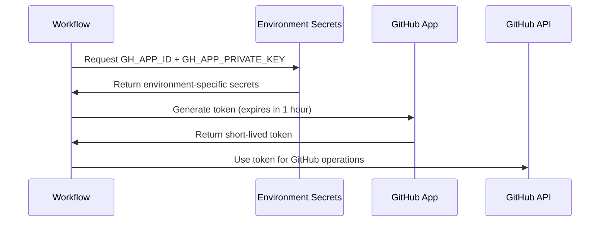
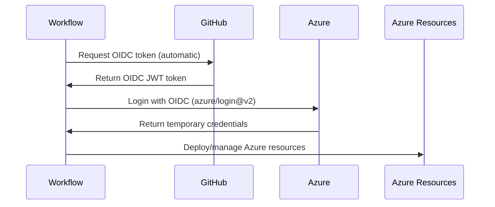

# Environment Setup Guide - Enterprise Best Practices

## Overview

This guide documents the enterprise-standard environment isolation and secret management setup implemented in this repository.

## Architecture

```
┌─────────────────────────────────────────────────────────────────┐
│                    GitHub Actions Workflow                       │
│                  (Push to branch triggers deployment)            │
└─────────────────────────────────────────────────────────────────┘
                              │
                              ├─── dev branch
                              │         ↓
                              │    ┌────────────────┐
                              │    │ Environment:   │
                              │    │     dev        │
                              │    └────────────────┘
                              │         │
                              │    Secrets (dev):
                              │    • GH_APP_ID
                              │    • GH_APP_PRIVATE_KEY
                              │    • AZUREAPPSERVICE_CLIENTID
                              │    • AZUREAPPSERVICE_TENANTID
                              │    • AZUREAPPSERVICE_SUBSCRIPTIONID
                              │
                              ├─── staging branch
                              │         ↓
                              │    ┌────────────────┐
                              │    │ Environment:   │
                              │    │   staging      │
                              │    └────────────────┘
                              │         │
                              │    Secrets (staging):
                              │    • GH_APP_ID
                              │    • GH_APP_PRIVATE_KEY
                              │    • AZUREAPPSERVICE_CLIENTID
                              │    • AZUREAPPSERVICE_TENANTID
                              │    • AZUREAPPSERVICE_SUBSCRIPTIONID
                              │
                              └─── main branch (production)
                                        ↓
                                   ┌────────────────┐
                                   │ Environment:   │
                                   │     prod       │
                                   └────────────────┘
                                        │
                                   Secrets (prod):
                                   • GH_APP_ID
                                   • GH_APP_PRIVATE_KEY
                                   • AZUREAPPSERVICE_CLIENTID
                                   • AZUREAPPSERVICE_TENANTID
                                   • AZUREAPPSERVICE_SUBSCRIPTIONID
```

## Branch → Environment Mapping

| Branch    | Environment | Azure Resources              | OIDC Subject Pattern                                    |
|-----------|-------------|------------------------------|---------------------------------------------------------|
| `dev`     | `dev`       | `rg-orderprocessing-dev`     | `repo:pavanthakur/.../ref:refs/heads/dev`               |
| `staging` | `staging`   | `rg-orderprocessing-staging` | `repo:pavanthakur/.../ref:refs/heads/staging`           |
| `main`    | `prod`      | `rg-orderprocessing-prod`    | `repo:pavanthakur/.../ref:refs/heads/main`              |

## Workflow Configuration

### 1. Deploy API Workflow (`deploy-api-to-azure.yml`)

```yaml
deploy:
  runs-on: windows-latest
  needs: build
  # Automatically selects environment based on branch
  environment: ${{ github.ref == 'refs/heads/main' && 'prod' || github.ref == 'refs/heads/staging' && 'staging' || 'dev' }}
  permissions:
    id-token: write
    contents: read
```

**How it works:**
- Push to `dev` branch → Uses `dev` environment secrets
- Push to `staging` branch → Uses `staging` environment secrets
- Push to `main` branch → Uses `prod` environment secrets

### 2. Deploy UI Workflow (`deploy-ui-to-azure.yml`)

Same pattern as Deploy API workflow - environment is automatically selected based on the branch being deployed.

### 3. Infrastructure Deploy Workflow (`infra-deploy.yml`)

```yaml
validate:
  runs-on: ubuntu-latest
  environment: ${{ github.event_name == 'workflow_dispatch' && inputs.environment || 'dev' }}

deploy:
  runs-on: ubuntu-latest
  environment: ${{ github.event_name == 'workflow_dispatch' && inputs.environment || github.ref_name }}
```

**How it works:**
- Manual workflow: Uses selected environment from input
- Push event: Uses branch name as environment

### 4. Azure Bootstrap Workflow (`azure-bootstrap.yml`)

```yaml
bootstrap-dev:
  runs-on: windows-latest
  environment: dev

bootstrap-staging:
  runs-on: windows-latest
  environment: staging

bootstrap-prod:
  runs-on: windows-latest
  environment: prod
```

Each bootstrap job explicitly uses its designated environment for secret isolation.

## Token Generation Flow

### 1. GitHub App Token (for GitHub operations)



**Usage in workflow:**
```yaml
- name: Generate GitHub App Token
  id: app-token
  uses: actions/create-github-app-token@v1
  with:
    app_id: ${{ secrets.GH_APP_ID }}
    private_key: ${{ secrets.GH_APP_PRIVATE_KEY }}

- name: Use token for GitHub operations
  env:
    GH_TOKEN: ${{ steps.app-token.outputs.token }}
  run: |
    gh secret set MY_SECRET --body "value"
```

### 2. Azure OIDC Token (for Azure operations)



**Usage in workflow:**
```yaml
- name: Azure Login (OIDC)
  uses: azure/login@v2
  with:
    client-id: ${{ secrets.AZUREAPPSERVICE_CLIENTID }}
    tenant-id: ${{ secrets.AZUREAPPSERVICE_TENANTID }}
    subscription-id: ${{ secrets.AZUREAPPSERVICE_SUBSCRIPTIONID }}
```

## Secret Configuration

### Required Secrets Per Environment

Navigate to: `Settings → Environments → [environment-name] → Secrets`

#### Development Environment (`dev`)

| Secret Name                     | Description                          | Source                           |
|---------------------------------|--------------------------------------|----------------------------------|
| `GH_APP_ID`                     | GitHub App ID                        | GitHub App settings page         |
| `GH_APP_PRIVATE_KEY`            | GitHub App private key (PEM format)  | Generated from GitHub App        |
| `AZUREAPPSERVICE_CLIENTID`      | Azure OIDC Client ID                 | Azure App Registration           |
| `AZUREAPPSERVICE_TENANTID`      | Azure Tenant ID                      | Azure subscription               |
| `AZUREAPPSERVICE_SUBSCRIPTIONID`| Azure Subscription ID                | Azure subscription               |

#### Staging Environment (`staging`)

Same secrets as dev, but with staging-specific values.

#### Production Environment (`prod`)

Same secrets as dev, but with production-specific values.

### Repository-Level Secrets

The following secrets may remain at repository level for the bootstrap workflow:

| Secret Name              | Description                     | Used By                |
|--------------------------|---------------------------------|------------------------|
| `GH_APP_ID`              | GitHub App ID                   | Bootstrap automation   |
| `GH_APP_INSTALLATION_ID` | GitHub App installation ID      | Bootstrap automation   |
| `GH_APP_PRIVATE_KEY`     | GitHub App private key          | Bootstrap automation   |

**Note:** Repository-level Azure secrets (if they exist) can be removed after environment-specific secrets are configured.

## Security Benefits

### 1. Secret Isolation
- Dev team can only access dev environment secrets
- Production secrets isolated to production environment
- Prevents accidental cross-environment deployments

### 2. Environment Protection Rules

Configure in `Settings → Environments → [environment-name] → Protection rules`:

**Production (`prod`):**
- ✅ Required reviewers (1-2 approvers)
- ✅ Wait timer (5-30 minutes)
- ✅ Deployment branches: `main` only

**Staging (`staging`):**
- ✅ Deployment branches: `staging` only
- ⚠️ Optional: Required reviewer

**Development (`dev`):**
- ✅ Deployment branches: `dev` only
- ⚠️ No manual approval needed

### 3. Audit Trail
- Every deployment logged with environment context
- Clear visibility into which environment was accessed
- GitHub tracks who approved production deployments

## Migration from Repository-Level Secrets

If you previously used repository-level secrets, follow these steps:

### Step 1: Create Environment-Specific Secrets

1. Go to `Settings → Environments → New environment`
2. Create environments: `dev`, `staging`, `prod`
3. Add secrets to each environment (see table above)

### Step 2: Verify Workflows Use Environments

All deployment workflows now include the `environment:` keyword. Verify changes:

```bash
git log --oneline --grep="environment" -5
```

### Step 3: Test Each Environment

```bash
# Test dev
git checkout dev
git push origin dev

# Test staging
git checkout staging
git push origin staging

# Test production (will require approval if configured)
git checkout main
git push origin main
```

### Step 4: Remove Repository-Level Azure Secrets

After confirming all workflows work with environment-specific secrets:

1. Go to `Settings → Secrets and variables → Actions`
2. Remove (if they exist):
   - `AZUREAPPSERVICE_CLIENTID`
   - `AZUREAPPSERVICE_TENANTID`
   - `AZUREAPPSERVICE_SUBSCRIPTIONID`

**Keep these repository-level secrets:**
- `GH_APP_ID`
- `GH_APP_INSTALLATION_ID`
- `GH_APP_PRIVATE_KEY`

## Troubleshooting

### Issue: "Secret not found"

**Cause:** Environment not specified in workflow or secret not configured.

**Solution:**
1. Verify workflow has `environment:` line in job definition
2. Check secret exists in correct environment: `Settings → Environments → [env] → Secrets`

### Issue: "Deployment waiting for approval"

**Cause:** Production environment has required reviewers configured.

**Solution:** This is expected! Have an authorized user approve the deployment in the Actions tab.

### Issue: "Branch not allowed to deploy"

**Cause:** Environment has deployment branch restrictions.

**Solution:**
1. Check `Settings → Environments → [env] → Deployment branches`
2. Ensure correct branch is allowed (e.g., `main` for prod, `staging` for staging)

### Issue: "OIDC login failed"

**Cause:** Wrong OIDC credentials for environment or federated credentials not created.

**Solution:**
1. Verify OIDC setup was completed: Run `azure-bootstrap.yml` workflow
2. Check Azure Portal → App Registrations → GitHub-Actions-OIDC → Federated credentials
3. Ensure subject claim matches: `repo:owner/repo:ref:refs/heads/[branch]`

## Best Practices

### 1. Never Commit Secrets
- ✅ Use GitHub Secrets for all credentials
- ✅ Use environment-specific secrets for isolation
- ❌ Never hardcode secrets in code or workflows

### 2. Least Privilege Access
- ✅ Grant Azure OIDC app minimal required permissions
- ✅ Limit GitHub App permissions to necessary scopes
- ✅ Use environment protection for production

### 3. Regular Rotation
- 🔄 Rotate GitHub App private keys annually
- 🔄 Review Azure OIDC app credentials quarterly
- 🔄 Audit environment access logs monthly

### 4. Deployment Approvals
- ✅ Require manual approval for production
- ✅ Consider approval for staging if needed
- ✅ Allow automatic dev deployments

### 5. Branch Protection
- ✅ Protect `main` branch (require PR reviews)
- ✅ Protect `staging` branch (require PR reviews)
- ⚠️ Consider protecting `dev` branch (optional)

## Quick Reference

### Check Current Environment Configuration

```bash
# View environment secrets (names only, not values)
gh api repos/pavanthakur/XYDataLabs.OrderProcessingSystem/environments/dev/secrets

# View protection rules
gh api repos/pavanthakur/XYDataLabs.OrderProcessingSystem/environments/prod
```

### Manual Deployment with Specific Environment

```bash
# Trigger infra deployment to prod
gh workflow run infra-deploy.yml -f environment=prod -f dryRun=false

# Trigger bootstrap for dev
gh workflow run azure-bootstrap.yml \
  -f environment=dev \
  -f setupOidc=false \
  -f bootstrapInfra=true
```

### View Recent Deployments by Environment

```bash
# View prod deployments
gh run list --workflow=deploy-api-to-azure.yml --branch=main

# View staging deployments
gh run list --workflow=deploy-api-to-azure.yml --branch=staging

# View dev deployments
gh run list --workflow=deploy-api-to-azure.yml --branch=dev
```

## Additional Resources

- [GitHub Environments Documentation](https://docs.github.com/en/actions/deployment/targeting-different-environments/using-environments-for-deployment)
- [Azure OIDC with GitHub Actions](https://learn.microsoft.com/en-us/azure/developer/github/connect-from-azure)
- [GitHub Apps Authentication](https://docs.github.com/en/apps/creating-github-apps/authenticating-with-a-github-app)
- [Repository Documentation](./README.md)
- [Quick Setup GitHub App Guide](./03-Configuration-Guides/QUICK-SETUP-GITHUB-APP.md)

---

**Last Updated:** 2025-11-22  
**Version:** 1.0.0  
**Maintained by:** DevOps Team
